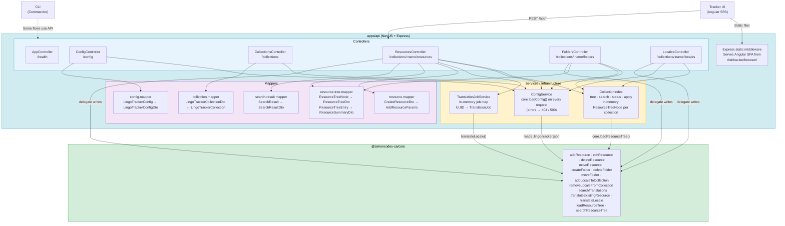
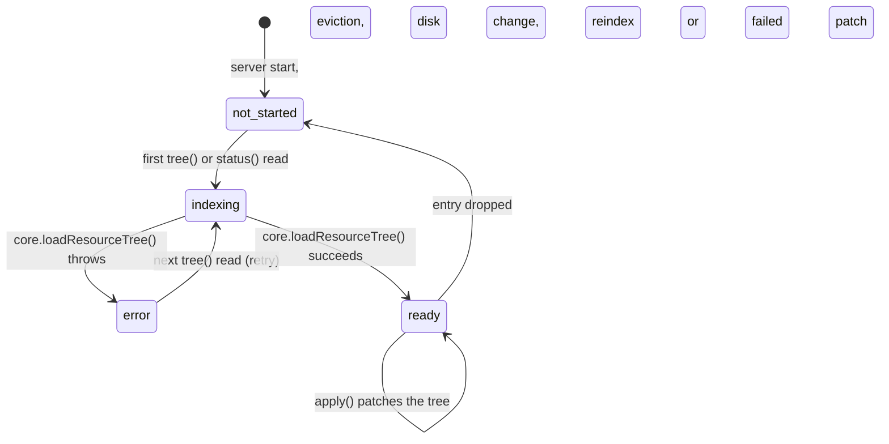
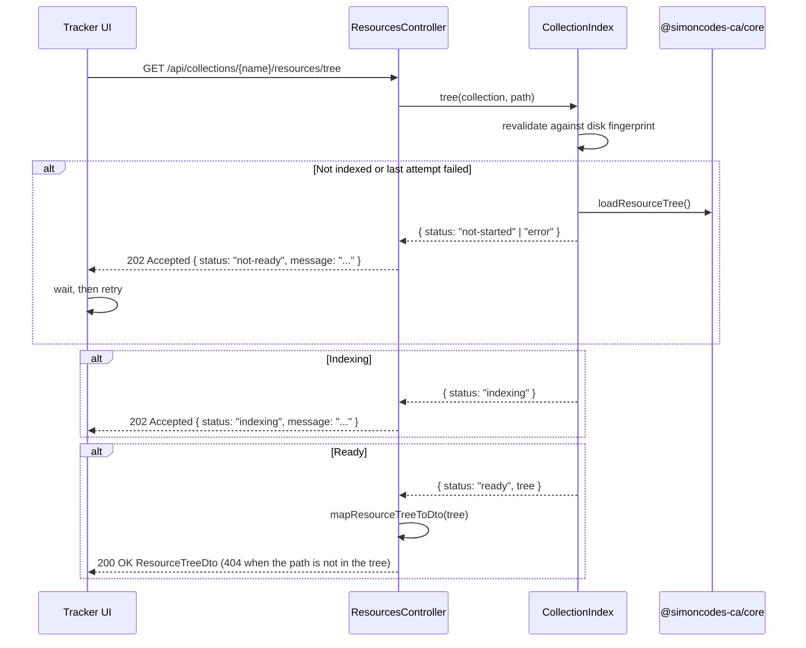
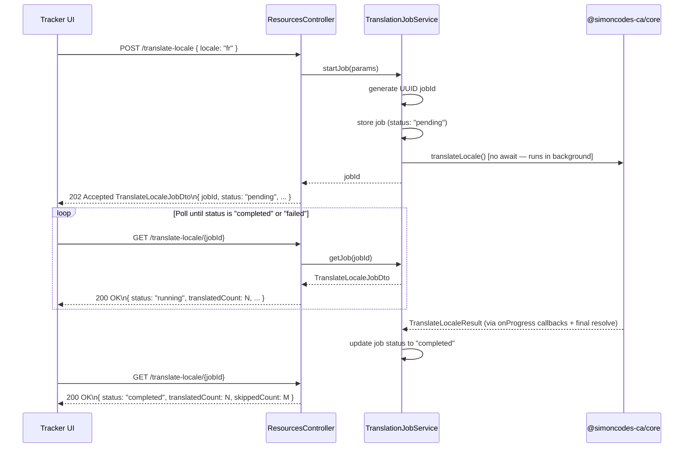

# REST API (`apps/api`)

The NestJS API is LingoTracker's HTTP interface. It exposes all translation management operations over REST, serves the Angular Tracker UI as static files from the same process, and owns two cross-cutting systems: an in-memory [Collection Index](glossary.md#collection-index) that makes the resource tree fast to browse, and an async job runner for long-running locale translation operations. All API routes are prefixed with `/api`; Swagger docs are available at `/api` when the server is running.

Return to [architecture README](README.md).

---

## Table of Contents

- [Endpoint Reference](#endpoint-reference)
- [Component Diagram](#component-diagram)
- [Static File Serving](#static-file-serving)
- [Collection Index](#collection-index)
  - [Interface](#interface)
  - [Bounded Multi-Collection Design](#bounded-multi-collection-design)
  - [Index State Machine](#index-state-machine)
  - [Writes: Resource Mutations](#writes-resource-mutations)
  - [Polling Flow from the Frontend](#polling-flow-from-the-frontend)
- [Translation Job System](#translation-job-system)
- [Mapper Layer](#mapper-layer)

---

## Endpoint Reference

All paths are relative to the `/api` global prefix. URL path parameters that contain collection names are URI-decoded inside each controller action to handle names with special characters.

### Health

| Method | Path | Purpose | Request DTO | Response DTO |
|--------|------|---------|-------------|--------------|
| `GET` | `/health` | Liveness check | — | `{ status: string }` |

### Config

| Method | Path | Purpose | Request DTO | Response DTO |
|--------|------|---------|-------------|--------------|
| `GET` | `/config` | Read global config and all collection configs, with protected terms resolved from their files. Also carries the preferred terminology rules, the rule file path, and any load error or missing-file warning. | — | `LingoTrackerConfigDto` |
| `PUT` | `/config` | Update the writable top-level globals: `protectedTerms` and `preferredTerminology`. The handler writes each one to its own **file**, and leaves `.lingo-tracker.json` untouched. `preferredTerminology` is the full rule list. The server validates it again and returns `400` with per-row errors when a rule is invalid. `collections`, `locales`, and `baseLocale` stay excluded on purpose. | `UpdateConfigDto` | `{ message: string }` |

### Collections

| Method | Path | Purpose | Request DTO | Response DTO |
|--------|------|---------|-------------|--------------|
| `POST` | `/collections` | Create a new [collection](glossary.md#collection) | `CreateCollectionDto` | `{ message: string }` |
| `PUT` | `/collections/:collectionName` | Update a collection's name or settings. When `locales` in the request body differs from the current config, the handler diffs the two lists and adds/removes locale files on disk accordingly (base locale cannot be removed). The handler writes a `protectedTerms` array from the body to the collection's terms file. A collection with no `protectedTermsFile` returns 400. | `UpdateCollectionDto` | `{ message: string }` |
| `DELETE` | `/collections/:collectionName` | Delete a collection and its config entry | — | `{ message: string }` |

### Resources

| Method | Path | Purpose | Request DTO | Response DTO |
|--------|------|---------|-------------|--------------|
| `POST` | `/collections/:collectionName/resources` | Create one or more [resources](glossary.md#resource) (batch-aware) | `CreateResourceDto \| CreateResourceDto[]` | `CreateResourceResponseDto` |
| `PATCH` | `/collections/:collectionName/resources` | Update a resource's base value, translations, comment, or tags | `UpdateResourceDto` | `UpdateResourceResponseDto` |
| `DELETE` | `/collections/:collectionName/resources` | Delete one or more resources by key | `DeleteResourceDto` | `DeleteResourceResponseDto` |
| `POST` | `/collections/:collectionName/resources/move` | Move or rename resources (single key or wildcard pattern, cross-collection supported) | `MoveResourceDto` | `MoveResourceResponseDto` |
| `POST` | `/collections/:collectionName/resources/translate` | Auto-translate a single resource via the configured provider | `TranslateResourceDto` | `TranslateResourceResponseDto` |
| `GET` | `/collections/:collectionName/resources/tree` | Fetch the resource [tree](glossary.md#resource-tree) (or subtree) from the Collection Index | query: `path`, `includeNested` | `ResourceTreeDto \| TreeStatusResponseDto` |
| `GET` | `/collections/:collectionName/resources/cache/status` | Poll the [Collection Index](glossary.md#collection-index) state (starts indexing) | — | `CacheStatusDto` |
| `GET` | `/collections/:collectionName/resources/search` | Full-text search across the collection | query: `SearchTranslationsDto` | `SearchResultsDto` |
| `POST` | `/collections/:collectionName/resources/translate-locale` | Fire-and-forget: start a bulk locale translation job | `TranslateLocaleRequestDto` | `TranslateLocaleJobDto` (202 Accepted) |
| `GET` | `/collections/:collectionName/resources/translate-locale/:jobId` | Poll a translation job by ID | — | `TranslateLocaleJobDto` |

### Folders

| Method | Path | Purpose | Request DTO | Response DTO |
|--------|------|---------|-------------|--------------|
| `POST` | `/collections/:collectionName/folders` | Create a [folder](glossary.md#folder) | `CreateFolderDto` | `CreateFolderResponseDto` |
| `DELETE` | `/collections/:collectionName/folders` | Delete a folder and all its contents | `DeleteFolderDto` | `DeleteFolderResponseDto` |
| `POST` | `/collections/:collectionName/folders/move` | Move a folder within or across collections | `MoveFolderDto` | `MoveFolderResponseDto` |

### Locales

| Method | Path | Purpose | Request DTO | Response DTO |
|--------|------|---------|-------------|--------------|
| `POST` | `/collections/:collectionName/locales` | Add a locale to a collection (re-indexes) | `AddLocaleDto` | `AddLocaleResponseDto` |
| `DELETE` | `/collections/:collectionName/locales/:locale` | Remove a locale from a collection (re-indexes) | — | `RemoveLocaleResponseDto` |

### Bundles

Bundle definitions live under `bundles` in `.lingo-tracker.json` and are exposed on `GET /config`. Generation runs as an async job (one at a time, in order) that the client polls, mirroring the translation job flow.

| Method | Path | Purpose | Request DTO | Response DTO |
|--------|------|---------|-------------|--------------|
| `POST` | `/bundles` | Create a [bundle](glossary.md#bundle) definition. Validation failures return 400 `{ message, errors[] }`; a duplicate name returns 409. | `CreateBundleDto` | `{ message: string }` |
| `PUT` | `/bundles/:name` | Replace a bundle definition, optionally renaming it via `name` in the body. 404 when missing, 400 when invalid, 409 when the new name is taken. | `UpdateBundleDto` | `{ message: string }` |
| `DELETE` | `/bundles/:name` | Remove a bundle definition (404 when missing) | — | `{ message: string }` |
| `POST` | `/bundles/dry-run` | Plan a bundle from the request body without writing anything. The definition does not have to be saved, so the UI can preview unsaved edits. | `BundleDryRunRequestDto` | `BundleDryRunResultDto` |
| `POST` | `/bundles/:name/generate` | Fire-and-forget: start a generation job for a saved bundle. Optional `locales` must be a subset of the project locales (400 otherwise). | `GenerateBundleRequestDto` | `BundleGenerateJobDto` (202 Accepted) |
| `GET` | `/bundles/jobs/:jobId` | Poll a bundle generation job by ID | — | `BundleGenerateJobDto` |

---

## Component Diagram

<!-- C4 Level 3: internal structure of the API process -->



Controllers are the only layer that knows HTTP. They read the config from `ConfigService` (a thin wrapper over core `loadConfig()` that maps `ConfigNotFoundError` to 404 and parse/read failures to 500), turn the `:collectionName` route param into the effective `Collection` with `openRouteCollection()` (`collections/open-route-collection.ts`: decodes the name, calls core `openCollection()`, maps `CollectionNotFoundError` to 404), delegate business operations to `@simoncodes-ca/core` (see [core-library.md](core-library.md)), apply mappers at the boundary, and pass the `mutations` of every successful core write to `CollectionIndex.apply()`.

**Read-only enforcement.** `WritableCollectionGuard` (`collections/guards/writable-collection.guard.ts`) is applied at the class level to the `Resources`, `Locales`, and `Folders` controllers. For any non-`GET` request it reads the `:collectionName` route param, opens the collection with core `openCollection(config, name, { writable: true })`, and maps `ReadOnlyCollectionError` to `403 Forbidden` (unknown collections pass through so the controller returns its 404). This is the single API choke-point for read-only enforcement. The `Collections` controller is intentionally **not** guarded: updating a collection's config entry or unregistering it (`PUT`/`DELETE /collections/:name`) is permitted even for read-only collections, since the lock protects resources, not the registration. On create, the controller defaults `readOnly` to `true` for `node_modules` paths (via the `isUnderNodeModules` domain helper) when the DTO omits it.

---

## Static File Serving

The Express server that backs NestJS is configured before NestJS routes are registered. The middleware registration order in `main.ts` is intentional:

1. `express.static(dist/tracker/browser)` — serves the Angular build output (JS bundles, assets) for any URL that matches a real file on disk.
2. A catch-all `GET {*splat}` handler — for any non-`/api` request that did not match a static file, sends `index.html` so the Angular router can handle client-side navigation.
3. NestJS routes under `/api` — registered last; the catch-all explicitly skips requests whose URL starts with `/api` via `next()`.

This means a single `node apps/api/main.js` process serves both the UI and the API with no reverse proxy required. The Angular SPA's `base href` and API client are both configured relative to the same origin.

---

## Collection Index

`CollectionIndex` (`apps/api/src/app/cache/collection-index.service.ts`) is a singleton Nest provider. It holds an in-memory copy of each open collection's [resource tree](glossary.md#resource-tree), so the Tracker can browse and search a collection without reading the disk on each request.

### Interface

```typescript
tree(collection: Collection, path?: string): TreeRead;          // { status: 'ready', tree | null } | { status: 'not-started' | 'indexing' | 'error' }
search(collection: Collection, query: string, maxResults: number): SearchResult[];
status(collection: Collection): CacheStatusDto;                  // for GET .../cache/status
apply(mutations: readonly ResourceMutation[]): void;              // after every core write
```

Controllers do not know how the index works. They read with `tree()`, `search()` and `status()`, and give the `mutations` of each core write to `apply()`. These items are internal to the index:

- **Indexing.** `tree()` indexes a collection that is not indexed or whose last attempt failed. `status()` indexes only a collection that is not indexed, and reports `error` as it is. Both report the state that they found, so the first read answers `not-started` (and `/tree` returns `202`). `search()` never starts indexing. It searches the disk until the collection is indexed.
- **Revalidation.** Before each read, a ready entry compares a stat-only disk fingerprint (`computeTreeFingerprint`) with the fingerprint from its last index or own write. If they differ, the entry is dropped and indexed again. This makes CLI commands, `git checkout` and hand edits visible without a restart. Filesystem watching is not used, because inotify does not fire for Windows-side writes on a WSL `/mnt/c` mount, and the same is true for some network and container mounts. The check runs at most once per `LINGO_TRACKER_REVALIDATE_INTERVAL_MS` (default 2000 ms) for each entry.
- **Own writes.** After `apply()` patches an entry, the index refreshes that entry's fingerprint at the end of the tick. A bulk endpoint that applies mutations in a loop causes one scan, not one per resource. A read that comes before the refresh adopts the new fingerprint, so an own write is never read as an outside change.
- **Patching.** One tree-walk helper applies each mutation to the tree. When a mutation does not match the tree (for example, a `remove` of a key that the index does not have), the index drops that collection. The next read indexes it again. A wrong patch never stays in memory.

### Bounded Multi-Collection Design

The index holds a `Map` of entries keyed by collection name. The map is capped at `LINGO_TRACKER_MAX_CACHED_COLLECTIONS` (default 4). When the cap is reached, the least recently used entry is evicted.

**Why more than one.** Opening a second collection in another browser tab is a real usage pattern. With a single slot, each tab's 2-second `/cache/status` poll evicted the other tab's entry, so neither reached `ready`, both polled forever, and the server re-indexed continuously. Independent entries remove the contention.

**Why bounded.** A fully loaded tree for a large collection (thousands of keys, many locales, full values and metadata) can use tens of megabytes of JavaScript heap, and that cost multiplies per collection. The cap is a memory budget. Set it to 1 to get the old single-slot behaviour.

**Eviction.** Each read or patch increments the entry's `accessSequence` (a monotonic counter, not a clock, because several collections can be touched in the same millisecond). When a new entry is added at the cap, the entry with the lowest `accessSequence` is dropped.

**Per-entry state.** The fingerprint, the revalidation throttle stamp and the deferred fingerprint-refresh timer are stored on the entry. A read of one collection cannot postpone the staleness check of a different collection.

### Index State Machine

<!-- Index state machine — status values reported by tree() and status() -->



| State | Meaning |
|-------|---------|
| `not-started` | The index has no entry for this collection. The read that reported it has started indexing. |
| `indexing` | `core.loadResourceTree()` is running. `loadResourceTree()` is synchronous, so in practice the read that starts indexing also finishes it; the state is part of the HTTP contract. |
| `ready` | The tree is in memory. Reads are served from it. |
| `error` | The last attempt threw. The message is reported by `status()`. The next `tree()` read tries again. |

### Writes: Resource Mutations

Each core write returns `mutations: ResourceMutation[]` (see [core-library.md](core-library.md) and the [glossary](glossary.md#resource-mutation)), which describe what changed on disk. The controller calls `index.apply(result.mutations)`. The index finds every entry whose translations folder is the mutation's `translationsFolder`, so a cross-collection move updates the source and the destination with no controller logic.

| Mutation | Returned by | Index action |
|---|---|---|
| `upsert` (key, entry) | `addResource`, `editResource`, `translateExistingResource`, `moveResource` / `moveFolder` (destination) | Insert or replace the entry. Missing folders are created, as on disk. |
| `remove` (key) | `deleteResource`, `moveResource` / `moveFolder` (source) | Remove the entry. Missing entry → drop the collection. |
| `add-folder` (path) | `createFolder` | Create the folder node (and missing parents). |
| `remove-folder` (path) | `deleteFolder`, `moveFolder` (deleted source folder) | Remove the folder node. Missing folder → drop the collection. |
| `reindex` | `addLocaleToCollection`, `removeLocaleFromCollection` | Drop the collection. Every folder's metadata changed. |

A folder move is a list of per-key `upsert` + `remove` pairs and then a `remove-folder`. Thus the index follows partial moves, merges into an existing folder, and `nestUnderDestination: false` in the same way as the disk. Writes that do not go through the API (the translate-locale job, CLI commands, imports) are found by revalidation.

### Polling Flow from the Frontend

The Tracker UI polls the index endpoints when it needs the resource tree. For the full sequence, see [user-flows.md — Cache Indexing Flow](user-flows.md#6-cache-indexing-flow). The protocol is:



A 202 Accepted response always means "retry shortly". A 200 OK carries the full or partial tree. The route uses `@Res({ passthrough: true })` only to set the 202 status; Nest serializes the returned DTO. The frontend owns the retry loop; there is no server-sent event or WebSocket.

---

## Translation Job System

Bulk locale translation (`POST /resources/translate-locale`) can take seconds to minutes depending on collection size. The API uses a fire-and-forget async job pattern to avoid HTTP timeouts.



**Job lifecycle states:** `pending` → `running` → `completed` | `failed`. `TranslationJobService` stores jobs in a plain `Map<string, TranslationJob>` in process memory. Jobs are never evicted — this is appropriate for a single-user development tool. If the process restarts, all jobs are lost and the UI must re-issue any in-progress operations.

**Progress reporting.** `translateLocale()` in `@simoncodes-ca/core` accepts an `onProgress` callback. `TranslationJobService` subscribes to this callback and updates the in-memory job's `translatedCount`, `failedCount`, and `skippedCount` fields on each tick. Polling clients see live progress, not just a final result.

**Error handling.** If `translateLocale()` rejects with a `TranslationError` (API key issue, provider timeout) or any other error, the job transitions to `failed` and the `error` field is set. No retry is attempted. The UI can display the error and offer a manual re-trigger.

---

## Mapper Layer

The mapper layer enforces the boundary between `@simoncodes-ca/core`'s domain models and `@simoncodes-ca/data-transfer`'s DTOs. All transformation happens in `apps/api/src/app/mappers/`. No controller accesses a raw domain model object directly in its response, and no core function receives a DTO as its argument.

For the entity types that mappers transform, see [domain-and-data-model.md](domain-and-data-model.md).

| Mapper file | Direction | Key transformation |
|-------------|-----------|-------------------|
| `resource.mapper.ts` | `CreateResourceDto` → `AddResourceParams` | Flat field-for-field projection; adds `allLocales` when auto-translation is active |
| `resource-tree.mapper.ts` | `ResourceTreeNode` → `ResourceTreeDto` | Flattens `folderPathSegments[]` array to a dot-delimited `path` string; merges `source` (base locale value) into the `translations` record keyed by the base locale string; extracts per-locale `status` from the `metadata` record |
| `resource-tree.mapper.ts` | `ResourceTreeEntry` → `ResourceSummaryDto` | Identifies the base locale by the absence of `status` and `baseChecksum` in the metadata entry; produces a flat `{ key, translations, status, comment, tags, inheritedTags }` shape. The `inheritedTags` field carries the parent collection's `tags` so the UI can render them distinctly without re-reading the config. |
| `collection.mapper.ts` | `LingoTrackerCollectionDto` ↔ `LingoTrackerCollection` | Bidirectional; shallow clone of `locales[]` and `tags[]` arrays to prevent aliasing. Carries the `protectedTermsFile` setting in both directions. Drops resolved `protectedTerms` on the way back to config, because terms live in a file and the controller writes them there separately. |
| `config.mapper.ts` | `LingoTrackerConfig` → `LingoTrackerConfigDto` | Delegates collection mapping to `collection.mapper` and bundle mapping to `bundle.mapper`; shallow clone of `locales[]`. Takes an optional `ResolvedProtectedTerms` and `projectName` (basename of the API's working directory) from the controller, so the mapper itself reads no files. |
| `bundle.mapper.ts` | `BundleDefinitionDto` ↔ `BundleDefinition`; `BundlePlan` → `BundleDryRunResultDto`; `GenerateBundleResult` → `BundleGenerateJobResultDto` | Bidirectional definition mapping trims strings and drops empty optionals so nothing spurious is written to the config. The plan mapper drops `absolutePath` and caps `conflictKeys` at 50. The job-result mapper rebuilds written file paths from `localesProcessed` plus the types file. |
| `search-result.mapper.ts` | `SearchResult` → `SearchResultDto` | Structurally identical types; mapper exists for explicit API boundary documentation |

**Why does `config.mapper.ts` take resolved terms as an argument?** Protected terms live in JSON files outside `.lingo-tracker.json`. Building the DTO therefore requires reading the filesystem.

The mapper keeps no file access. Instead `ConfigController.getConfig()` calls `resolveProtectedTermsForConfig(config)` from core, which reads every scope in one pass, and hands the result to the mapper. The mapper stays a pure projection.

The resolved terms and their file paths then reach the UI as read-only DTO fields, `protectedTerms` and `protectedTermsFilePath`. The writable `protectedTermsFile` setting travels alongside them.

**Why the base locale detection logic in `resource-tree.mapper.ts`?** The `ResourceTreeEntry` domain model stores the base locale value in a dedicated `source` field and tracks its metadata in the same `metadata` record as translations — distinguished by the absence of `status` and `baseChecksum` fields (the base locale has a checksum but no `baseChecksum` to compare against, and no `status` since it is never `new` or `stale` relative to itself). The DTO flattens this into a single `translations` map for simpler frontend consumption. The mapper performs this denormalization at the API boundary so the domain model stays clean.
