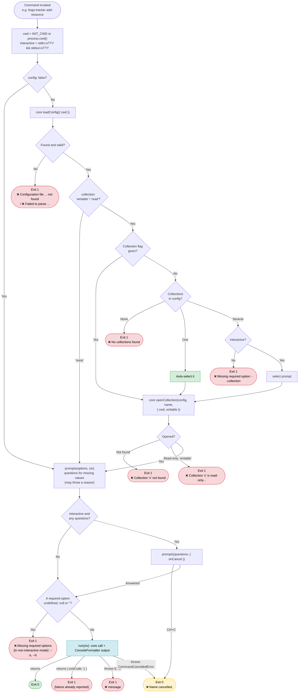
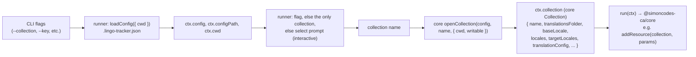

# CLI (`apps/cli`)

The LingoTracker CLI is a Node.js command-line binary built with [Commander](https://github.com/tj/commander.js). It provides every day-to-day translation management operation — from project initialization and resource CRUD through bundle generation, import/export, and CI/CD validation — as a single `lingo-tracker` executable. Each command is a prompt schema plus a call to `@simoncodes-ca/core`, run by one [Command Runner](glossary.md#command-runner). The runner owns config loading, collection resolution, the interactive rule, cancellation and exit codes. The command owns its questions, its core call and its output formatting. Resource files are read and written only through core. The CLI itself writes a few files of its own: `init` writes `.lingo-tracker.json`, `export` and `import` write their summary files, `glossary` writes its JSON output, and `install-skill` writes the skill templates.

Return to [architecture README](README.md).

---

## Table of Contents

- [Command Inventory](#command-inventory)
- [Command Runner](#command-runner)
  - [Defining a Command](#defining-a-command)
  - [What Each Command Opens](#what-each-command-opens)
- [Interactive vs Non-Interactive Mode](#interactive-vs-non-interactive-mode)
  - [The Interactive Rule](#the-interactive-rule)
  - [Runner Flowchart](#runner-flowchart)
- [Errors and Exit Codes](#errors-and-exit-codes)
- [Config Loading and Collection Resolution](#config-loading-and-collection-resolution)
  - [Config Loading](#config-loading)
  - [Collection Resolution](#collection-resolution)
  - [Resolution Flowchart](#resolution-flowchart)
- [Testing Commands](#testing-commands)
- [Shared Utilities](#shared-utilities)
  - [Multiselect Helpers (`prompt-utils.ts`)](#multiselect-helpers-prompt-utilsts)
  - [Output Formatting (`console-formatter.ts`)](#output-formatting-console-formatterts)
  - [Error Messages (`error-messages.ts`)](#error-messages-error-messagests)
  - [String Parsers (`string-parsers.ts`)](#string-parsers-string-parsersts)
  - [Result Aggregator (`result-aggregator.ts`)](#result-aggregator-result-aggregatorts)

---

## Command Inventory

All commands are registered in `apps/cli/src/main.ts`. Each row below lists the exact Commander command name, the flags it accepts, and the `@simoncodes-ca/core` function the command action calls.

| Command | Key Options / Flags | Core Function Called |
|---|---|---|
| `init` | `--collection-name`, `--translations-folder`, `--base-locale`, `--locales`, `--setup-bundle`, `--bundle-dist`, `--bundle-name`, `--token-casing`, `--type-dist-file`, `--enable-auto-translation`, `--translation-provider`, `--translation-api-key-env` | Writes `.lingo-tracker.json` directly (no `@simoncodes-ca/core` function — uses `CONFIG_FILENAME`, `DEFAULT_CONFIG` constants) |
| `add-collection` | `--collection-name`, `--translations-folder`, `--base-locale`, `--locales` | `addCollection()` |
| `delete-collection` | `--collection-name` | `deleteCollectionByName()` |
| `edit-collection` | `<name>` (argument), `--add-tag` (repeatable), `--remove-tag` (repeatable), `--set-tags` | `updateCollection()` with the stored collection and the new `tags` |
| `add-locale` | `--collection`, `--locale` | `addLocaleToCollection()` |
| `remove-locale` | `--collection`, `--locale` | `removeLocaleFromCollection()` |
| `add-resource` | `--collection`, `--key`, `--value`, `--comment`, `--tags`, `--target-folder`, `--translations <json>` | `addResource()` (locales without a `--translations` value are seeded by core: [locale seeding](glossary.md#locale-seeding)). `--translations` is parsed inside the command; malformed JSON, or anything but an array of `{ locale, value, status }`, exits 1 with `❌ Invalid --translations …` |
| `edit-resource` | `--collection`, `--key` (full key), `--base-value`, `--comment`, `--tags`, `--target-folder` (moves the entry into this folder; core `moveTo`), `--locale`, `--locale-value` | `editResource()` |
| `delete-resource` | `--collection`, `--key`, `--yes` | `deleteResource()` |
| `move` | `--collection`, `--source`, `--dest`, `--override`, `--verbose` | `moveResource()` |
| `normalize` | `--collection`, `--all`, `--dry-run`, `--json` | `normalize()` |
| `translate-locale` | `--collection`, `--locale`, `--verbose` | `translateLocale(collection, { targetLocale, onProgress })` (through the [Translator](glossary.md#translator)); the summary prints `Skipped (needs human translation)` for complex ICU, lost placeholders and dropped protected terms |
| `bundle` | `--name`, `--locale`, `--quiet`, `--verbose`, `--token-casing`, `--token-constant-name`, `--no-transform-icu-to-transloco`, `--debug-keys` | `generateBundle()` (with the project `cwd`) |
| `export` | `-f/--format`, `-c/--collection`, `-l/--locale`, `-s/--status`, `-t/--tags`, `-o/--output`, `--structure`, `--rich`, `--include-base`, `--include-status`, `--include-comment`, `--include-tags`, `--base-property-name`, `--filename`, `--no-protect-notes`, `--dry-run`, `--verbose` | `runExport()` |
| `import` | `-f/--format`, `-s/--source`, `-l/--locale`, `-c/--collection`, `--strategy`, `--update-comments`, `--update-tags`, `--preserve-status`, `--create-missing`, `--validate-base`, `--dry-run`, `--verbose` | `parseJsonImport()` / `parseXliffImport()` → `importResources()` |
| `validate` | `--allow-translated`, `--skip-locales`, `--skip-icu`, `--skip-placeholders`, `--require-portable-plurals` | `openCollection()` for each collection → `validateResources()`, `generateValidationSummary()` |
| `find-similar` | `--collection`, `--value`, `--max-results` | `searchTranslations()` |
| `glossary` | `--text`, `--input`, `--output`, `--stdout`, `--collection`, `--locales`, `--include-all`, `--extractor` | `readCollection()` (matching/extraction done in the command, not core) |
| `protected-terms` | `--collection`, `--add` (repeatable), `--remove` (repeatable), `--set`, `--list`, `--file` | `setGlobalProtectedTerms()` / `setCollectionProtectedTerms()` / `setGlobalProtectedTermsFile()` / `setCollectionProtectedTermsFile()`, reading via `readGlobalProtectedTerms()` / `readCollectionProtectedTerms()` |
| `preferred-terminology` | `--list`, `--add <discouraged>`, `--preferred`, `--reason`, `--remove <discouraged>` | `loadPreferredTerminology()` / `writePreferredTerminology()` |
| `install-skill` | `--collection <spec>` (repeatable), `--dir`, `--token-casing` | No core call — generates a `.claude/` skill file by template |

### `protected-terms` scoping

The command handles `--file` before it writes any term. `--file x.json --add Foo` therefore names the new file first, then writes into it.

Both scopes read through the same core helpers. The command itself parses no terms file.

- **Global** — `readGlobalProtectedTerms(config, cwd)`. When `protectedTermsFile` is absent, this falls back to `.lingo-tracker-protected-terms.json` beside the config.
- **Collection** — `readCollectionProtectedTerms(collection, cwd)`. This returns an empty list when the collection names no file. A collection has no default path.

`--list` on a collection prints three lists: the global terms, the collection's terms, and `effectiveProtectedTerms()` of the two. It names the resolved file behind each list. Paths inside the project root print as relative paths.

The core layer raises errors for a malformed file, for a collection with no file, and for a missing parent directory. The command lets each one reach the runner, which prints `❌ <message>` and sets exit code 1. It writes no partial result. An unknown `--collection` exits 1 with `❌ Collection "x" not found`.

### `validate` locales

`validate` opens every collection with `openCollection()` and hands the collections to `validateResources()`. Each collection is validated with its own base locale and target locales (its `locales`, else the global `locales`, without its base locale). The command reads no global `baseLocale` or `locales` itself. When no collection has a target locale, the command exits 1.

`--skip-locales` removes locales from every collection. A locale that is some collection's target locale is skipped. A locale that is only a base locale is ignored without a message. Any other locale gets an `unknown locale` warning. When every target locale is skipped, the command exits 1.

A folder whose files cannot be read fails validation. The summary lists it under `Unreadable Folders`.

### `glossary` pipeline

The `glossary` command is intentionally CLI-only (no new core API surface) but reads resources through the core [Collection Reader](glossary.md#collection-reader), `readCollection()` (the same reader that `export`, `validate` and `bundle` use). Its logic lives in three sibling modules under `apps/cli/src/commands/`:

- `glossary-extractor.ts` — the **extraction seam**. `CandidateExtractor = (block) => Candidate[]`, with a deterministic stopword + unigram/bigram default (`ngramExtractor`). `resolveExtractor(mode)` selects the implementation; `ai` is reserved and throws a clear not-implemented error today. This boundary lets an AI-based extractor replace the n-gram one without touching matching/output.
- `glossary-matcher.ts` — matches candidates (over `FlatEntry[]`) against base-locale values only, scores (exact > whole-word containment), keeps top-1 per candidate, dedupes across candidates, and applies the per-locale status filter.
- `glossary.ts` — orchestration: resolve input (`--text` → `--input` → stdin), read each collection with `readCollection()` (stripping each collection's base locale from `translations`; an unreadable folder is a warning on stderr, so `--stdout` output stays valid JSON), run extractor → matcher, serialize the header + term-array schema, write to a file or stdout.

For the full description of what each core function does internally, see [core-library.md](core-library.md).

For the import and export sequence diagrams showing the full end-to-end flow, see [user-flows.md](user-flows.md).

---

## Command Runner

`apps/cli/src/runner/command-runner.ts` is the one place that runs a command. `main.ts` keeps the Commander option declarations and calls the function that `defineCommand` returns. That function does the same steps for every command, in this order:

1. Finds the project root: `INIT_CWD` (set by pnpm to the directory where the command was typed), else `process.cwd()`.
2. Reads the [interactive rule](#the-interactive-rule) once.
3. Loads `.lingo-tracker.json` with core `loadConfig({ cwd })`, unless the command sets `config: false`.
4. Resolves and opens the collection, when the command needs one ([Collection Resolution](#collection-resolution)).
5. Builds the command's questions (in both modes; the builder may throw to fail early) and asks them when interactive.
6. Checks the `required` options against the flags merged with the answers. `undefined`, `null` and `''` count as missing, so an empty interactive answer fails the same way as an absent flag.
7. Calls `run`, and turns the result or the thrown error into output and an exit code ([Errors and Exit Codes](#errors-and-exit-codes)).

The runner sets `process.exitCode` and returns. No CLI code calls `process.exit()`, so Commander finishes normally.

### Defining a Command

```typescript
// apps/cli/src/commands/add-locale.ts
export const addLocaleCommand = defineCommand<AddLocaleOptions>()({
  name: 'Add locale',                 // used in "❌ Add locale cancelled."
  collection: 'writable',             // 'writable' | 'read' | 'none'
  prompts: (options) =>               // questions for missing values; asked only when interactive
    options.locale ? [] : [{ type: 'text', name: 'locale', message: 'Enter locale to add (e.g. fr-ca, de, es)' }],
  required: ['locale'],               // checked after the questions; `run` sees it as a string
  run: async ({ collection, cwd, answers }) => {
    const result = await addLocaleToCollection(collection.name, answers.locale, { cwd });
    ConsoleFormatter.success(result.message);
  },
});
```

`defineCommand<Options>()` is curried: the options type is given, and the rest is inferred from the spec. The spec fields:

| Field | Meaning |
|---|---|
| `name` | Operation name for the cancel line. |
| `collection` | `'writable'` opens the collection with `writable: true`. `'read'` opens it for reading. `'none'` opens no collection. |
| `collectionOption` | The option that holds the collection name. Default `collection`. `delete-collection` uses `collectionName`; `edit-collection` uses its positional `<name>`. |
| `config` | `false` skips loading the config. Only `init` and `install-skill` set it. It is only allowed with `collection: 'none'`: `config: false` with `'writable'` or `'read'` does not compile. |
| `prompts(options, ctx)` | Returns the questions for the values the flags left out. It receives the same context as `run`, without the answers, so it can use the opened collection (for example the locale choices). It is called in both modes, before `required` is checked, so it can throw a better reason than "missing flag": `remove-locale` reports `No removable locales in collection "x".` and `translate-locale` reports disabled translation this way. `init` returns `[]` in an initialized folder. |
| `required` | Options that must have a value before `run`: checked after the questions when interactive, against the flags when not. `undefined`, `null` and `''` count as missing. `run` sees these options typed as present. `init` declares none: it needs `--collection-name` and `--translations-folder` only when there is a config to write, and checks them itself with the same `requireOptions` helper. |
| `run(ctx)` | The core call(s) and the output. It returns nothing, or `{ exitCode: 1 }` for a failure it has already reported. It throws to fail with `❌ <message>`. |

The context (`CommandContext`) has `cwd`, `interactive`, `ask`, and `answers` (the flags merged with the prompt answers). It has `config` and `configPath` unless `config: false`. It has `collection` (the core `Collection`) only when `collection` is `'writable'` or `'read'`. The type follows the spec, so a `'none'` command cannot read `ctx.collection`.

`ask(questions)` runs follow-up prompts inside `run`: confirmations (`delete-resource`, `normalize --all`, the `add-resource` override), the `add-resource` translations loop, the `add-collection` read-only question, and the `install-skill` loop. A cancel in `ask` is the same cancel as in the declared questions. A command throws `CommandCancelledError` when the user declines a confirmation.

### What Each Command Opens

| Command | `collection` | Notes |
|---|---|---|
| `add-resource`, `edit-resource`, `delete-resource`, `move`, `add-locale`, `remove-locale`, `translate-locale`, `import` | `'writable'` | `move` opens an optional destination collection itself, also writable. |
| `delete-collection`, `edit-collection`, `find-similar` | `'read'` | `delete-collection` and `edit-collection` change the registration, not the resources, so a read-only collection is allowed. |
| `add-collection`, `normalize`, `bundle`, `export`, `validate`, `glossary`, `protected-terms`, `preferred-terminology` | `'none'` | `normalize` takes `--collection` or `--all`. `export` takes a list. `glossary` and `protected-terms` take an optional `--collection` (absent means every collection, or the global scope). These commands call core `openCollection` themselves; a name that is not configured still ends as `❌ Collection "x" not found`, exit 1. |
| `init`, `install-skill` | `'none'`, `config: false` | Neither reads `.lingo-tracker.json`. |

---

## Interactive vs Non-Interactive Mode

### The Interactive Rule

The CLI has one definition of "interactive", in `apps/cli/src/runner/terminal.ts`:

```typescript
export function isInteractiveTerminal(): boolean {
  return Boolean(process.stdin.isTTY && process.stdout.isTTY);
}
```

The runner reads it once per command and passes it to the command as `ctx.interactive`. No other CLI code reads `isTTY`.

Both `stdin` and `stdout` must be a terminal. A pipe or a redirect on either side (for example `lingo-tracker add-resource | tee log.txt`) makes the command non-interactive, which is the same as CI/CD.

- **Interactive** — a question is asked for each value the flags left out.
- **Non-interactive (CI/CD)** — nothing is asked. When a required flag is absent, the command prints `❌ Missing required options in non-interactive mode: --flag1, --flag2` and exits 1. It does not wait for input. (Interactive, an empty answer to a required question prints `❌ Missing required options: --flag` and exits 1.)

Three missing-flag messages keep their own wording, because the rule is not "this flag is required":

- `❌ Missing required option: --collection` (or `--collection-name`): several collections, none named, non-interactive. With one collection, it would have been selected.
- `❌ Missing required option in non-interactive mode: --collection or --all`: `normalize` needs one of the two.
- `❌ Missing required option in non-interactive mode: --collection` followed by a `Usage:` line: `install-skill`, whose `--collection` takes a `name:bundle:TokenConstant:tokenFilePath` spec.

`terminal.ts` has one more function, `hasPipedStdin()` (`!process.stdin.isTTY`). Only `glossary` uses it, to read its input block from a pipe. This is a different question: `glossary > out.json` is non-interactive, but reading stdin there would wait for the keyboard.

### Runner Flowchart



---

## Errors and Exit Codes

Core raises [typed errors](glossary.md#typed-errors) whose message is already the user-facing text. A command does not catch them: it lets them reach the runner, which prints them. The runner branches on the class only for the config errors (stderr, with a hint) and a cancel; every other error takes one path:

| Thrown | Printed | Exit code |
|---|---|---|
| `ConfigNotFoundError` | `❌ Configuration file .lingo-tracker.json not found.` and `Run "lingo-tracker init" to initialize a project.` (stderr) | 1 |
| `ConfigParseError`, or another error reading the file | `❌ Failed to parse configuration file: <reason>` (stderr) | 1 |
| `CommandCancelledError` (a cancelled prompt, or a declined confirmation) | `❌ <Name> cancelled.` (one line) | 0 |
| Any other error (`CollectionNotFoundError` → `❌ Collection "x" not found`, `ReadOnlyCollectionError`, `ResourceNotFoundError`, a plain `Error`, …) | `❌ <message>` | 1 |

A cancel is not a failure: the user chose to stop, so the exit code is 0.

Exit codes:

| Situation | Exit code |
|---|---|
| Success | 0 |
| Prompt cancelled (Ctrl+C), or a confirmation declined (`delete-resource`, `add-resource` override, `normalize --all`) | 0 |
| `init` in a folder that is already initialized | 0 |
| Config file missing or unreadable | 1 |
| No collections configured, on a command that needs one | 1 |
| Several collections, no `--collection`, non-interactive | 1 |
| Unknown collection (every command) | 1 |
| Read-only collection on a mutating command (runner `'writable'`, `move` destination, `normalize --collection`) | 1 |
| A required flag missing in non-interactive mode (every command, including `import --source` and `--locale`, `export --format`, `normalize` without `--collection`/`--all`, `install-skill` without `--collection`), or an empty interactive answer to a required question | 1 |
| `remove-locale` without `--locale` on a collection with no target locale (`No removable locales in collection "x".`); `translate-locale` on a collection with translation disabled or no target locale | 1 |
| `bundle --token-constant-name` with several bundles | 1 |
| `add-resource --translations` that is not valid JSON or not an array of `{ locale, value, status }` | 1 |
| Missing or conflicting flags in `edit-collection`, `find-similar`, `protected-terms`, `preferred-terminology` | 1 |
| Core error in any command (for example in `add-collection`, `delete-collection`, `add-resource`, `edit-resource`, `delete-resource`, `move`, `add-locale`, `remove-locale`) | 1 |
| Partial failure: `delete-resource` or `move` reports per-key errors; `normalize` fails on a collection; `bundle` fails on a bundle, names an unknown bundle, or finds no bundles | 1 |
| `validate` failed, or had nothing to validate; `translate-locale` with failed entries (`Translation failed: <message>` when the run cannot start); `export` with errors or hierarchical conflicts (not with `--dry-run`); `import` with errors or failed resources (`Import failed: <message>` when parsing fails) | 1 |

`normalize --all` skips a read-only collection with an info line and does not fail.

### Changes Introduced by the Command Runner

For scripts written against the earlier CLI:

- These cases exit 1 and exited 0 before: a core error in `add-collection`, `delete-collection`, `add-resource`, `edit-resource`, `delete-resource`, `move`, `add-locale`, `remove-locale`; an unknown collection (every command but `glossary`); a missing required flag in non-interactive mode (for example `import` without `--source`); partial failures in `delete-resource`, `move`, `normalize` and `bundle`; `export` with an unknown `--collection` (it printed `No matching collections found.`).
- A cancel prints one `❌ <Name> cancelled.` line (it was `❌ ❌ …` in several commands) and exits 0.
- `process.exit()` is no longer called; Commander returns normally.
- One interactive rule (stdin and stdout both terminals). Commands that checked only stdout, or only stdin, change mode when one side is piped.
- The collection prompt reads `Select collection` for every command.
- `find-similar` auto-selects a single collection when `--collection` is omitted (it failed before), and prompts for the collection and `--value` when interactive. `translate-locale` auto-selects a single collection instead of prompting.
- `edit-collection`, `protected-terms` and `preferred-terminology` check their flags after the config is loaded and the collection resolved, so a missing config is reported first.
- An empty interactive answer to a required question exits 1.
- `remove-locale` with no target locale and no `--locale` says `No removable locales in collection "x".` in both modes.
- `bundle --token-constant-name` with several bundles exits 1.
- `import --source` and `install-skill --dir` resolve a relative path against the project root (`INIT_CWD`, else `process.cwd()`), like `export --output` and `glossary --input`.
- `add-resource --translations` is parsed inside the command: bad JSON exits 1 with a message instead of an unhandled rejection.
- `validate --skip-placeholders` is passed through (it was declared but ignored).

---

## Config Loading and Collection Resolution

### Config Loading

The runner loads the config before anything else, unless the command sets `config: false` (`init`, `install-skill`). Reading and parsing is done by core `loadConfig({ cwd })`, the single config reader shared with the API (see [core-library.md — Config and Collection Resolution](core-library.md#config-and-collection-resolution)).

- **Directory** — the runner's private `getCwd()`: `process.env.INIT_CWD`, else `process.cwd()`. pnpm sets `INIT_CWD` to the user's directory even when it runs the script from the package directory. The command gets it as `ctx.cwd`, and resolves every relative path option against it: `export --output`, `import --source`, `glossary --input`/`--output`, `install-skill --dir`.
- **File not found** — `❌ Configuration file .lingo-tracker.json not found.` and `Run "lingo-tracker init" to initialize a project.`, exit 1.
- **Parse or read error** — `❌ Failed to parse configuration file: <reason>` (the JSON parser's message, or the I/O error), exit 1.
- **Context** — `ctx.config` and `ctx.configPath` (absolute path of `.lingo-tracker.json`).

`protected-terms` reads the config again with core `loadConfig` after `--file` changes a pointer, so the next reads and writes use the new file.

### Collection Resolution

For a command with `collection: 'writable'` or `'read'`, the runner resolves the name from the collection option (`--collection`, unless `collectionOption` names another):

1. If the option is given, use it.
2. If no [collection](glossary.md#collection) is configured, fail: `❌ No collections found. Run \`lingo-tracker add-collection\` first.`, exit 1.
3. If exactly one collection is configured, use it (no prompt).
4. If several are configured and the command is interactive, show a `select` prompt.
5. If several are configured and the command is non-interactive, fail: `❌ Missing required option: --collection`, exit 1.

It then opens the name with core `openCollection(config, name, { cwd, writable })`, where `writable` is `true` for `'writable'`. The result, `ctx.collection`, is the core `Collection`: the absolute `translationsFolder` and the effective `baseLocale`, `locales`, `targetLocales`, and `translationConfig`. Commands read those fields; none of them applies the collection-then-global fallback itself.

**Read-only enforcement.** `collection: 'writable'` is the CLI choke-point for read-only collections: core throws `ReadOnlyCollectionError`, and the runner prints `❌ Collection "name" is read-only. Its resources cannot be modified.` and exits 1. Commands do not check `readOnly` themselves, with two exceptions that open collections without the runner: `move` opens its destination with `writable: true`, and `normalize` fails on a read-only `--collection` and skips read-only collections under `--all`.

### Resolution Flowchart



The `Collection` itself is the first argument passed to every core resource and folder operation (`addResource(collection, …)`, `editResource(collection, key, …)`, `moveResource(collection, …)`, `deleteResource(collection, …)`). Commands never construct filesystem paths or effective settings themselves, and they do not decide what untranslated locales get: core's [locale seeding](glossary.md#locale-seeding) does.

---

## Testing Commands

A command spec gives flags in and checks the core call and the exit code:

- Feed the config by mocking core `loadConfig` (keep the real `openCollection` and error classes, so collection resolution runs for real), or with a real temporary `.lingo-tracker.json` and `INIT_CWD`.
- Control the interactive rule by mocking `runner/terminal` (`isInteractiveTerminal`), not by setting `isTTY`.
- Mock `prompts` for answers. A cancel is `onCancel` called by the mock.
- Reset `process.exitCode` before and after each test, and assert it. Nothing calls `process.exit`, so no spec mocks it.

`runner/command-runner.spec.ts` covers the runner itself: the interactive rule, config errors (mocked, and through the real `loadConfig`: invalid JSON, `EISDIR`), the `process.cwd()` fallback, the collection branches (including `--collection ''` and a cancelled select), required options (non-interactive, after prompting, `''`), cancel, thrown errors and `{ exitCode: 1 }`. `main.spec.ts` covers the flag wiring in `main.ts`, which the runner cannot see.

---

## Shared Utilities

All shared utilities live in `apps/cli/src/utils/` and are re-exported from `apps/cli/src/utils/index.ts` as a flat namespace. Commands import from `'../utils'`.

The Command Runner and the interactive rule live in `apps/cli/src/runner/` ([Command Runner](#command-runner)); commands import them from `'../runner/command-runner'`.

### Multiselect Helpers (`prompt-utils.ts`)

Prompting itself is done by the runner (`prompts` in the spec, `ctx.ask` in `run`). This file keeps two helpers for the `export` multiselect questions.

`processMultiselectWithAll(selectedValues)` handles multiselect prompts that include an "All" option. If the sentinel `__ALL__` is among the selected values, it returns `undefined` (meaning "process everything"), otherwise returns the selected subset.

`multiselectResultToString(items)` converts `string[] | undefined` to a comma-separated string or `undefined`, which is the format expected by `--collection` and `--locale` on the export command.

### Output Formatting (`console-formatter.ts`)

`ConsoleFormatter` is a `const` object with six methods used by every command for terminal output:

| Method | Prefix | Use |
|---|---|---|
| `ConsoleFormatter.success(msg)` | `✅` | Operation completed successfully |
| `ConsoleFormatter.error(msg)` | `❌` | Operation failed |
| `ConsoleFormatter.warning(msg)` | `⚠️` | Non-fatal issue |
| `ConsoleFormatter.info(msg)` | `ℹ️` | Informational message |
| `ConsoleFormatter.progress(msg)` | `🔄` | In-progress activity |
| `ConsoleFormatter.section(title)` | `📊` | Section header with a `─` separator line |
| `ConsoleFormatter.indent(msg, level)` | *(spaces)* | Indented detail line (2 spaces per level) |
| `ConsoleFormatter.keyValue(key, value, indent)` | *(spaces)* | `Key: Value` pair at a given indent level |

All methods write to `console.log`. The object is `as const` so TypeScript enforces the exact method set at every call site.

### Error Messages (`error-messages.ts`)

`ErrorMessages` is a `const` object of string constants and factory functions. It centralizes every user-facing error string so wording is consistent across commands and tests assert against a single source of truth.

Selected entries:

The runner owns the collection, missing-option and cancel messages; they are not in `ErrorMessages`.

```typescript
ErrorMessages.CONFIG_NOT_FOUND            // static string
ErrorMessages.COLLECTION_READ_ONLY(name)  // factory → "❌ Collection "name" is read-only. …" (normalize)
ErrorMessages.OPERATION_FAILED(op, why?)  // factory → "❌ Op failed: reason"
ErrorMessages.RESOURCE_NOT_FOUND(key)     // factory → "❌ Resource key "key" not found."
```

### String Parsers (`string-parsers.ts`)

`parseCommaSeparatedList(input)` — splits a comma-separated string into a trimmed, non-empty `string[]`. Returns `undefined` for empty or missing input. Used by commands that accept multi-value flags like `--locale en,fr,de` and `--key key1,key2`.

`parseCommaSeparatedListRequired(input, fieldName)` — same, but throws if the result is empty. Used when at least one value is mandatory.

### Result Aggregator (`result-aggregator.ts`)

`aggregateNumericFields<T>(results, numericFields)` — sums a specified list of numeric fields across an array of result objects. Used by `normalize` (which processes multiple collections) to compute combined totals before printing the summary. Eliminates boilerplate `reduce` patterns and ensures new metric fields are not silently missed in the aggregate.

---

*For glossary definitions of terms used above: [collection](glossary.md#collection), [base locale](glossary.md#base-locale), [bundle](glossary.md#bundle), [resource key](glossary.md#resource-key).*
