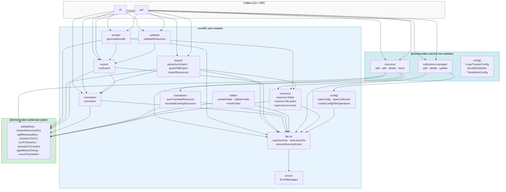
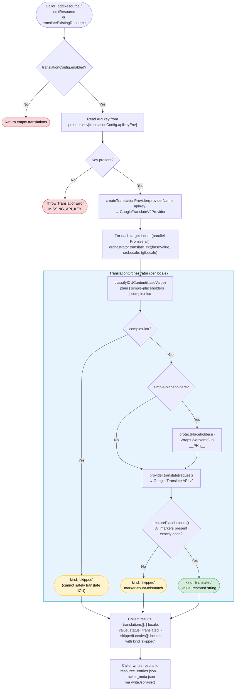

# Core Library (`@simoncodes-ca/core`)

`@simoncodes-ca/core` is the Node.js business-logic layer of LingoTracker. It owns every operation that touches the filesystem, computes checksums, calls external APIs, or orchestrates multi-step pipelines. The library depends on `@simoncodes-ca/domain` for pure logic and types, but is never imported by the browser-facing Tracker UI. All three applications — CLI, API, and the Angular app's server-side operations — call into this library.

Return to [architecture README](README.md).

---

## Table of Contents

- [Module Map](#module-map)
- [Public Surface](#public-surface)
- [Config and Collection Resolution](#config-and-collection-resolution)
- [Error Model](#error-model)
- [Resource CRUD Flows](#resource-crud-flows)
  - [Collection-bound operations](#collection-bound-operations)
  - [Locale seeding](#locale-seeding)
  - [add-resource](#add-resource)
  - [edit-resource](#edit-resource)
  - [delete-resource](#delete-resource)
  - [move-resource](#move-resource)
- [Normalization Pipeline](#normalization-pipeline)
- [Auto-Translation Pipeline](#auto-translation-pipeline)
  - [Provider abstraction](#provider-abstraction)
- [Import Pipeline](#import-pipeline)
- [Export Pipeline](#export-pipeline)
- [Bundle Generation](#bundle-generation)
- [Validation for CI/CD](#validation-for-cicd)

---

## Module Map

`@simoncodes-ca/core` is organized into two root-level groupings and one `lib/` subdirectory that holds the deeper sub-modules.

```
libs/core/src/
├── index.ts                      # Public barrel — named exports grouped by role (see Public Surface)
├── constants.ts                  # CONFIG_FILENAME, DEFAULT_CONFIG (public); resource/meta filenames (internal)
│
├── config/                       # Config types used at the root of the package
│   ├── lingo-tracker-config.ts   # LingoTrackerConfig interface
│   ├── lingo-tracker-collection.ts # Collection config (incl. protectedTermsFile pointer)
│   ├── bundle-definition.ts      # BundleDefinition, CollectionBundleDefinition, EntrySelectionRule
│   └── translation-config.ts     # TranslationConfig (provider name, API key env var)
│
├── resource/                     # Resource CRUD on an opened Collection — reads/writes resource_entries.json + tracker_meta.json
│   ├── add-resource.ts           # addResource(): create or overwrite a single entry
│   ├── edit-resource.ts          # editResource(): update value, comment, tags, or locale values; moveTo moves the entry
│   ├── locale-seeding.ts         # seedLocales(): what target locales get when a base value is written
│   ├── delete-resource.ts        # deleteResource(): remove one or more entries by key
│   ├── move-resource.ts          # moveResource(): rename/relocate entries (single or wildcard)
│   ├── checksum.ts               # calculateChecksum(): MD5 via node:crypto
│   ├── resource-entry.ts         # ResourceEntry, ResourceEntries interfaces
│   ├── resource-entry-metadata.ts # ResourceEntryMetadata interface
│   └── tracker-metadata.ts       # TrackerMetadata interface
│
├── collections-manager/          # Collection-level operations (create / delete / update in config)
│   ├── add-collection.ts         # addCollection()
│   ├── delete-collection-by-name.ts # deleteCollectionByName()
│   ├── set-protected-terms.ts    # setGlobal/CollectionProtectedTerms(): write the terms file; setGlobal/CollectionProtectedTermsFile(): move the pointer
│   └── update-collection.ts      # updateCollection() — async; diffs locale list and calls addLocaleToCollection / removeLocaleFromCollection
│
└── lib/                          # Deeper sub-modules
    ├── bundle/                   # Bundle generation pipeline
    │   ├── generate-bundle.ts    # generateBundle(): main entry point
    │   ├── resource-loader.ts    # loadCollectionResources(): flat resource list per locale
    │   ├── hierarchy-builder.ts  # buildHierarchy(): dot-keys → nested JSON object
    │   ├── pattern-matcher.ts    # matchesPattern(): glob-style key filtering
    │   ├── tag-filter.ts         # matchesTags(): AND/OR tag filter logic
    │   └── type-generation/      # TypeScript type file generation from bundle keys
    │
    ├── config/                   # Config file I/O and collection resolution
    │   ├── load-config.ts        # loadConfig(): the only reader of .lingo-tracker.json
    │   ├── open-collection.ts    # openCollection(): a collection's effective settings (Collection)
    │   ├── config-file-operations.ts # read/write/update .lingo-tracker.json (reads via loadConfig)
    │   └── protected-terms-file.ts   # Resolve, read, and write protected-terms JSON files (cached per path)
    │
    ├── export/                   # The Export run
    │   ├── run-export.ts         # runExport(): the Export run; exportTargetLocales()
    │   ├── export-common.ts      # loadResourcesFromCollections(): shared resource walker; filterResources(); validateBasePropertyName()
    │   ├── export-to-json.ts     # JSON exporter (internal to runExport)
    │   ├── export-to-xliff.ts    # XLIFF 1.2 exporter (internal to runExport)
    │   ├── export-summary.ts     # Markdown export summary (internal to runExport)
    │   └── types.ts              # ExportOptions, ExportResult, FilteredResource, etc.
    │
    ├── import/                   # The Import run; barrel exports only the public interface
    │   ├── import-resources.ts   # importResources(): the Import run over one collection
    │   ├── parse-json-import.ts  # parseJsonImport(): JSON adapter (flat / hierarchical / rich objects)
    │   ├── parse-xliff-import.ts # parseXliffImport(): XLIFF 1.2 adapter
    │   ├── import-session.ts     # ImportSession: settings + accumulated changes, warnings, errors, files
    │   ├── process-resource-group.ts # Applies one folder's resources (internal)
    │   ├── resource-grouping.ts  # groupResourcesByFolder(): batches resources by target path
    │   ├── determine-status.ts   # Which source status an import honours
    │   ├── apply-icu-auto-fix.ts # applyICUAutoFixToResources(): repairs malformed placeholders
    │   ├── normalize-transloco-syntax.ts # {{ x }} → {x} before storage
    │   ├── load-base-locale-values.ts    # Reads current base values for the auto-fix
    │   ├── import-statistics.ts  # Counts created / updated / skipped / failed
    │   ├── import-summary.ts     # generateImportSummary(): Markdown import summary
    │   ├── import-validation.ts  # Validates imported resources before write
    │   └── types.ts              # ImportRunOptions, ImportResult, ImportedResource, etc.
    │
    ├── validate/                 # CI/CD validation pipeline
    │   ├── validate-resources.ts # validateResources(): full cross-collection status check
    │   ├── validate-icu.ts       # validateIcuValues(): compiles each value under its own locale
    │   └── generate-validation-summary.ts # Human-readable validation result summary
    │
    ├── normalize/                # Normalization pipeline
    │   ├── normalize.ts          # normalize(): main entry point
    │   ├── normalize-entry.ts    # normalizeEntry(): single-entry checksum + status repair
    │   ├── cleanup-empty-folders.ts # cleanupEmptyFolders(): removes empty directories
    │   ├── iterative-folder-walker.ts # walkFolders(): depth-ordered directory traversal
    │   └── folder-utils.ts       # Path helpers for the walker
    │
    ├── translation/              # Auto-translation provider abstraction
    │   ├── translation-provider.ts       # TranslationProvider interface, TranslationError
    │   ├── translation-provider-factory.ts # createTranslationProvider(): factory by name
    │   ├── google-translate-v2.provider.ts # GoogleTranslateV2Provider implementation
    │   ├── auto-translate-resources.ts   # autoTranslateResource(): orchestrate per-locale calls
    │   ├── translate-existing-resource.ts # translateExistingResource(): translate new/stale entries
    │   ├── placeholder-protector.ts      # protectPlaceholders() / restorePlaceholders()
    │   └── translation-orchestrator.ts   # Wraps provider call with placeholder protection
    │
    ├── folder/                   # Folder-level filesystem operations
    │   ├── create-folder.ts      # createFolder(): mkdir with segment validation
    │   ├── delete-folder.ts      # deleteFolder(): recursive removal
    │   └── move-folder.ts        # moveFolder(): rename + resource re-key
    │
    ├── file-io/                  # Low-level JSON read/write helpers (internal; no barrel)
    │   ├── json-file-operations.ts  # readJsonFile(), writeJsonFile(), typed helpers
    │   └── directory-operations.ts  # ensureDirectoryExists()
    │
    └── errors/                   # Error messages and typed errors
        ├── error-messages.ts     # ErrorMessages: static error string builders (internal)
        └── lingo-tracker-error.ts # LingoTrackerError and its typed subclasses (see Error Model)
```

<!-- Module relationship graph within @simoncodes-ca/core -->



For the entity types (`ResourceEntry`, `TrackerMetadata`, `LocaleMetadata`) that these modules read and write, see [domain-and-data-model.md](domain-and-data-model.md).

---

## Public Surface

`libs/core/src/index.ts` is the [public surface](glossary.md#public-surface): 172 names, listed one by one and grouped by role. It exports only what the API or CLI uses, plus the types in those names' signatures. It does not re-export `domain` names; callers import `TranslationStatus`, `TokenCasing` and `ImportStrategy` from `@simoncodes-ca/domain`.

| Group | What it holds |
|---|---|
| Operations | The entry points the apps call. Resources: `addResource`, `editResource`, `deleteResource`, `moveResource`. Folders: `createFolder`, `deleteFolder`, `moveFolder`. Collections and locales: `addCollection`, `updateCollection`, `deleteCollectionByName`, `addLocaleToCollection`, `removeLocaleFromCollection`, `setGlobal/CollectionProtectedTerms[File]`. Bundles: `generateBundle`, `planBundle`, `add/update/deleteBundleDefinition`, `validateBundleKey`, `validateBundleDefinition`, `getBundleOutputPath`, `hasTypeDistConfigured`. Import: `importResources` and its adapters. Export: `runExport`, `exportTargetLocales`, the export argument checks, `loadResourcesFromCollections`. Also `normalize`, `translateLocale`, `translateExistingResource`, `validateResources`, `generateValidationSummary`, `describePreferredTermRule`. |
| Collection & config | `loadConfig`, `openCollection`, `Collection`, `CONFIG_FILENAME`, `DEFAULT_CONFIG`, the config types (`LingoTrackerConfig`, `LingoTrackerCollection`, `TranslationConfig`, `BundleDefinition`, ...), and the protected-terms and preferred-terminology file readers and writers. |
| ResourceFolder | `openResourceFolder`, `ResourceFolder` and the types in its methods, `resolveResourcePaths`. |
| Read models | `loadResourceTree`, `extractSubtree`, `extractResourcesRecursively`, `searchTranslations`, `searchResourceTree`, `computeTreeFingerprint`, `treeFingerprintsMatch`, `reindexMutation` and their types. The API's [Collection Index](glossary.md#collection-index) is built from these. A `ResourceTreeEntry` and a `SearchResult` (which carries the entry's `source` and `metadata`) both fit the domain `buildResourceSummary` input, which the API uses to answer with a [Resource Summary](glossary.md#resource-summary). |
| Errors | `LingoTrackerError` and every typed subclass, `TranslationError`, `PreferredTerminologyValidationError`. See [Error Model](#error-model). |
| Types | Parameter and result types for the operations above (`AddResourceParams`, `GenerateBundleResult`, `ImportResult`, ...). |

Each sub-module with a barrel (`resource/`, `collections-manager/`, and `lib/bundle`, `config`, `errors`, `folder`, `import`, `normalize`, `resource`, `translation`, `validate`) lists its own public names the same way, and the root barrel re-exports from it. `lib/export/` has no barrel, so the root barrel imports its files directly. `lib/file-io/` is internal and has no barrel. Everything else is internal: `ErrorMessages`, `calculateChecksum`, the translation provider classes, the bundle helpers, the normalize walker, `SafeAny`, and the like. Core's specs import these by relative path. Test helpers such as `setupMockFs` (`collections-manager/locale-spec-helpers.ts`) are not in any barrel.

---

## Config and Collection Resolution

Core owns the config file and the rule that turns a collection's config entry into its effective settings. The adapters (CLI, API) call two functions in `lib/config/` once per command or request, then pass the results to the per-resource operations.

- **`loadConfig({ cwd? })`** is the only reader of `.lingo-tracker.json`. It returns the file as written, with no validation and no fallbacks. It throws `ConfigNotFoundError` when the file does not exist and `ConfigParseError` when the file is not a JSON object; other I/O errors pass through. The CLI passes its `INIT_CWD`-aware directory, the API passes `process.cwd()`, and `createConfigFileOperations().read()` (used by the config writers) reads through it too.
- **`openCollection(config, name, { cwd?, writable? })`** returns a `Collection`: `name`, the absolute `translationsFolder` (resolved against `cwd`), `baseLocale` (collection, else global, else `en`; an empty string counts as unset), `locales` (collection, else global, else `[]`), `targetLocales` (`locales` without `baseLocale`), `translationConfig` (collection, else global; not merged), normalized `tags`, `readOnly`, and the raw entry as `config`. It throws `CollectionNotFoundError` for an unknown name and, when `writable` is set, `ReadOnlyCollectionError` for a read-only collection.

The fallback rule lives only in `openCollection`. The collection operations in `collections-manager/` (`addLocaleToCollection`, `removeLocaleFromCollection`, `updateCollection`) use it for their locale checks. The [Import run](glossary.md#import-run) and the [Export run](glossary.md#export-run) take `Collection` objects, so they read the base locale and locales from there and never read the config file. The resource and folder operations (`addResource`, `editResource`, `deleteResource`, `moveResource`, `translateExistingResource`, `createFolder`, `deleteFolder`, `moveFolder`) take the opened `Collection` as their first parameter too, so no caller passes a base locale, a locale list, a translation config, or a `cwd`. See [Collection-bound operations](#collection-bound-operations). The typed errors extend `LingoTrackerError`; see [Error Model](#error-model).

---

## Error Model

Core raises a [typed error](glossary.md#typed-errors) for every failure that an adapter must tell apart. Each class extends `LingoTrackerError` (`lib/errors/lingo-tracker-error.ts`), has a stable `code`, and keeps its payload in typed fields. The message text comes from `ErrorMessages` (`lib/errors/error-messages.ts`), so it did not change when the types were added. The CLI prints the message; the API maps the class to an HTTP status (see [api.md — Error Mapping](api.md#error-mapping)). Neither adapter reads the message to decide what happened.

| Class | `code` | Payload | Thrown by |
|---|---|---|---|
| `ConfigNotFoundError` | `CONFIG_NOT_FOUND` | `configPath` | `loadConfig` |
| `ConfigParseError` | `CONFIG_PARSE_FAILED` | `configPath`, `reason` | `loadConfig` |
| `CollectionNotFoundError` | `COLLECTION_NOT_FOUND` | `collectionName` | `openCollection`, `deleteCollectionByName`, `updateCollection`, `setCollectionProtectedTerms`, `setCollectionProtectedTermsFile` |
| `CollectionAlreadyExistsError` | `COLLECTION_ALREADY_EXISTS` | `collectionName` | `addCollection`, `updateCollection` (rename) |
| `ReadOnlyCollectionError` | `COLLECTION_READ_ONLY` | `collectionName` | `openCollection` with `{ writable: true }` |
| `InvalidLocaleError` | `INVALID_LOCALE` | `locale` | `addLocaleToCollection`, `removeLocaleFromCollection` |
| `LocaleNotFoundError` | `LOCALE_NOT_FOUND` | `locale`, `collectionName` | `removeLocaleFromCollection`; `addResource` / `editResource` for a supplied translation in a locale the collection does not have |
| `LocaleAlreadyExistsError` | `LOCALE_ALREADY_EXISTS` | `locale`, `collectionName` | `addLocaleToCollection` |
| `BaseLocaleImmutableError` | `BASE_LOCALE_IMMUTABLE` | `locale` | `addLocaleToCollection`, `removeLocaleFromCollection` |
| `InvalidResourceKeyError` | `INVALID_RESOURCE_KEY` | `key` | `validateAndResolvePaths` (so `addResource`, `editResource` including its `moveTo`, `translateExistingResource`) |
| `ResourceNotFoundError` | `RESOURCE_NOT_FOUND` | `key` | `editResource`, `translateExistingResource` |
| `ResourceAlreadyExistsError` | `RESOURCE_ALREADY_EXISTS` | `key` | `editResource` with a `moveTo` whose folder already has the entry key |
| `InvalidFolderPathError` | `INVALID_FOLDER_PATH` | `part`, `segment` | `createFolder`, `deleteFolder`, `moveFolder` |
| `FolderNotFoundError` | `FOLDER_NOT_FOUND` | `folderPath` | `deleteFolder`, `moveFolder` (source missing or not a directory) |
| `FolderMoveIntoDescendantError` | `FOLDER_MOVE_INTO_DESCENDANT` | `sourceFolderPath`, `destinationFolderPath` | `moveFolder` (same collection) |
| `AutoTranslationDisabledError` | `AUTO_TRANSLATION_DISABLED` | `collectionName` | `translateExistingResource` |
| `BundleNotFoundError` | `BUNDLE_NOT_FOUND` | `bundleName` | `updateBundleDefinition`, `deleteBundleDefinition` |
| `BundleAlreadyExistsError` | `BUNDLE_ALREADY_EXISTS` | `bundleName` | `addBundleDefinition`, `updateBundleDefinition` (rename) |
| `InvalidBundleDefinitionError` | `INVALID_BUNDLE_DEFINITION` | `errors[]` | bundle definition add / update |
| `TranslationError` | provider code (`MISSING_API_KEY`, `RATE_LIMIT`, `INVALID_REQUEST`, …) | `retryable`, `providerErrorCode` | translation providers, `autoTranslateResource` |
| `PreferredTerminologyValidationError` | `INVALID_PREFERRED_TERMINOLOGY` | `errors[]` | `writePreferredTerminology` |

Rules:

- **Domain validators stay untyped.** `@simoncodes-ca/domain` has no error classes. `validateKey`, `validateTargetFolder`, and `validateLocale` throw a plain `Error`. Core wraps each call in one place and throws the typed error with the same message: `validateAndResolvePaths` for keys and target folders, and `assertValidLocale` (`collections-manager/assert-valid-locale.ts`) for locales.
- **Batch operations report per-item failures, not throw.** `deleteResource`, `moveResource`, and `moveFolder` put per-key failures into their result (`errors`) as strings. Bad input to the whole operation (a malformed folder path, a missing folder, a move into the folder's own descendant) is a typed error.
- **Unexpected failures stay `Error`.** File I/O errors, invariant breaks (for example `ResourceFolder`'s "Resource entry not found"), and parser errors for import files are not typed. An adapter treats them as "something went wrong" and shows the message.

---

## Resource CRUD Flows

Resource CRUD is implemented across four functions in `libs/core/src/resource/`, each bound to an opened `Collection`. Each function follows the same structural pattern: resolve the dot-delimited [resource key](glossary.md#resource-key) to a filesystem path, load the current JSON files, apply changes, recompute [checksums](glossary.md#checksum) and [translation status](glossary.md#translation-status), then write both files back. Both files are always written together by one call (`ResourceFolder.save()`); the writes are sequential, not atomic.

**All writes go through `ResourceFolder`.** `openResourceFolder(folderPath, { baseLocale })` in `lib/resource/resource-folder.ts` is the only owner of a [resource folder](glossary.md#resource-folder) (`resource_entries.json` + `tracker_meta.json`). Add, edit, delete, move, import, normalize, translate-locale, translate-existing-resource, and add/remove-locale all load the pair through it, change it with `setBase` / `setTranslation` / `setStatus` / `setDetails` / `setEntry` / `seedLocale` / `dropLocale` / `remove`, and persist with `save()` (which deletes both files when the folder becomes empty). `ResourceFolder` computes the checksums and applies the domain [staleness rule](glossary.md#staleness-rule) (`applyBaseChange`, `recordTranslation` in `libs/domain/src/lib/staleness.ts`), so no caller builds `{ checksum, baseChecksum, status }` by hand. Readers (tree loading, search, folder move/delete, folder cleanup) use it too, and `resolveResourcePaths()` is the only function that maps a key to its folder.

**Writes return what changed.** Every write (add, edit, delete, move, translate-existing-resource, folder create/delete/move, add/remove-locale) returns `mutations: ResourceMutation[]` (`lib/resource/resource-mutation.ts`) next to its other results: an `upsert` with the stored entry as `ResourceFolder.treeEntry()` reads it, a `remove`, an `add-folder` / `remove-folder`, or a `reindex` when the change is too broad to describe. Each mutation carries the absolute translations folder it applies to. A move returns an `upsert` at the destination and a `remove` at the source for each moved key, and a folder move adds a `remove-folder` for the deleted source. The API's [Collection Index](glossary.md#collection-index) uses them to follow the disk without reading it again; the CLI ignores them. See [Resource Mutation](glossary.md#resource-mutation).

### Collection-bound operations

Every resource and folder operation takes an opened [Collection](glossary.md#collection-resolved) as its first parameter, like the Import run:

```ts
addResource(collection, { key, baseValue, comment?, tags?, targetFolder?, translations? })
editResource(collection, key, { baseValue?, comment?, tags?, translations?, moveTo? })
deleteResource(collection, { keys })
moveResource(collection, { source, destination, override?, destinationCollection? })
translateExistingResource(collection, key)
createFolder(collection, { folderName, parentPath? })
deleteFolder(collection, { folderPath })
moveFolder(collection, { sourceFolderPath, destinationFolderPath, override?, nestUnderDestination?, destinationCollection? })
```

The base locale, the target locales, and the translation config come only from the `Collection`; there is no `'en'` fallback and no `cwd` (the `translationsFolder` is absolute). A cross-collection move takes the destination as a second `Collection`.

**Key placement.** `addResource` stores `targetFolder.key` (`resolveResourceKey`, applied by `validateAndResolvePaths`). `editResource` takes the entry's full, existing key. Its `moveTo` is a destination folder (`''` is the collection root): the entry keeps its entry key (the last segment) and moves there, as a lossless copy, after the edit is saved. The destination must not already have that entry key (`ResourceAlreadyExistsError`). This is checked before anything is written, and again on a fresh read of the destination just before the move, because auto-translation may run in between; a collision found then throws with the edit already saved in the source folder. The destination is written before the source entry is removed.

### Locale seeding

[Locale seeding](glossary.md#locale-seeding) (`seedLocales` in `resource/locale-seeding.ts`) decides what each of `collection.targetLocales` gets when a base value is written:

1. A translation the caller supplied → the caller's value and status.
2. Else, when `collection.translationConfig` is enabled → `autoTranslateResource()` (status `translated`).
3. Else, or when the provider skipped the locale (ICU) → a copy of the base value with status `new`.

`addResource` applies it to every target locale. `editResource` applies it after a base value change, to the locales that need work by the [staleness rule](glossary.md#staleness-rule) (`needsTranslation` after `setBase`), with one limit: step 3 never overwrites a real translation. Only a missing locale, or one that held an untranslated copy of the old base, gets the copy; a real translation stays, marked `stale`. A supplied translation for a locale that is not in the collection throws `LocaleNotFoundError`; a value for the base locale is ignored.

### add-resource

**Entry point:** `addResource(collection, params)`

Steps:

1. **Resolve paths** — `validateAndResolvePaths()` calls `resolveResourceKey()` and `splitResolvedKey()` from `@simoncodes-ca/domain` to derive `folderPath`, `resourceEntriesPath`, `trackerMetaPath`, and `entryKey`.
2. **Ensure directory** — `ensureDirectoryExists()` creates the folder tree with `mkdirSync({ recursive: true })`.
3. **Load existing files** — `openResourceFolder()` loads both files (missing files are empty).
4. **Normalize base value** — `translocoToICU()` converts any Transloco `{{ varName }}` syntax in the incoming base value to ICU `{varName}` before storage.
5. **Resolve translations** — [locale seeding](#locale-seeding): supplied translations first, then auto-translation or a copy of the base as `new` for every other target locale. All values are resolved before anything is written, so a provider failure writes nothing.
6. **Replace the entry** — `setEntry` / `setBase` / `setDetails` / `setTranslation` on the `ResourceFolder`. A translation equal to the base value is stored as `new`.
7. **Write files** — `folder.save()` writes both `resource_entries.json` and `tracker_meta.json`.

### edit-resource

**Entry point:** `editResource(collection, key, changes)`

Steps:

1. **Resolve paths and load** — same as add-resource. `key` is the entry's full key. A `moveTo` is resolved and checked for a collision before anything changes.
2. **Throws if not found** — exits immediately if either JSON file or the specific entry key is absent.
3. **Update base value** (if changed) — `translocoToICU()` normalizes the incoming value; `folder.setBase()` recomputes the base checksum and applies the [staleness rule](glossary.md#staleness-rule) to every non-base locale.
4. **Update comment/tags** — simple field overwrites with change detection to avoid unnecessary writes.
5. **Update locale values** — for each locale in `changes.translations`, normalizes with `translocoToICU()`, recomputes checksum via `calculateChecksum()`, and updates `status` (defaults to `'translated'` if not provided).
6. **Persist initial changes** — `folder.save()` before attempting auto-translation, so the base value change is durable even if the translation API call fails.
7. **Seed on base change** — if the base value changed, [locale seeding](#locale-seeding) runs for the locales that need work and were not supplied; results are written by a second `folder.save()`.
8. **Move** — with a `moveTo` naming another folder, the entry is copied as stored to the destination and removed from the source. The result's `resolvedKey` is the destination key, and `mutations` are an `upsert` there and a `remove` at the source.

### delete-resource

**Entry point:** `deleteResource(collection, { keys })`

Steps:

1. **Validate each key** — `validateKey()` from `@simoncodes-ca/domain`.
2. **Resolve paths** — `resolveResourcePaths()`.
3. **Remove** — `folder.remove(entryKey)` removes the entry and its metadata.
4. **Save** — `folder.save()` rewrites both files, or deletes both when the folder has no entries left.
5. **Batch errors** — errors per key are collected and returned; the operation does not stop on first failure.

### move-resource

**Entry point:** `moveResource(collection, { source, destination, override, destinationCollection })`

Two modes:

- **Single key move** (`moveSingleResource`) — validates source and destination keys, checks for collision at destination (returns warning unless `override` is set), copies the entry and its metadata to the destination with `setEntry()` (lossless: values, comment, tags, checksums, and statuses such as `verified` and `stale` are kept; no auto-translation), then calls `deleteResource()` at the source. `moveFolder()` moves each resource this way.
- **Wildcard pattern move** (`moveResourcesByPattern`) — patterns ending with `*` are expanded by `walkFolders()` to enumerate all keys under the prefix, then each key is moved individually using `moveSingleResource()`.

---

## Normalization Pipeline

**Entry point:** `normalize(params)` in `lib/normalize/normalize.ts`

[Normalization](glossary.md#normalization) is a repair and synchronization pass over the entire `translationsFolder`. It is designed to be idempotent and non-destructive — it never removes existing translation values.

Steps:

1. **Walk folders** — `walkFolders()` in `iterative-folder-walker.ts` traverses the directory tree iteratively (not recursively), grouping folders by depth level. Folders at the same depth are processed concurrently (`Promise.all`), but since all I/O inside is synchronous (`fs.readFileSync` / `fs.writeFileSync`), there is no interleaving risk.
2. **Load files per folder** — `loadResourceFiles()` reads `resource_entries.json` and `tracker_meta.json`, skipping folders with invalid JSON and emitting a console warning.
3. **Normalize each entry** — `normalizeEntry()` in `normalize-entry.ts` performs per-entry normalization:
   - Recomputes the base locale checksum and updates `tracker_meta.json` if it changed.
   - For each configured locale: adds a placeholder entry (base value copied, status `new`) if the locale is missing entirely; recomputes the translation checksum; updates status to `stale` if the stored `baseChecksum` no longer matches the current base checksum; converts any Transloco `{{ varName }}` syntax in stored values to ICU via `translocoToICU()` (tracked as `valuesConverted`).
4. **Persist changes** — if any entry in a folder changed, both JSON files are rewritten. If the files did not exist (orphaned folder), they are created.
5. **Dry-run mode** — when `dryRun: true`, all file writes are skipped and counters still reflect what *would* change.
6. **Cleanup empty folders** — after all folders are processed, `cleanupEmptyFolders()` removes any directories that no longer contain `resource_entries.json`.

Returns a `NormalizeResult` with counts: `entriesProcessed`, `localesAdded`, `valuesConverted`, `filesCreated`, `filesUpdated`, `foldersRemoved`.

---

## Auto-Translation Pipeline

**Entry point:** `autoTranslateResource(params)` in `lib/translation/auto-translate-resources.ts`

This pipeline is called by [locale seeding](#locale-seeding) (so from `addResource()` and from `editResource()` on a base value change), and also from the standalone `translateExistingResource()` function which targets only entries with `new` or `stale` status.

<!-- Auto-translation pipeline flowchart -->



### Provider abstraction

The `TranslationProvider` interface in `translation-provider.ts` defines the contract that all translation backends must satisfy:

```typescript
interface TranslationProvider {
  translate(requests: TranslateRequest[]): Promise<TranslateResult[]>;
  getCapabilities(): ProviderCapabilities;
}
```

`createTranslationProvider(providerName, apiKey)` in `translation-provider-factory.ts` is the single switch-point that maps a provider name string to a concrete implementation. Today only `'google-translate'` is supported, instantiating `GoogleTranslateV2Provider`. Adding a new provider (e.g. DeepL) requires:

1. Implementing `TranslationProvider`.
2. Adding one `case` branch in `createTranslationProvider()`.
3. Updating `TranslationConfig` to accept the new provider name.

**Why a single factory instead of a plugin registry?** LingoTracker currently has one provider. A plugin-registry pattern (dynamic module loading, registration maps) would add indirection and surface area for no concrete benefit. The factory switch is O(1), statically typed, and the full provider list is visible at a glance. If a second provider ships, the factory grows by four lines. This is "extensible without over-engineering" — the abstraction boundary (`TranslationProvider`) is clean; the wiring (`createTranslationProvider`) is simple until it needs to be otherwise.

The `TranslationOrchestrator` class sits between `autoTranslateResource()` and the provider. It is responsible for:

- Calling `classifyICUContent()` from `@simoncodes-ca/domain` to decide whether the string is safe to send to the provider.
- Calling `protectPlaceholders()` before the provider call and `restorePlaceholders()` after, to prevent the translation engine from mutating ICU variable names.
- Returning a discriminated union (`kind: 'translated' | 'skipped'`) so callers can distinguish success from graceful skip without exception handling.

The [ICU format](glossary.md#icu-format) classification determines safety: `plain` and `simple-placeholders` strings are sent (with placeholder protection for the latter); `complex-icu` strings (containing `plural`, `select`, or `selectordinal`) are skipped entirely because machine translation cannot reliably preserve nested ICU syntax.

---

## Import Pipeline

**Entry points:** `parseJsonImport(filePath)` / `parseXliffImport(filePath)` (format adapters) and `importResources(collection, resources, options)` (the [Import run](glossary.md#import-run)), in `lib/import/`.

An import has two parts. A **format adapter** reads one file and returns `ImportedResource[]` (`key`, `value`, optional `baseValue`, `comment`, `tags`, `status`). `parseJsonImport` detects a flat (`{"common.ok": "OK"}`) or hierarchical (`{common: {ok: "OK"}}`) structure with `detectJsonStructure()` and accepts rich objects; `parseXliffImport` (async) turns each trans-unit with a target into a resource. Adapters throw when the file is missing or malformed, and they know nothing about collections.

`importResources(collection, resources, options)` then applies the resources to one locale of the collection. It is synchronous, and the only entry point for the steps below. The CLI does `detectImportFormat` → adapter → `importResources` → `generateImportSummary`.

1. **Open the session** — `openImportSession(collection, options)` applies the strategy defaults for `createMissing`, `updateComments`, and `updateTags` (explicit options win) and refuses an import into `collection.baseLocale` unless the strategy is `migration`. The `ImportSession` holds the resolved options and collects `changes`, `warnings`, `errors`, `filesModified`, and the ICU fix records; each later step appends to it.
2. **Resolve references** (`migration` only) — `resolveAllReferences()` from `@simoncodes-ca/domain` inlines Transloco key references (`{{t('key')}}`, `{{key}}`) between the imported values. Missing and circular references stay literal and add a warning.
3. **Normalize syntax** — `normalizeTranslocoSyntaxInResources()` converts Transloco `{{ varName }}` to ICU `{varName}`.
4. **ICU auto-fix** — `applyICUAutoFixToResources()` repairs placeholders that differ from the stored base value (for example, a translated placeholder name), using `icuAutoFixer` from `@simoncodes-ca/domain`. Fixes and failures are recorded separately in the result.
5. **Validate** — `validateImportResources()` fails invalid keys and hierarchical conflicts, skips empty values, and warns on duplicate and very long keys, before any write.
6. **Group by folder** — `groupResourcesByFolder()` batches resources by their [resource folder](glossary.md#resource-folder), so each folder is read and written once.
7. **Process each group** — `processResourceGroup(session, group)` opens the folder with `openResourceFolder()` and applies each resource according to the [import strategy](glossary.md#import-strategy). A missing resource is skipped unless `createMissing` is set; a target-locale creation needs a `baseValue`. A base-locale import writes base values, and `ResourceFolder.setBase()` applies the [staleness rule](glossary.md#staleness-rule); on those imports every written value is checked against the preferred terminology (advisory warnings). A target-locale import warns on a `baseValue` mismatch, then runs `findProtectedTermViolations(storedSource, incomingValue, terms)`: a term that appears in the stored source and is missing from the incoming translation fails that entry with `Protected term(s) altered: …`, and the rest of the group is unaffected. Otherwise `resolveImportStatus()` (domain) decides the status. The folder is saved once, only when it changed and never in a dry run.
8. **Build the result** — `sessionResult()` derives the counts and status transitions from the session's changes and returns the `ImportResult`.

The caller passes `options.protectedTerms` and `options.preferredTerminology` (read from disk by the adapter layer), so the run itself reads no config. `generateImportSummary(result, { ...options, format, source })` renders the Markdown summary; the format and file path come from the caller because the run does not know where the resources came from.

Import strategies control how the merge behaves:

| Strategy | `createMissing` default | `updateComments` default | Base locale allowed |
|---|---|---|---|
| `translation-service` | false | false | No |
| `verification` | false | false | No |
| `migration` | true | true | Yes |
| `update` | false | false | No |

For the full sequence diagram of an import operation, see [user-flows.md — Import / Export Flow](user-flows.md#2-import--export-flow).

---

## Export Pipeline

**Entry point:** `runExport(collections, options)` in `lib/export/run-export.ts` (the [Export run](glossary.md#export-run)).

Export writes the resources of one or more collections to one file per target locale. `runExport` is the only entry point; the JSON and XLIFF exporters, the resource filter, and the summary are its internals. The CLI keeps the prompts, the output-directory and `--base-property-name` checks, the console rendering, and the write of the summary file (or, in a dry run, printing it).

1. **Choose the locales** — `exportTargetLocales(collections, options.locales)` lists every collection's target locales (a `Collection`'s `targetLocales`: its locales without its base locale) in order of first appearance, narrowed to the requested ones. The CLI calls it too, to print the plan before the run. The collections must share one base locale, because an export file has one source language; otherwise `runExport` throws.
2. **Load resources** — `loadResourcesFromCollections()` in `export-common.ts` walks each translations folder via `walkFolders()` and reads every `resource_entries.json` with its `tracker_meta.json`. Each entry becomes a `LoadedResource` with `source`, `translations`, `status`, `tags`, `collectionTags`, `collectionProtectedTerms`, and `comment`.
3. **Filter per locale** — for each locale, only the collections that have that locale as a target contribute. `filterResources()` keeps the resources whose status (missing counts as `new`) matches `options.status` and whose effective tags (`effectiveTags(collectionTags, resourceTags)` from `libs/domain/src/lib/effective-tags.ts`) match `options.tags`. A locale with no match is skipped, and `onProgress` reports it.
4. **Annotate protected terms** — `filterResources()` calls `findProtectedTerms(source, effectiveProtectedTerms(global, collection))` on each row and stores the matches on `FilteredResource.protectedTermsFound`. The caller reads the term lists from disk and passes them as `options.protectedTerms` (`global`, and `collections` by name), so the run reads no config. `augmentProtectedTerms: false` (the `--no-protect-notes` flag) leaves the field `undefined`.
5. **Serialize** — the JSON exporter writes a flat or hierarchical file (hierarchical key conflicts are reported separately); the XLIFF exporter writes an XLIFF 1.2 document with `<trans-unit>` elements and `<note>` elements for comments. `protectedTermsFound` becomes a `doNotTranslate` array in rich JSON and a `Do not translate: …` note in XLIFF. An exporter that throws fails only its locale; the run continues.
6. **Report** — `ExportRunResult` is the totals over all locales (`ExportResult`: files, resource count, warnings, errors, hierarchical conflicts), one `localeResults` entry per locale (`exported`, `skipped`, or `failed`, with the exception message when an exporter threw), and the Markdown `summary`.

For the full sequence diagram, see [user-flows.md — Import / Export Flow](user-flows.md#2-import--export-flow).

---

## Protected Terms Resolution

**Entry points:** `lib/config/protected-terms-file.ts`

Core owns the resolution of protected terms, because they live in standalone JSON files rather than in `.lingo-tracker.json`.

Domain owns the pure logic: `normalizeProtectedTerms()`, `effectiveProtectedTerms()`, `findProtectedTerms()`, and `findProtectedTermViolations()`. Domain reads no files.

Resolution rules:

| Scope | Pointer | Default when absent |
|---|---|---|
| Global | `config.protectedTermsFile` | `.lingo-tracker-protected-terms.json` beside the config |
| Collection | `collection.protectedTermsFile` | None — the collection contributes no terms |

Core resolves both settings against the directory that holds `.lingo-tracker.json`. It uses an absolute path as it stands.

`readEffectiveProtectedTerms(config, collection, cwd)` returns the combined list. `resolveProtectedTermsForConfig(config, cwd)` reads every scope in one pass, which suits read-only consumers such as the API.

Core caches reads in a module-level `Map` keyed by absolute path. It hands back a copy of each entry, so a caller that mutates the result leaves the cache intact. `writeProtectedTermsFile()` refreshes the entry it wrote, and `clearProtectedTermsFileCache()` drops every entry.

The two failure modes differ on purpose. An **absent** file reads as an empty list, and this is the normal state before the first term is added. Core warns only when the path came from an explicit setting.

**Malformed** content throws. That covers invalid JSON, a payload that is not an array, and an element that is not a string. An empty list here would protect nothing, and altered brand names would reach the resources through import with nobody seeing it.

Writes normalize the list, sort it alphabetically, and end the file with a newline. Adding a term therefore produces a one-line diff.

The pointer-setting functions call `assertWritableProtectedTermsPath()` *before* they mutate the config. A bad path therefore fails first, and the config keeps pointing at a file that can exist.

---

## Bundle Generation

**Entry point:** `generateBundle(params)` in `lib/bundle/generate-bundle.ts`

[Bundle](glossary.md#bundle) generation aggregates resources from one or more collections into a single locale JSON file per configured locale, converting [ICU format](glossary.md#icu-format) to Transloco syntax in the process.

Key steps:

1. **Resolve configuration** — token casing, ICU-to-Transloco transformation flag, and target locales are resolved via a three-level priority chain: CLI override → bundle config → global config → default.
2. **Load resources** — `loadCollectionResources()` reads flat `{key: value}` pairs for the target locale and base locale, falling back to the base locale value when a translation is absent.
3. **Filter entries** — `EntrySelectionRule` objects in the `BundleDefinition` combine pattern matching (`matchesPattern()`) and tag filtering (`matchesTags()`) to include only the relevant subset of resources. Collections set to `'All'` skip filtering.
4. **ICU conversion** — when `transformICUToTransloco` is `true` (the default), `icuToTransloco()` from `@simoncodes-ca/domain` is called on each value. Values with malformed ICU syntax are passed through with a warning.
5. **Build hierarchy** — `buildHierarchy()` converts the flat `{dotKey: value}` map into a nested object matching the Angular Transloco expected structure.
6. **Write output** — `writeBundleFile()` creates the output directory if needed and writes the JSON file at the path defined by `bundleDefinition.dist` + `bundleDefinition.bundleName.replace('{locale}', locale)`.
7. **Type generation** — if `bundleDefinition.typeDist` is configured, `generateBundleTypes()` emits a TypeScript constant file with the translation key tree for use in Angular templates.

For a deep-dive into `BundleDefinition` configuration and the type generation sub-pipeline, see [bundle-generation.md](bundle-generation.md) *(phase 5, coming soon)*.

---

## Validation for CI/CD

**Entry point:** `validateResources(collections, targetLocales, options)` in `lib/validate/validate-resources.ts`

The validation pipeline is designed for headless CI/CD use. It loads all resources from all specified collections via `loadResourcesFromCollections()` (the same shared walker used by the export pipeline), then checks every resource key in every target locale against its stored [translation status](glossary.md#translation-status).

Categorization rules:

| Status | Default result | With `allowTranslated: true` |
|---|---|---|
| `new` | Failure | Failure |
| `stale` | Failure | Failure |
| `translated` | Failure | Warning |
| `verified` | Success | Success |

The function never stops at the first failure — it validates all resources and returns a complete `ResourceValidationResult` so the team has full visibility. The result includes:

- `passed: boolean` — `true` only when `failures.length === 0`
- `failures`, `warnings`, `successes` — `ResourceValidationDetail[]` objects with `key`, `locale`, `collection`, and `status`
- `statusCounts` — aggregate counts per status type
- `totalResourcesValidated`, `totalUniqueKeys`, `localesValidated`, `collectionsValidated`

`generateValidationSummary()` in `generate-validation-summary.ts` converts this result into a human-readable string for CLI output.

The CLI's `validate` command exits with a non-zero code when `passed` is `false`, making it suitable for use as a blocking step in CI pipelines. The `--allow-translated` flag maps directly to `options.allowTranslated`.

`ValidationOptions` also accepts an optional `skippedLocales: readonly string[]` field. This is **reporting-only** — it does not filter resources inside `validateResources()`. The CLI performs locale filtering before calling the function (removing skipped locales from `targetLocales`) and then passes the skipped list so `generateValidationSummary()` can include a `Skipped Locales: <list> (<count>)` line in the output between "Locales Validated" and "Collections Validated".

For the [staleness](glossary.md#staleness) detection mechanism that produces `stale` status entries in the first place, see [domain-and-data-model.md — Checksum-Driven Staleness Detection](domain-and-data-model.md#checksum-driven-staleness-detection).

For the CLI command signatures and flags that call into this library, see [cli.md](cli.md) *(phase 4, coming soon)*. For the API endpoints that expose these operations over HTTP, see [api.md](api.md) *(phase 4, coming soon)*.
