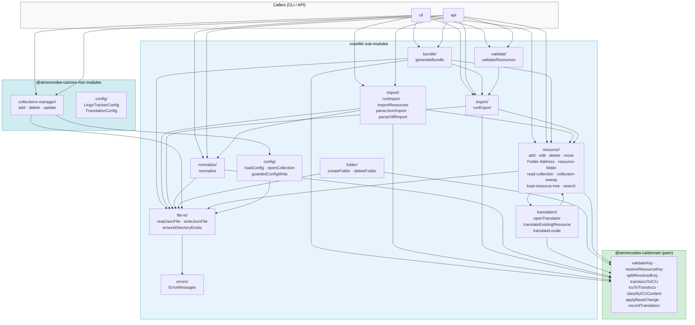
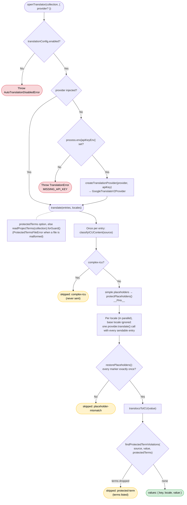

# Core Library (`@simoncodes-ca/core`)

`@simoncodes-ca/core` is the Node.js business-logic layer of LingoTracker. It owns every operation that touches the filesystem, computes checksums, calls external APIs, or orchestrates multi-step pipelines. The library depends on `@simoncodes-ca/domain` for pure logic and types, but is never imported by the browser-facing Tracker UI. All three applications — CLI, API, and the Angular app's server-side operations — call into this library.

Return to [architecture README](README.md).

---

## Table of Contents

- [Module Map](#module-map)
- [Public Surface](#public-surface)
- [Config and Collection Resolution](#config-and-collection-resolution)
- [Error Model](#error-model)
- [Resource CRUD Flows](#resource-crud-flows)
  - [Collection-bound operations](#collection-bound-operations)
  - [Locale seeding](#locale-seeding)
  - [add-resource](#add-resource)
  - [edit-resource](#edit-resource)
  - [delete-resource](#delete-resource)
  - [move-executor](#move-executor)
  - [Move Plan](#move-plan)
  - [Entry Relocation](#entry-relocation)
- [Collection Reader](#collection-reader)
  - [Resource Tree Index](#resource-tree-index)
  - [Resource Search](#resource-search)
- [Collection Set](#collection-set)
- [Collection Sweep](#collection-sweep)
- [Normalization Pipeline](#normalization-pipeline)
- [Auto-Translation Pipeline](#auto-translation-pipeline)
  - [Provider abstraction](#provider-abstraction)
- [Import Pipeline](#import-pipeline)
- [Export Pipeline](#export-pipeline)
- [Term Glossary](#term-glossary)
- [Bundle Generation](#bundle-generation)
- [Validation for CI/CD](#validation-for-cicd)

---

## Module Map

`@simoncodes-ca/core` is organized into two root-level groupings and one `lib/` subdirectory that holds the deeper sub-modules.

```
libs/core/src/
├── index.ts                      # Public barrel — named exports grouped by role (see Public Surface)
├── constants.ts                  # CONFIG_FILENAME, DEFAULT_CONFIG (public); resource/meta filenames (internal)
│
├── config/                       # Config types used at the root of the package
│   ├── lingo-tracker-config.ts   # LingoTrackerConfig interface
│   ├── lingo-tracker-collection.ts # Collection config (incl. protectedTermsFile pointer)
│   └── translation-config.ts     # TranslationConfig (provider name, API key env var)
│
├── collections-manager/          # Collection-level operations (create / delete / update in config)
│   ├── add-collection.ts         # addCollection(): validated config and optional terms write through the Collection Lifecycle
│   ├── delete-collection.ts         # deleteCollection()
│   ├── locale-files.ts           # seedLocaleFiles() / dropLocaleFiles(): the translation-file side of a locale change
│   ├── protected-terms-request.ts # protected-term request assertion and view/result types
│   ├── collection-change.ts      # changeCollection(): refusals, locale files, config/terms steps and mutation reporting
│   └── update-collection.ts      # updateCollection(): public wrapper for Collection Change
│
└── lib/                          # Deeper sub-modules
    ├── bundle/                   # Bundle generation pipeline
    │   ├── generate-bundle.ts    # generateBundle(): main entry point
    │   ├── plan-bundle.ts        # planBundle(): the dry-run plan (files, key counts, conflicts), writes nothing
    │   ├── prepare-bundle-run.ts  # Bundle Run Preparation: definition, settings, locales and collections
    │   ├── bundle-definition-operations.ts # add/update/deleteBundleDefinition(): edit `bundles` in the config file
    │   ├── bundle-selection.ts   # Bundle Selection: resolveBundleCollections() + selectBundleEntries()
    │   ├── resource-loader.ts    # loadCollectionResources(): one collection's values for one locale, via readCollection()
    │   ├── hierarchy-builder.ts  # buildBundleHierarchy(): Key Tree adapter with token conflict checks
    │   ├── pattern-matcher.ts    # matchesPattern(): glob-style key filtering
    │   ├── tag-filter.ts         # matchesTags(): AND/OR tag filter logic
    │   └── type-generation/      # generateBundleTypes(): the TypeScript type file from the selected keys
    │
    ├── collection-set/           # whole-collection read model for export, validate, glossary
    ├── config/                   # Config file I/O and collection resolution
    │   ├── load-config.ts        # loadConfig(): the only reader of .lingo-tracker.json
    │   ├── open-collection.ts    # openCollection(): a collection's effective settings (Collection)
    │   ├── collection-entry.ts   # Collection Entry: toCollectionEntry() / addCollectionEntry() / patchCollectionEntry(), pure
    │   ├── config-file-operations.ts # read/write/update .lingo-tracker.json (reads via loadConfig)
    │   ├── term-file.ts              # The term-file module: pointer resolution, read (problems reported), write (typed errors)
    │   ├── protected-terms-file.ts   # The protected-terms kind: string list, global + per-collection files
    │   ├── preferred-terminology-file.ts # The preferred-terminology kind: validated rule objects, one global file
    │   └── project-terms.ts          # readProjectTerms(collection): the terms and rules in force, with intent views
    │
    ├── export/                   # The Export run
    │   ├── run-export.ts         # runExport(): the Export run; exportTargetLocales()
    │   ├── export-common.ts      # filterResources(); validateBasePropertyName()
    │   ├── export-to-json.ts     # JSON exporter (internal to runExport)
    │   ├── export-to-xliff.ts    # XLIFF 1.2 exporter (internal to runExport)
    │   ├── export-summary.ts     # Markdown export summary (internal to runExport)
    │   └── types.ts              # ExportOptions, ExportResult, FilteredResource, etc.
    │
    ├── glossary/                 # Term Glossary: Collection Set → candidates → ranked terms
    │   ├── build-glossary.ts     # buildGlossary(): opened-collection orchestration and locale selection
    │   ├── glossary-extractor.ts # CandidateExtractor and deterministic n-gram implementation
    │   └── glossary-matcher.ts   # value matching, ranking, and per-locale status filtering
    │
    ├── import/                   # The Import run; barrel exports only the public interface
    │   ├── run-import.ts         # runImport(): source file through summary
    │   ├── import-resources.ts   # importResources(): apply already parsed resources
    │   ├── parse-json-import.ts  # parseJsonImport(): JSON adapter (flat / hierarchical / rich objects)
    │   ├── parse-xliff-import.ts # parseXliffImport(): XLIFF 1.2 adapter
    │   ├── import-session.ts     # ImportSession: settings + accumulated changes, warnings, errors, files
    │   ├── process-resource-group.ts # Applies one folder's resources (internal)
    │   ├── apply-icu-auto-fix.ts # applyICUAutoFixToResources(): repairs malformed placeholders
    │   ├── normalize-transloco-syntax.ts # {{ x }} → {x} before storage
    │   ├── load-base-locale-values.ts    # Reads current base values for the auto-fix
    │   ├── import-statistics.ts  # Counts created / updated / skipped / failed
    │   ├── import-summary.ts     # generateImportSummary(): Markdown import summary
    │   ├── import-validation.ts  # Validates imported resources before write
    │   └── types.ts              # ImportRunOptions, ImportResult, ImportedResource, etc.
    │
    ├── validate/                 # CI/CD validation pipeline
    │   ├── validate-resources.ts # validateResources(): status check per collection, with its own locales
    │   ├── validate-icu.ts       # validateIcuValues(): compiles each value under its own locale
    │   └── generate-validation-summary.ts # Human-readable validation result summary
    │
    ├── normalize/                # Normalization pipeline
    │   ├── normalize.ts          # normalize(collection): main entry point
    │   └── normalize-collections.ts # normalizeCollections(): selected collections, events and totals
    │
    ├── translation/              # Machine translation: the Translator and the operations that use it
    │   ├── translator.ts                 # openTranslator(): setup, ICU skip, placeholder + protected-term guards, ICU normalisation
    │   ├── translation-provider.ts       # TranslationProvider interface (the seam)
    │   ├── translation-provider-factory.ts # createTranslationProvider(): the Google adapter's constructor site
    │   ├── google-translate-v2.provider.ts # GoogleTranslateV2Provider adapter
    │   ├── in-memory-translation-provider.ts # InMemoryTranslationProvider adapter (internal; core specs, no network)
    │   ├── translate-existing-resource.ts # translateExistingResource(): translate one entry's new/stale locales
    │   ├── translation-run.ts            # prepareTranslationRun(): locale handles, selection, batching, tally, and mutations
    │   ├── translate-locale.ts           # TranslateLocaleProgress / TranslateLocaleResult: locale run types
    │   └── placeholder-protector.ts      # protectPlaceholders() / restorePlaceholders()
    │
    ├── resource/                 # Resource CRUD, Folder Address, folder files, and collection read models
    │   ├── folder-batch.ts       # groupByFolder() / openFolders(): batch access by full key
    │   ├── folder-address.ts     # validate, resolve and check folder addresses
    │   ├── add-resource.ts       # addResource()
    │   ├── edit-resource.ts      # editResource()
    │   ├── delete-resource.ts    # deleteResource()
    │   ├── execute-move.ts       # executeMove() / executeMoves(): key, pattern and folder moves
    │   ├── move-plan.ts          # planMove(): pure move refusals, collection identity, and destination keys
    │   ├── relocate-entries.ts   # Entry Relocation used by moves
    │   ├── checksum.ts           # MD5 checksums
    │   ├── resource-folder.ts    # openResourceFolder(): the Resource Folder (entries + metadata as a unit)
    │   ├── iterative-folder-walker.ts # walkFolders(): depth-ordered directory traversal (hidden folders skipped)
    │   ├── collection-folders.ts # walkCollectionFolders(): which folders belong to a collection (reader and sweep)
    │   ├── read-collection.ts    # readCollection(), readCollectionFolders(): the Collection Reader
    │   ├── collection-sweep.ts   # sweepCollection(), sweepKeys(): the Collection Sweep (write side)
    │   ├── folder-pruning.ts     # pruneEmptyFolders(): safe removal of empty folders
    │   ├── load-resource-tree.ts # loadResourceTree(): the API's resource tree (built on readCollectionFolders)
    │   ├── search.ts             # Resource Search; tree/page adapters remain internal
    │   ├── resource-mutation.ts  # ResourceMutation: what a write changed
    │   ├── resource-tree-index.ts # ResourceTreeIndex: tree, patches, fingerprints, subtree and search
    │   └── tree-fingerprint.ts   # computeTreeFingerprint(): stat-only change detection
    │
    ├── folder/                   # Folder-level filesystem operations
    │   ├── create-folder.ts      # createFolder(): mkdir with segment validation
    │   └── delete-folder.ts      # deleteFolder(): recursive removal
    │
    ├── file-io/                  # Low-level JSON read/write helpers (internal; no barrel)
    │   ├── json-file-operations.ts  # readJsonFile(), writeJsonFile(), typed helpers
    │   └── directory-operations.ts  # ensureDirectoryExists()
    │
    └── errors/                   # Error messages and typed errors
        ├── error-messages.ts     # ErrorMessages: static error string builders (internal)
        ├── format-rule-errors.ts # Shared preferred-terminology row formatter (internal)
        ├── lingo-tracker-error.ts # All core errors and domain details (see Error Model)
        └── index.ts             # Complete internal error barrel
```

<!-- Module relationship graph within @simoncodes-ca/core -->


```mermaid
graph TD
    subgraph apps["Callers (CLI / API)"]
        CLI["cli"]
        API["api"]
    end

    subgraph core["@simoncodes-ca/core root modules"]
        COLLECTIONS["collections-manager/\nadd · delete · update"]
        CONFIG_ROOT["config/\nLingoTrackerConfig\nTranslationConfig"]
    end

    subgraph lib["core/lib/ sub-modules"]
        BUNDLE["bundle/\ngenerateBundle"]
        EXPORT["export/\nrunExport"]
        IMPORT["import/\nrunImport · importResources\nparseJsonImport · parseXliffImport"]
        VALIDATE["validate/\nvalidateResources"]
        NORMALIZE["normalize/\nnormalize"]
        TRANSLATION["translation/\nopenTranslator\ntranslateExistingResource\ntranslateLocale"]
        FOLDER["folder/\ncreateFolder · deleteFolder"]
        FILEIO["file-io/\nreadJsonFile · writeJsonFile\nensureDirectoryExists"]
        CONFIG_LIB["config/\nloadConfig · openCollection\nguardedConfigWrite"]
        ERRORS["errors/\nErrorMessages"]
        RESOURCE_LIB["resource/\nadd · edit · delete · move\nFolder Address · resource-folder\nread-collection · collection-sweep\nload-resource-tree · search"]
    end

    subgraph domain["@simoncodes-ca/domain (peer)"]
        DOMAIN["validateKey · resolveResourceKey\nsplitResolvedKey · translocoToICU\nicuToTransloco · classifyICUContent\napplyBaseChange · recordTranslation"]
    end

    CLI --> RESOURCE_LIB
    CLI --> COLLECTIONS
    CLI --> BUNDLE
    CLI --> IMPORT
    CLI --> EXPORT
    CLI --> VALIDATE
    CLI --> NORMALIZE

    API --> RESOURCE_LIB
    API --> COLLECTIONS
    API --> BUNDLE
    API --> IMPORT
    API --> EXPORT
    API --> VALIDATE
    API --> NORMALIZE

    RESOURCE_LIB --> TRANSLATION

    BUNDLE --> FILEIO
    BUNDLE --> RESOURCE_LIB
    BUNDLE --> EXPORT
    BUNDLE --> DOMAIN

    IMPORT --> FILEIO
    IMPORT --> RESOURCE_LIB
    IMPORT --> NORMALIZE
    IMPORT --> DOMAIN

    EXPORT --> FILEIO
    EXPORT --> RESOURCE_LIB
    EXPORT --> DOMAIN

    VALIDATE --> EXPORT

    NORMALIZE --> FILEIO
    NORMALIZE --> DOMAIN

    TRANSLATION --> DOMAIN
    TRANSLATION --> RESOURCE_LIB

    FOLDER --> FILEIO
    FOLDER --> DOMAIN

    COLLECTIONS --> CONFIG_LIB
    COLLECTIONS --> FILEIO

    RESOURCE_LIB --> DOMAIN
    RESOURCE_LIB --> FILEIO

    CONFIG_LIB --> FILEIO
    FILEIO --> ERRORS

    style core fill:#d1ecf1,stroke:#17a2b8,color:#000
    style lib fill:#e8f4fd,stroke:#17a2b8,color:#000
    style domain fill:#d4edda,stroke:#28a745,color:#000
    style apps fill:#f8f9fa,stroke:#6c757d,color:#000
```

For the entity types (`ResourceEntry`, `TrackerMetadata`, `LocaleMetadata`) that these modules read and write, see [domain-and-data-model.md](domain-and-data-model.md).

---

## Public Surface

`libs/core/src/index.ts` is the [public surface](glossary.md#public-surface): it exports only names used by a consumer outside `libs/core`, plus the types those names’ signatures need. Types are erased, so the public-surface spec pins runtime values; the import analysis also covers type imports and imports in app specs. The barrel does not re-export `domain` names; callers import `TranslationStatus`, `TokenCasing`, `ImportStrategy`, `BundleDefinition` and related rules from `@simoncodes-ca/domain`.

| Group | What it holds |
|---|---|
| Operations | The entry points imported by apps. Resources: `addResource`, `addResources`, `editResource`, `deleteResource`, `executeMove`, `executeMoves`. Folders: `createFolder`, `deleteFolder`, `executeMove`. Collections and locales: `addCollection`, `updateCollection`, `deleteCollection`, `editCollectionTags`, `addLocaleToCollection`, `removeLocaleFromCollection`. Bundles: `addBundleDefinition`, `updateBundleDefinition`, `deleteBundleDefinition`, `generateBundles`, `generatePreparedBundle`, `prepareBundleRun`, `planBundle`. Import: `detectImportFormat`, `runImport`. Export: `runExport`, `exportTargetLocales`. Glossary: `buildGlossary`. Normalize: `emptyNormalizeCollectionsResult`, `normalize`, `normalizeCollections`. Translation: `prepareTranslationRun`, `translateExistingResource`. Validation: `runValidate`. |
| Collection & config | `loadConfig`, `openCollection`, `Collection`, `OpenedProject`, `OpenedCollection`, `CONFIG_FILENAME`, `DEFAULT_CONFIG`, `LingoTrackerConfig`, `LingoTrackerCollection`, `TranslationConfig`, `initConfig`, `initProject`, `InitProjectAnswers`, `InitProjectResult`, `DEFAULT_BUNDLE_DIST`, `DEFAULT_BUNDLE_NAME`, `DEFAULT_TYPE_DIST_FILE`, `displayTermPath`, `loadPreferredTerminology`, `updateProjectTerms`, `readProjectTermsView`, `preferredTerminologyRequestFromFlags`, plus the config result types `LoadPreferredTerminologyResult` and `ResolvedProtectedTerms`. |
| Project Terms | `updateProjectTerms`, its `ProjectTermsUpdate`, `ProjectTermsUpdateView`, and `ProjectTermsUpdateReport` types, plus `ProjectTermsView` and `PreferredTerminologyFlags`, and `TerminologyFindings` used by resource writes. |
| ResourceFolder | `openResourceFolder`, `ResourceFolder`, `OpenResourceFolderOptions`, `EntryDetails`, `NormalizeEntryReport`, `ResourceFolderEntry`, and `ResourceFolderSaveResult`. |
| Collection Reader | `readCollection`, `CollectionRead`, `CollectionReadProblem`, `CollectionReadTarget`, and `StoredResource`. |
| Read models | `ResourceTreeIndex`, `ResourceTreeApplyResult`, `extractResourcesRecursively`, `searchResources`, and `normalizeSearchRequest`; signature types include `FolderChild`, `MatchType`, `ResourceMutation`, `ResourceTreeEntry`, `ResourceTreeNode`, `SearchMode`, `SearchOptions`, `SearchRequest`, `SearchPage`, `SearchResult`, `SearchableResource`, and `TreeFingerprint`. |
| Errors | `LingoTrackerError` and the typed subclasses imported by apps, including `PreferredTerminologyValidationError`. `TranslationError` stays public because implementers of the public `TranslationProvider` type must throw it. |
| Operation types | The parameter and result types needed by exported operations: `AddCollectionOptions`, `AddLocaleToCollectionOptions`, `AddLocaleToCollectionResult`, `AddResourceOptions`, `AddResourceParams`, `AddResourceResult`, `AddResourcesResult`, `BuildGlossaryOptions`, `BuildGlossaryResult`, `BundlePlan`, `BundlePlanExampleKey`, `BundlePlanFile`, `BundleProgressEvent`, `BundleRunOutcome`, `BundleTypeOutcome`, `CollectionNormalizeResult`, `CollectionTagEdit`, `CreateFolderParams`, `CreateFolderResult`, `DeleteFolderParams`, `DeleteFolderResult`, `DeleteResourceParams`, `DeleteResourceResult`, `EditResourceChanges`, `EditResourceResult`, `ExistingResourcePolicy`, `ExportFormat`, `ExportLocaleResult`, `ExportResult`, `ExportRunOptions`, `ExportRunResult`, `GenerateBundleParams`, `GenerateBundleResult`, `GenerateBundlesOptions`, `GenerateBundlesResult`, `ImportFormat`, `ImportResult`, `ImportRunOptions`, `ImportRunWarning`, `MoveFolderParams`, `MoveFolderResult`, `MoveResourceParams`, `MoveResourceResult`, `MoveResourcesOperation`, `NormalizeCollectionsOptions`, `NormalizeCollectionsResult`, `NormalizeOptions`, `NormalizeResult`, `OpenTranslatorOptions`, `PreferredTerminologyEditResult`, `PlanBundleParams`, `PrepareBundleRunParams`, `PreparedBundleRun`, `ProviderCapabilities`, `RemoveLocaleFromCollectionOptions`, `RemoveLocaleFromCollectionResult`, `RunImportOptions`, `RunImportResult`, `TranslateExistingResourceResult`, `TranslationRun`, `LocaleTranslationRun`, `TranslationRunOptions`, `TranslationRunExecutionOptions`, `TranslateLocaleProgress`, `TranslateLocaleResult`, `TranslationProvider`, `TranslateRequest`, `TranslateResult`, `UpdateBundleDefinitionOptions`, `UpdateCollectionOptions`, `ValidateRunOptions`, and `ValidateRunResult`. `LingoTrackerConfig`, `LingoTrackerCollection`, `TranslationConfig`, `Collection`, `LoadConfigOptions`, `OpenCollectionOptions`, `LoadPreferredTerminologyResult`, `ResolvedProtectedTerms`, `StoredProtectedTerms`, `TermFile`, `TermFiles`, `ErrorKind`, `ResourceEntryMetadata`, `ResourceTranslation`, `ResourceValidationResult`, and `ValidationOptions` also remain exported for their signatures. `BundleDefinition` and export argument types come from `@simoncodes-ca/domain`. |

Each sub-module with a barrel (`collections-manager/`, and `lib/bundle`, `config`, `errors`, `folder`, `import`, `normalize`, `resource`, `translation`, `validate`) keeps its own internal barrel exports. The root barrel re-exports only names with an outside consumer. `lib/export/` and `lib/glossary/` have no barrels, so the root barrel imports their entry points directly. `lib/file-io/` is internal. Other names remain available to code inside core through their implementation files or intermediate barrels; core specs import internal helpers by relative path. Test helpers live in `*.spec-helpers.ts` files, which `tsconfig.lib.json` excludes from the build: `setupMockFs` (`collections-manager/locale.spec-helpers.ts`) and the real-filesystem fixtures `useTempDir`, `testCollection`, `seedResources`, `writeFolderFiles` (`testing/temp-dir.spec-helpers.ts`). New reader specs use real temp directories rather than a mocked `fs`.

---

## Config and Collection Resolution

Core owns the config file and opens collections with domain's [Collection Settings](glossary.md#collection-settings) rule. The adapters (CLI, API) call two functions in `lib/config/` once per command or request, then pass the results to the per-resource operations.

- **`loadConfig({ cwd? })`** is the only reader of `.lingo-tracker.json`. It returns the file as written, with no validation and no fallbacks. It throws `ConfigNotFoundError` when the file does not exist and `ConfigParseError` when the file is not a JSON object; other I/O errors pass through. The CLI passes its `INIT_CWD`-aware directory, the API passes `process.cwd()`, and every request or command creates an `OpenedProject` from that read.
- **`openCollection(config, name, { cwd?, writable?, forDeletion? })`** returns a `Collection`: `name`, the absolute `translationsFolder` (resolved against `cwd`, or empty for a malformed entry opened with `forDeletion: true`), `baseLocale` (collection, else global, else `en`; an empty string counts as unset), `locales` (non-empty collection list, else global, else `[]`; an empty collection list inherits), `targetLocales` (`locales` without `baseLocale`), `translationConfig` (collection, else global; not merged), normalized `tags`, `termFiles` (the absolute paths of the protected-terms and preferred-terminology files, resolved but not read; see [Project Terms](#project-terms)), `readOnly`, and the raw entry as `config`. The `OpenedCollection` return value is also an `OpenedProject`: it carries `sourceConfig` and `projectRoot` for guarded registration and locale writes. It throws `CollectionNotFoundError` for an unknown name and, when `writable` is set, `ReadOnlyCollectionError` for a read-only collection.

`openCollection` calls `inheritCollectionSettings` from domain for `baseLocale`, `locales`, `translation` and `readOnly`. Core adds the absolute paths, target locales, tags and term files. The Tracker calls the same domain rule. It adds raw `translationsFolder` (`''` when the collection is unknown) and `translationEnabled` (`translation?.enabled === true`). Both callers use domain's `findCollectionEntry` for own-property lookup.

Each config writer receives an `OpenedProject` or `OpenedCollection` and calls core-internal `guardedConfigWrite(source)`. The guard validates the opened snapshot and compares the file with the exact bytes `loadConfig()` read. A change or disappearance raises `ConfigChangedError`; a successful write advances the baseline. An in-memory snapshot without a read version, used by tests, has no concurrency check. Collection locale changes check before touching resource files and again at the config write. `initConfig` uses an exclusive create. The [Config Write Transaction](glossary.md#config-write-transaction) restores config bytes after a failed companion write.

The write side is the [Collection Entry](glossary.md#collection-entry) (`lib/config/collection-entry.ts`): three pure functions over the in-memory config that decide what a collection's record contains. `toCollectionEntry(config, collection)` builds the minimal record: `translationsFolder` (trimmed; blank is `InvalidCollectionError`), then only what differs from the global config (`exportFolder`, `importFolder`, `baseLocale`, `locales` compared as ordered lists), `translation` verbatim (a per-collection override is never diffed against the global block), `readOnly` only when true, normalized non-empty `tags`, a trimmed non-empty `protectedTermsFile`. A blank `exportFolder`, `importFolder` or `baseLocale` is not stored (the collection inherits), and a field set to `null` (possible in a JSON body, not in the type) is `InvalidCollectionError`. `assertCollectionFields` also rejects a non-string `translationsFolder`; the API mapper calls it before dropping DTO-only fields. The rule for every field is listed once in a record keyed by the `LingoTrackerCollection` type, so a new field is a compile error until its rule exists. `addCollectionEntry(config, name, collection)` refuses a taken name and, when `readOnly` is left unset, marks a folder under `node_modules` read-only (the domain `isUnderNodeModules`). An empty `locales` list is dropped too: it means inherit, and `openCollection` uses the global list when the collection list is absent or empty. `patchCollectionEntry(config, name, patch, newName?)` refuses an unknown name and a rename onto a taken one, merges `patch` over the stored record (a field the patch sets wins, so `tags: []`, `readOnly: false`, `locales: []`, or `''` for `exportFolder`, `importFolder`, `baseLocale` or `protectedTermsFile` clear a setting; a field left out or `undefined` keeps its stored value; `translation` has no empty value, since a `TranslationConfig` needs `enabled`, `provider` and `apiKeyEnv`, so a patch replaces the override but cannot clear it), rebuilds the record through the field rules and renames in place, keeping the collection's position in the file. So a caller that edits one setting never carries the others over, and a client that does not send `translation`, `exportFolder` or `importFolder` cannot drop them.

`addCollection`, `editCollectionTags`, project-term pointer changes, and every locale change write collection records through the Collection Entry. `addCollection(project, name, collection, { protectedTerms? })` and `updateCollection(openedCollection, newName, patch, { protectedTerms?, onMutation? })` validate protected terms and the resulting entry, including its file pointer, before writing. They stage config and terms through the [Config Write Transaction](glossary.md#config-write-transaction). A failed terms write restores their exact previous bytes only when no locale file write was attempted. After a locale write attempt, core keeps the new config. A refused precondition changes neither file. `editCollectionTags(openedCollection, { add?, remove?, set? }, { onMutation? }?)` takes arrays for every supplied list, checks the edit, and returns `Promise<string[]>` with normalized tags. `initConfig(config, { cwd? })` refuses an existing config with `InvalidConfigError`, validates through `createConfigFileOperations().create()` and uses an exclusive file create, so a concurrent creator cannot be overwritten; it produces the same JSON bytes as the old CLI init path. `updateCollection`, `addLocaleToCollection`, and `removeLocaleFromCollection` share one locale-change path: validate the request, read every folder before writing, seed added locales, purge removed locales, then write the minimized config once with `patchCollectionEntry`. Add/remove compute the target locale list from the collection's effective locales. An unreadable folder leaves config and files unchanged. A base locale, old or new, is never seeded or purged. A changed collection record delivers reindex mutations for its old and new translations folders, with duplicate paths removed. `deleteCollection` can remove a malformed registration whose `translationsFolder` is missing or is not a string. It delivers a reindex mutation only when that field is a string. The [Import run](glossary.md#import-run) and the [Export run](glossary.md#export-run) take `Collection` objects, so they read the base locale and locales from there and never read the config file. The resource and folder operations (`addResource`, `editResource`, `deleteResource`, `executeMove`, `translateExistingResource`, `createFolder`, `deleteFolder`) take the opened `Collection` as their first parameter too, so no caller passes a base locale, a locale list, a translation config, or a `cwd`. See [Collection-bound operations](#collection-bound-operations). The typed errors extend `LingoTrackerError`; see [Error Model](#error-model). `editCollectionTags` also accepts optional `onMutation` and awaits Collection Change for refusal, config write, and reindex rules; read-only registrations allow tag edits, while stale or invalid edits write nothing and emit no mutation. The operations exposed for resource moves are `executeMove` and `executeMoves`, and the folder-specific move helpers have been consolidated into the shared move executor.

**Collection Change.** `changeCollection` in `collections-manager/collection-change.ts` owns the shared engine for update, tag edits, add-locale, and remove-locale. All refusals precede writes. Locale sugar checks read-only before locale-specific checks and the stale snapshot. Update patches check terms, rename, entry, bundle references, terms destination, and stale snapshot before read-only and added-locale validation. Every affected folder is read before writes. The engine seeds added locales, purges removed locales, writes config, then writes optional terms.

The planning step resolves all facts that the write phase needs before any write. The write phase writes config before optional terms. If no locale file write was attempted, a terms failure restores config and companion files. Otherwise, core keeps the new config consistent with the locale files. `changeCollection` throws the original error. Locale resource writes remain outside the transaction. Public result shapes remain unchanged. Locale and config failures also throw directly. One reporting step deduplicates reindex mutations for attempted locale saves and changed records, including failed writes. Record equality ignores object key order but preserves array order.


Collection rename and delete also update [Bundle Collection References](glossary.md#bundle-collection-references). `renameBundleCollectionReferences(config, oldName, newName)` preserves every entry's prefix, rules, other fields and order; it refuses a new name already referenced by a bundle with `CollectionRenameBundleConflictError`. `removeBundleCollectionReferences(config, name)` checks all bundles before changing any list; if removal would empty an explicit list, it raises `CollectionRequiredByBundleError` with every affected bundle name. Both helpers skip malformed collection lists and tolerate null entries in hand-edited bundles. They replace the bundles record instead of mutating bundle objects shared with the original config. The collection and bundle changes share one config write. `'All'` bundles remain unchanged. Delete only unregisters the collection; it leaves translation folders on disk.

---

## Error Model

Core raises a [typed error](glossary.md#typed-errors) for operational failures that reach an adapter. All core error classes live in `lib/errors/lingo-tracker-error.ts`, including `TranslationError` and `PreferredTerminologyValidationError`. Each subclass declares an `ErrorKind`, a stable `code`, and typed payload fields. `ERROR_CODES` defines domain codes, while `PROVIDER_ERROR_CODES` lists known provider codes and `ProviderErrorCode` permits future provider codes.

Core errors expose domain facts: `code`, the affected `field` when available, and optional `details: readonly unknown[]`. Bundle and preferred-terminology validation errors expose their existing `errors` arrays through `details`. Core declares no HTTP statuses or presentation rules. The API maps `kind` to a default HTTP status and owns message transforms and status overrides. The [API Error Mapping](api.md#error-mapping) section describes these rules.

The CLI continues to use the original `message` and typed payload fields. The error constructor and terminology-file reader share `formatRuleErrors` for their row messages. `CoreOperationError` sets `exposeMessage` to false, so the API returns its generic 500 body without a message. Its `name` is `Error`, so `String(error)` keeps its earlier text. Most other message text comes from `ErrorMessages` (`lib/errors/error-messages.ts`). Neither adapter matches message text to decide what happened.

The internal `lib/errors/index.ts` barrel exports every error subclass. Its completeness spec discovers all modules in `errors/` and checks each subclass against the barrel. A source guard also rejects core error subclasses outside `errors/`, including subclasses through imported aliases. The core error spec reserves kind `upstream` for `TranslationError`, including unknown provider codes. The core public index exports errors used by app code. `TranslationError` also stays public because implementers of the public `TranslationProvider` type must throw it. `src/index.spec.ts` pins that smaller public surface, and the completeness spec checks that public errors use the same constructors.

| Class | `code` | Payload | Thrown by |
|---|---|---|---|
| `ConfigNotFoundError` | `CONFIG_NOT_FOUND` | `configPath` | `loadConfig` |
| `ConfigParseError` | `CONFIG_PARSE_FAILED` | `configPath`, `reason` | `loadConfig` |
| `ConfigChangedError` | `CONFIG_CHANGED` | — | `guardedConfigWrite` for every config write when the opened snapshot is stale; API 409, CLI exit 1 |
| `InvalidConfigError` | `INVALID_CONFIG` | `cause` for an I/O failure (the message is fixed text that names only `.lingo-tracker.json` and the field or pointer, never a path or an fs message) | `guardedConfigWrite` (so every config write: a required field missing or of the wrong shape, or `Could not read .lingo-tracker.json` / `Could not write .lingo-tracker.json`; `loadConfig`'s own typed errors pass through) and `resolvePreferredTerminologyFilePath` for a `preferredTerminologyFile` pointer that is not a string. The API answers 500 with the message. |
| `ProtectedTermsFileError` | `INVALID_PROTECTED_TERMS_FILE` | `filePath` | `forGuard()` on the [Project Terms](#project-terms): `openTranslator` (so `addResource` / `editResource` with auto-translation on, `translateExistingResource` and locale runs, when there is work) and `importResources` before it writes; and `ProjectTermsView.forTarget()` or `readStoredProjectProtectedTerms()` for selected stored scopes. The API answers 500 with the message. |
| `ImportSourceError` | `IMPORT_SOURCE_ERROR` | `stage` (`format` or `source`), `cause` | `runImport` when format detection, source reading, or parsing fails, before any resource write |
| `InvalidImportLocaleError` | `INVALID_IMPORT_LOCALE` | — | `openImportSession` when a non-migration import targets the base locale; keeps the former 500-with-message API answer |
| `CollectionNotFoundError` | `COLLECTION_NOT_FOUND` | `collectionName` | `openCollection`, `updateCollection`, `ProjectTermsView.forTarget`, `planProjectTermsUpdate` |
| `CollectionRequiredByBundleError` | `COLLECTION_REQUIRED_BY_BUNDLE` | `collectionName`, `bundleNames` | `deleteCollection` when an explicit bundle would become empty |
| `CollectionRenameBundleConflictError` | `COLLECTION_RENAME_BUNDLE_CONFLICT` | `collectionName`, `newCollectionName`, `bundleNames` | `updateCollection` when a bundle already references the rename target |
| `CollectionAlreadyExistsError` | `COLLECTION_ALREADY_EXISTS` | `collectionName` | `addCollection`, `updateCollection` (rename), through the Collection Entry |
| `InvalidNameError` | `INVALID_NAME` | — | `resolveRenameTarget` for a supplied collection or bundle rename target that is blank after trimming |
| `InvalidCollectionError` | `INVALID_COLLECTION` | `field` when a supplied field is null or `translationsFolder` has the wrong type | the Collection Entry (so `addCollection`, `updateCollection`, `planProjectTermsUpdate`) for a missing or blank `translationsFolder`, or a field set to `null` |
| `ReadOnlyCollectionError` | `COLLECTION_READ_ONLY` | `collectionName` | `openCollection` with `{ writable: true }`; `updateCollection` when the locales change |
| `ProtectedTermsFileNotSetError` | `PROTECTED_TERMS_FILE_NOT_SET` | `collectionName` | collection lifecycle or `planProjectTermsUpdate` when the resulting collection has no `protectedTermsFile` pointer |
| `ParentDirectoryMissingError` | `PARENT_DIRECTORY_MISSING` | `filePath`, `directory` | `writeTermFile` (so `writeProtectedTermsFile`, project terms update, and `writePreferredTerminology`) and `assertWritableProtectedTermsPath` |
| `InvalidLocaleError` | `INVALID_LOCALE` | `locale` | `addLocaleToCollection`, `removeLocaleFromCollection` |
| `LocaleNotFoundError` | `LOCALE_NOT_FOUND` | `locale`, `collectionName` | `removeLocaleFromCollection`; `addResource` / `editResource` for a supplied translation in a locale the collection does not have |
| `LocaleAlreadyExistsError` | `LOCALE_ALREADY_EXISTS` | `locale`, `collectionName` | `addLocaleToCollection` |
| `BaseLocaleImmutableError` | `BASE_LOCALE_IMMUTABLE` | `locale` | `addLocaleToCollection`, `removeLocaleFromCollection` |
| `InvalidResourceKeyError` | `INVALID_RESOURCE_KEY` | `key` | `validateAndResolvePaths` (so `addResource`, `editResource` including its `moveTo`, `translateExistingResource`) |
| `ResourceNotFoundError` | `RESOURCE_NOT_FOUND` | `key` | `editResource`, `translateExistingResource`; `deleteResource` returns its message in `errors[]` for a missing entry or resource file |
| `ResourceAlreadyExistsError` | `RESOURCE_ALREADY_EXISTS` | `key` | `editResource` with a `moveTo` whose folder already has the entry key |
| `InvalidFolderPathError` | `INVALID_FOLDER_PATH` | `part`, `segment` | `createFolder`, `deleteFolder`, `executeMove` |
| `InvalidCollectionFolderError` | `INVALID_COLLECTION_FOLDER` | `problem` | Direct address resolution and Resource Folder reads/saves; move/delete folder refusals use `Cannot move/delete folder` wording. |
| `FolderNotFoundError` | `FOLDER_NOT_FOUND` | `folderPath` | `deleteFolder`, `executeMove` (source missing or not a directory); `deleteResource` returns its Folder Address-based message in `errors[]` |
| `FolderMoveIntoDescendantError` | `FOLDER_MOVE_INTO_DESCENDANT` | `sourceFolderPath`, `destinationFolderPath` | `executeMove` (same collection) |
| `AutoTranslationDisabledError` | `AUTO_TRANSLATION_DISABLED` | `collectionName` | `assertAutoTranslationEnabled`, the precondition of `openTranslator`, `translateExistingResource` and `prepareTranslationRun` (checked first, even when there is no work) |
| `CannotTranslateBaseLocaleError` | `CANNOT_TRANSLATE_BASE_LOCALE` | `locale` | `TranslationRun.forLocale` when the target is the collection's base locale |
| `TranslationLocaleNotConfiguredError` | `TRANSLATION_LOCALE_NOT_CONFIGURED` | `locale`, `availableLocales` | `TranslationRun.forLocale` when the target is not configured for the collection |
| `BundleNotFoundError` | `BUNDLE_NOT_FOUND` | `bundleName` | `updateBundleDefinition`, `deleteBundleDefinition` |
| `BundleAlreadyExistsError` | `BUNDLE_ALREADY_EXISTS` | `bundleName` | `addBundleDefinition`, `updateBundleDefinition` (rename) |
| `InvalidBundleDefinitionError` | `INVALID_BUNDLE_DEFINITION` | `errors[]` | `addBundleDefinition`, `updateBundleDefinition` (every message from the domain `validateBundleKey` / `validateBundleDefinition`); the API throws it too for a dry run or a missing body |
| `TranslationError` | provider code (`MISSING_API_KEY`, `UNKNOWN_PROVIDER`, `INVALID_RESPONSE`, `RATE_LIMIT`, `INVALID_REQUEST`, …) | `retryable`, `providerErrorCode` | translation providers, `openTranslator` / `Translator.translate` (so every operation that auto-translates) |
| `PreferredTerminologyValidationError` | `INVALID_PREFERRED_TERMINOLOGY` | `errors[]` | `writePreferredTerminology` |

Rules:

- **Domain validators stay untyped.** `@simoncodes-ca/domain` has no error classes. `validateKey`, `validateTargetFolder`, and `validateLocale` throw a plain `Error`. Core wraps each call in one place and throws the typed error with the same message: `validateAndResolvePaths` for keys and target folders, and `assertValidLocale` (`collections-manager/assert-valid-locale.ts`) for locales.
- **Batch operations report per-item failures, not throw.** `deleteResource`, `executeMove`, and `executeMoves` put per-key failures into their result (`errors`) as strings. Bad input to the whole operation (a malformed folder path, a missing folder, a move into the folder's own descendant) is a typed error.
- **Programmer-error assertions stay `Error`.** `ResourceFolder` asserts that callers do not set a translation for the base locale, do not set a status without locale metadata, and do not require a missing entry. Operational file I/O and parser failures use `CoreOperationError`: the CLI keeps their message, and the API answers a generic 500 without one. `deleteResource` turns lower-level file failures into a key-based per-item message and keeps the underlying error in `cause`.
- **Adapters do not duplicate core's checks.** The CLI `add-collection` no longer tests for a taken name itself, and `translate-locale` no longer tests `translationConfig.enabled`: the core errors (`CollectionAlreadyExistsError`, `AutoTranslationDisabledError`) reach the runner, which prints their message. The API controllers have no catch-all; every core error reaches the exception filter.

---

## Resource CRUD Flows

**Translation write status.** `ResourceFolder.setTranslation` computes both checksums and calls `recordTranslation` in `libs/domain/src/lib/staleness.ts`. If the caller omits a status, `recordTranslation` stores `new` for a base copy or `translated` for a different value. It keeps every explicit status. An edit with an unchanged value and no status writes nothing; an explicit status changes only that status. `addResource`, `editResource`, and `importResources` check supplied statuses with `assertTranslationStatus` in `lib/resource/translation-status-input.ts` before they write. `parseJsonImport` checks statuses in rich JSON objects and treats `null` or `""` as absent. `ResourceFolder` checks direct calls too. An invalid status raises `InvalidTranslationStatusError`, which the API maps to HTTP 400.

Resource CRUD operations take an opened `Collection`. `writeEntry(collection, resolvedKey, intent, options?)` in `lib/resource/resource-entry.ts` is async and accepts only add, edit, or translate intent. It returns the discriminated `{ kind, result }` outcome. Edit and translate return fresh Resource Tree entries; add returns the stored translations and terminology. `removeEntry(collection, key, options?)` is synchronous and reports `emptied` for the caller's one operation-end prune. The entry module owns opening, staleness-aware changes, seeding, write-back and edit relocation, resolving one mutation sink for its phases. `locateEntry` returns only the resolved key, entry key and folder; `saveEntry` is the shared save/report path. Public callers project the unchanged result shapes. `preflightAdd` owns folder resolution, supplied-value validation and the existence check in that order, returning `AddPreflight`. `prepareAdd(preflight, options?)` owns the [Prepared Add](glossary.md#prepared-add): ICU base normalization, locale seeding and terminology with Translator problems. `prepareAdd` requires `AddPreflight` and returns `PreparedAdd`; `commitPrepared` requires `PreparedAdd`, reopens fresh state and writes it, carrying the captured advice into the result. These types enforce the phase order. `addResources` preflights every item before preparing any, checks batch duplicates after each preflight, then calls each prepared item’s `recheck` without an await before committing in input order. No batch state enters `writeEntry`.

The Resource Folder computes checksums and translation statuses. It writes both files sequentially, not atomically.

**All writes go through `ResourceFolder`.** `openResourceFolder(folderPath, { baseLocale })` in `lib/resource/resource-folder.ts` is the only owner of a [resource folder](glossary.md#resource-folder) (`resource_entries.json` + `tracker_meta.json`). The base locale argument is required; there is no English default. Add, edit, delete, move, import, normalize, translate-locale, translate-existing-resource, and add/remove-locale all load the pair through it, change it with `setBase` / `setTranslation` / `setStatus` / `setDetails` / `setEntry` / `normalizeEntry` / `seedLocale` / `dropLocale` / `remove`, and persist with `save()` (which deletes both files when the folder becomes empty). The folder converts locale values to ICU before storing them and computing checksums. `ResourceFolder` also applies the domain [staleness rule](glossary.md#staleness-rule) (`applyBaseChange`, `recordTranslation` in `libs/domain/src/lib/staleness.ts`), so no caller builds `{ checksum, baseChecksum, status }` by hand. `seedLocale` is the one seeding rule for a locale missing from a stored entry (a `new` copy of the base); add-locale, edit-collection and normalize share it. A locale value with no metadata counts as `new` everywhere: the reader and validate read it so, and `normalizeEntry` records it so. Readers use it too: every whole-collection read goes through the [Collection Reader](#collection-reader), every write over many folders goes through the [Collection Sweep](#collection-sweep), and `resolveResourcePaths()` is the only function that maps a key to its folder.

**Folder Address.** `lib/resource/folder-address.ts` validates every dot-delimited segment with the domain's `isValidSegment`, resolves the empty address to the collection's translations root, and checks existence or whether it is a directory. Folder create, delete and move keep their own error labels and root rules; `createFolder` returns `folderAddress`, the resolved dot path used by the API response; wildcard resource moves keep their key-style validation message. Resource key path resolution and tree loading also use it for address-to-path conversion. One shared `checkCollectionFolderPath` checks each segment below the translations root with `lstat`. The walker returns a problem for the first link; direct address resolution refuses it with `InvalidCollectionFolderError` (`invalid`, HTTP 400). All production Resource Folder opens supply the collection root, checking before reads and again before saves. Missing segments remain valid for creation. See [Folder Address](glossary.md#folder-address).

**Writes deliver what changed.** Each core write accepts an optional `onMutation` in its last object argument. The callback receives an `upsert`, `remove`, `add-folder`, `remove-folder`, or `reindex` synchronously after the disk operation returns or throws. The result carries no mutation array. `saveReporting` in `lib/resource/resource-mutation.ts` delivers the saved mutations on success and one `reindex` when a Resource Folder save throws, because one JSON file may be on disk. Relocation delivers all removes before all upserts; a failed write delivers `reindex`. Locale runs deliver one `reindex` per batch with save attempts, including partial failures. The API passes `CollectionIndex.sink`, which applies each change without throwing into the write. See [Resource Mutation](glossary.md#resource-mutation) and [Mutation Sink](glossary.md#mutation-sink).

### Collection-bound operations

Every resource and folder operation takes an opened [Collection](glossary.md#collection-resolved) as its first parameter, like the Import run:

```ts
addResource(collection, { key, baseValue, comment?, tags?, targetFolder?, translations? }, { onMutation? }?)
addResources(collection, items, { provider?, protectedTerms?, onMutation? }?)
editResource(collection, key, { baseValue?, comment?, tags?, translations?, moveTo? }, { onMutation? }?)
deleteResource(collection, { keys }, { onMutation? }?)
executeMove(collection, selection, { config?, cwd?, onMutation? }?)
executeMoves(collection, selections, { config?, cwd?, onMutation? }?)
translateExistingResource(collection, key, { provider?, protectedTerms?, onMutation? }?)
prepareTranslationRun(collection, { provider?, protectedTerms?, onMutation?, delay? }?)
run.forLocale(targetLocale).execute({ onProgress? }?)
createFolder(collection, { folderName, parentPath? }, { onMutation? }?)
deleteFolder(collection, { folderPath }, { onMutation? }?)
```

`addResource`, `addResources` and `editResource` take the same optional `{ provider?, protectedTerms? }` as a last parameter, for [locale seeding](#locale-seeding). The base locale, the target locales, the translation config and the term files come only from the `Collection`; there is no `'en'` fallback. All three check stored base values against the [Project Terms](#project-terms) and return advisory `terminology` (`editResource` does so when the edit supplied a base value and updated the entry). A cross-collection move takes a plain `toCollection` name. Core opens a named destination writable from the source opened collection’s project snapshot and root, inheriting its mutation sink. Destination errors follow the [Move Executor error policy](glossary.md#move-executor).

**Key placement.** `addResource` stores `targetFolder.key` (`resolveResourceKey`, applied by `validateAndResolvePaths`). `editResource` takes the entry's full, existing key. Its `moveTo` is a destination folder (`''` is the collection root): the entry keeps its entry key (the last segment) and moves there through the [Entry Relocation](#entry-relocation), after the edit is saved. The destination must not already have that entry key (`ResourceAlreadyExistsError`). This is checked before anything is written, and again by the relocation, which reads both folders fresh just before the move, because auto-translation may run in between; a collision found then throws with the edit already saved in the source folder. The destination is written before the source entry is removed.

Core owns its locale, resource deletion, and move result interfaces and does not depend on data-transfer. The API returns locale results directly as DTOs and checks structural equality through its [Response Contracts](glossary.md#response-contracts). Delete and move results include internal `RunOutcome`; moves also carry optional folder counts. The API checks the projected payload types, retains mappers for the extra internal fields, and preserves its [completed-outcome HTTP policy](api.md#completed-outcome-http-policy).

### Locale seeding

[Locale seeding](glossary.md#locale-seeding) (`seedLocales` in `lib/resource/locale-seeding.ts`) decides what each of `collection.targetLocales` gets when a base value is written:

1. A translation the caller supplied → the caller's value and status.
2. Else, when `collection.translationConfig` is enabled → the [Translator](#auto-translation-pipeline)'s value (status `translated`). Locale seeding checks `enabled` itself before it opens the Translator, so a disabled config never throws here.
3. Else, or when the Translator skipped the locale (complex ICU, a lost placeholder, or a dropped protected term) → a copy of the base value with status `new`. On edit, this applies only to a locale with no value or an untranslated copy of the old base; a locale that holds a real translation keeps it, marked `stale` by the staleness rule.

`addResource` applies it to every target locale. `editResource` applies it after a base value change, to the locales that need work by the [staleness rule](glossary.md#staleness-rule) (`needsTranslation` after `setBase`), with one limit: step 3 never overwrites a real translation. Only a missing locale, or one that held an untranslated copy of the old base, gets the copy; a real translation stays, marked `stale`. A supplied translation for a locale that is not in the collection throws `LocaleNotFoundError`; a value for the base locale is ignored.

### add-resource

**Entry point:** `addResource(collection, params, options?)`

Steps:

1. **Open the entry** — `addResource` validates and places the key once; the entry write resolves its folder and checks supplied locales and statuses before opening it.
2. **Check existence** — `preflightAdd` checks the opened folder for an existing entry, which add refuses by default. `onExisting: 'replace'` allows replacement. This check happens before locale seeding or any write.
3. **Prepare base value** — `prepareAdd` uses `translocoToICU()` to supply an ICU value to locale seeding and terminology checks; the Resource Folder enforces ICU on every write.
4. **Resolve translations** — [locale seeding](#locale-seeding): supplied translations first, then auto-translation or a copy of the base as `new` for every other target locale. The Prepared Add retains all values, skipped locales and terminology with Translator problems before anything is written, so a provider failure writes nothing.
5. **Commit the Prepared Add** — `commitPrepared` reads current folder state and checks existence again before writing the prepared values.
6. **Ensure directory** — `ensureDirectoryExists()` creates the folder tree with `mkdirSync({ recursive: true })`.
7. **Set the entry** — `setEntry` / `setBase` / `setDetails` / `setTranslation` on the `ResourceFolder`. A translation equal to the base value is stored as `new`.
8. **Save the entry** — `saveEntry(collection, entry, onMutation)` saves the folder and reports `upsert`. On a failed save, it reports `reindex`.

### Resource Batches

**Entry points:** `addResources(collection, items, options?)` and `executeMoves(collection, selections, { config?, cwd?, onMutation? }?)`.

`addResources` resolves and prepares every item before writing. It rejects malformed keys, unknown locales, duplicate or existing keys, unreadable folder JSON, and translation failures before any write. It saves each item in input order, returning counts, skipped locales, and terminology findings. Earlier items are delivered through `onMutation` as they are saved. A later disk failure leaves those entries on disk; if the failing folder save started, `saveReporting` delivers `reindex`. There is no rollback.

`executeMoves` validates submitted addresses once, resolves destinations and checks accepted folder sources before any writes, then runs the same executor body for each selection in order. Destination-unavailable errors are per-operation report entries. Counts, warnings, errors and folder removals accumulate through [Move Report](#move-report). If a runtime operation throws, earlier writes and delivered mutations remain; there is no rollback.

### edit-resource

**Entry point:** `editResource(collection, key, changes)`

Steps:

1. **Open the entry** — `locateEntry(collection, key)`. `key` is the entry's full key. A `moveTo` is resolved and checked for a collision before anything changes.
2. **Throws if not found** — exits immediately if either JSON file or the specific entry key is absent.
3. **Update base value** (if changed) — `translocoToICU()` normalizes the incoming value; `folder.setBase()` recomputes the base checksum and applies the [staleness rule](glossary.md#staleness-rule) to every non-base locale.
4. **Update comment/tags** — simple field overwrites with change detection to avoid unnecessary writes.
5. **Update locale values** — for each changed locale in `changes.translations`, `folder.setTranslation()` normalizes to ICU, recomputes the checksum, and updates `status` (defaults to `'translated'` if not provided).
6. **Persist initial changes** — `saveEntry(collection, entry, onMutation)` before attempting auto-translation, so the base value change is durable even if the translation API call fails.
7. **Seed on base change** — if the base value changed, [locale seeding](#locale-seeding) runs for the locales that need work and were not supplied; results are written by a second `folder.save()`.
8. **Move** — with a `moveTo` naming another folder, the entry moves as stored through the [Entry Relocation](#entry-relocation); a collision there throws `ResourceAlreadyExistsError`. The result's `resolvedKey` is the destination key; the sink receives the saved source edit, then the relocation's `remove` and destination `upsert`.

### delete-resource

**Entry point:** `deleteResource(collection, { keys }, { onMutation? }?)`

Steps:

1. **Validate each key** — `validateKey()` from `@simoncodes-ca/domain`.
2. **Check presence and open the entry** — check the folder and entries file through `resourceFolderPresence`, then call `locateEntry(collection, key)`.
3. **Remove** — `folder.remove(entryKey)` removes the entry and its metadata.
4. **Save** — `saveEntry(collection, entry, onMutation)` saves the folder and reports `remove`. An empty folder loses both files.
5. **Batch errors** — errors per key are collected and returned; the operation does not stop on ordinary per-key failures. A linked address throws `InvalidCollectionFolderError` before its files are read or changed. Missing folders use `FolderNotFoundError` with a Folder Address; missing files or entries use `ResourceNotFoundError` with the key. Read and parse failures say `folder <address> has unreadable resource files`; save failures say `could not write folder <address>`. Both start with `Failed to delete resource <key>:` and keep the original error in `cause`, so `errors[]` contains no server path.

### Move Executor

**Entry point:** `executeMove(collection, request, { onMutation? }?)` and `executeMoves(collection, requests, { onMutation? }?)`, where `collection` is an opened collection

`executeMove` in `lib/resource/execute-move.ts` owns validation, destination resolution, sweep, planning, relocation and folder pruning. `MoveRequest` has `source`, `destination`, optional `override` and `toCollection`. Core infers key/pattern selections; folders explicitly set `kind: 'folder'` and may set `nestUnderDestination`. Both entry points are synchronous. `MoveOptions` has only the optional `onMutation` sink; the collections come from the opened project. The same entry point serves the CLI and both API move routes. There are no config-dependent overloads.

- **Key**: one explicit source/destination pair.
- **Pattern**: `source` ends with `*` (including `prefix*`, `prefix.*`, and root `*`). Collection Sweep expands it; unreadable children become errors while readable siblings still move.
- **Folder**: Move Plan decides refusals before source inspection. An enumeration problem stops all writes. After every key moves without errors, Folder Pruning removes empty source folders. Stray files and hidden directories protect their folders; OS junk does not prevent removal.

The [Move Executor glossary entry](glossary.md#move-executor) defines the error policy, batch preflight guarantees and the safety reason for the folder/pattern sweep difference. Single moves throw destination-unavailable errors; the batch boundary converts those into report entries. Folder input validation precedes destination lookup.

Results are Move Reports, with `foldersDeleted` for folder selections. CLI and API adapters use their existing presentation and HTTP error mappings without additional report fields.

The result retains the warning `Source folder kept: holds content that is not part of the collection: <paths>`. New collection entries produce `Source folder kept: it has resources again: <paths>`. `foldersDeleted` counts the source folder only. Each removed folder, including the source, emits a `remove-folder` mutation. A source tree without entries uses the same pruning rule. `deleteFolder` still deletes the whole tree intentionally.

### Move Plan

**Entry point:** `planMove({ source, destination, selection, destinationPath })` in `lib/resource/move-plan.ts` (internal)

The planner has no filesystem calls. Its one argument supplies the opened source and destination collections, the selection, and the destination path. A resource selection returns an `entries` plan with both collections, relocations, and `sameCollection`. A folder selection returns a `folder` plan with only `forKeys(keys)`, or a typed refusal.

The refusal reasons are `descendant`, `same-location`, and `already-there`. These folder refusals apply only within the same collection. Each refusal supplies `warning()`, which returns the existing warning or throws `FolderMoveIntoDescendantError`. `executeMove` calls this method before source inspection and enumeration, preserving refusal behavior for missing sources. The error constructor supplies the descendant message once. The browser-safe domain predicate `isDescendantFolderPath` supplies the descendant rule for both the planner and the Tracker folder-drop rule.

A single key keeps its explicit destination. A wildcard prefix maps every swept key under the destination prefix, including the collection root. An edited entry keeps its last key segment, and an empty or whitespace-only destination folder names the collection root. A folder move appends the last source segment by default or for a root destination. With `nestUnderDestination: false`, equal depths replace the source folder path, and unequal depths append that last segment.

A folder selection does not include keys. Its plan supplies `forKeys(keys)` for keys that the caller enumerates after the move decision. This method returns an `entries` plan bound to the collections and `sameCollection` fact already decided. Move Executor validates and sweeps selections once; `executeMoves` uses its validated execution body. `editResource` checks the destination collision before saving. Entry Relocation takes only the bound plan and options, so separate collection arguments cannot disagree with the plan.

### Move Report

**Internal module:** `lib/resource/move-report.ts`.

`MoveReport` owns the result accumulator for resource, batch, and folder moves. `merge()` accepts relocation results or completed move results. `warn()` and `fail()` append messages. `finish()` returns the existing counts and diagnostics with a Run Outcome. Any error fails the run. Warnings alone succeed. `finish(true)` adds the source-folder deletion count.

Folder moves follow Move Plan, Entry Relocation, then Folder Pruning. The report consumes pruning results directly, including protected content and entries that appeared again. It counts only removal of the source folder. Pruning problems fail an empty-source move and produce warnings after resources moved.

Malformed folder paths and resource patterns throw typed errors. A malformed pattern keeps its validation message and uses `InvalidResourceKeyError` with kind `invalid`. The CLI exits 1 through the runner's typed-error path. The API returns HTTP 400 instead of a successful response with an `errors` array. Missing entries and collisions during valid moves remain report diagnostics.

### Entry Relocation

**Entry point:** `relocateEntries(plan, { override?, onMutation? })` in `lib/resource/relocate-entries.ts` (internal)

The [Entry Relocation](glossary.md#entry-relocation) is the one move primitive. It takes an `entries` plan from Move Plan, with source and destination collections, relocations, and `sameCollection`. It returns `{ moved, collisions, errors }`. `moved` holds each moved entry as stored at its destination (`ResourceTreeEntry`). It never throws for one relocation.

| Rule | What it does |
|---|---|
| Batch | Every folder involved is opened once and saved once, however many entries move in or out of it. A folder move of N keys from one folder is two folder writes, not N + N. A folder is saved only after every folder it sends entries to (post-order), and the saves stop at the first failed write. After a failure each moved entry is at its destination, at its source, or in both places. The exception is a cycle of folders that send entries to each other (a swap, `p.x` ↔ `q.x`): the cycle is broken at an arbitrary folder, so a write that fails inside it can lose the entries moving within it. A failure is an error and delivers `reindex` for the collections involved. |
| Lossless | Values, comment, tags, checksums and statuses (`verified`, `stale`) are carried as they are. Nothing is auto-translated. |
| Collision | A destination key is taken when an entry that is not itself moving away holds it. A taken key is a collision (the entry stays) unless `override` is set, which replaces the entry there. Two entries of one batch never move to one key; the later one is a collision. Collisions are decided before anything changes, and a key the batch frees counts as free, so `a.*` can move to `a.b`. An entry that stays because of a collision frees nothing, which can make another relocation a collision too. |
| Locales | An entry moved into another collection is fitted to that collection's locales (`ResourceFolder.setEntry` with `targetLocales`): values and metadata of locales the destination does not have are dropped, and each missing destination locale is seeded as a `new` copy of the base (the rule `seedLocale` applies). Inside one collection the entry is not changed. The two collections must have the same base locale; otherwise nothing moves and the result has one error. |
| Errors | A malformed key, a missing source entry, a folder that is not valid JSON, a relocation onto its own key, or a key listed twice is one error each; the other relocations still move. |
| Mutations | The sink receives a `remove` per moved key at the source, then an `upsert` per moved key at the destination. |

Callers: `executeMove` (key, pattern or folder), and `editResource` with a `moveTo` (one relocation; a collision throws `ResourceAlreadyExistsError`). Before Entry Relocation, the edit move and the former `moveResource` each copied, saved and removed on their own with different collision rules, a folder move of N keys rewrote the source folder once per key, and a cross-collection move kept locales the destination does not have and did not seed the ones it has.

---

## Collection Reader

The read-model types (`ResourceTreeEntry`, `ResourceTreeNode`, `FolderChild`) live in `lib/resource/resource-tree-types.ts`, shared by the reader and tree loader without a dependency cycle. Core retains its public type exports.

**Entry point:** `readCollection(collection, { startPath?, maxDepth? })` in `lib/resource/read-collection.ts`

The [Collection Reader](glossary.md#collection-reader) is the read side of the [Resource Folder](glossary.md#resource-folder). It walks a collection's `translationsFolder` and opens each folder with `openResourceFolder(folderPath, { baseLocale: collection.baseLocale })`. It returns `{ resources: StoredResource[], problems: CollectionReadProblem[] }`. It takes a `Collection`, or any object with `translationsFolder`, `baseLocale` and `tags` (`CollectionReadTarget`). Optional `startPath` and `maxDepth` scope the read.

A `StoredResource` holds:

- the address: `fullKey` (`apps.common.buttons.ok`), `folderPath` (`apps.common.buttons`, `''` at the root) and `entryKey` (`ok`);
- `entry`: the `ResourceTreeEntry` that `ResourceFolder.treeEntry()` returns. It has `source`, `translations`, `metadata` per locale, `comment` and `tags`. `translations` holds every locale property stored besides `source`: normally the target locales, but a hand-written base-locale key is kept as stored. A `tags` value that is not an array reads as no tags;
- `effectiveTags`: the collection tags united with the entry tags ([Tags](glossary.md#tags)). The reader is the one place this union is made: export filtering, bundle selection rules and type generation read `effectiveTags` and do not compute it again.

`readCollectionFolders(collection, { startPath, maxDepth })` is the same walk, one folder at a time and lazily. `loadResourceTree` builds the tree from it and sends folder problems to its optional `onProblem` callback. Core never prints these diagnostics. `CollectionFolderProblem` has a required `kind`: `unreadable` for listing/parsing failures, or `not-removed` for pruning removal failures. Adapters use `describeFolderProblem(problem, { collectionName? })`: `Skipped unreadable folder '<path or (root)>': <message>` or `Could not remove folder '<path>': <message>`, optionally prefixed with `Collection '<name>': `.

The reader applies these rules for every caller:

| Case | Rule |
|---|---|
| Base locale | Each folder is opened with the collection's base locale. |
| Hidden folder (name starts with `.`) | Skipped, with everything below it. A key segment cannot start with `.`. This rule, the missing-folder rule and the unlistable-folder rule are the collection-folder policy (`walkCollectionFolders` in `lib/resource/collection-folders.ts`) that the [Collection Sweep](#collection-sweep) shares. |
| Missing `translationsFolder` | An empty collection. It is not a problem for the reader. `runExport` adds a `translations folder not found` warning, so a mistyped folder is visible. |
| Folder that exists but cannot be listed (permission denied, or the `translationsFolder` is a file) | Returned as a `CollectionReadProblem`. `walkFolders` reports it through its `onUnlistable` callback. `loadResourceTree` throws when its start folder is a file. |
| Entry without a `tracker_meta.json` record, or folder without the file | Read with `metadata: {}`. Each locale then has no status, and callers treat that as `new`. This is the domain rule (`needsTranslation(undefined)` is true) applied the same way everywhere: locale runs also machine-translate such entries, which `loadResourceTree` used to leave out. |
| Malformed folder: a file is not valid JSON, or an entry is not an object | None of the folder's entries are read. The folder is returned as a `CollectionReadProblem` (`kind: 'unreadable'`, `folderPath`, `absolutePath`, and a `message` that names the file). The walk continues. |

The caller decides what a problem means:

| Caller | What it does with a problem |
|---|---|
| `validateResources` | Lists it in `unreadableFolders`, and validation fails. |
| `runExport` | Lists it under `malformedFiles` in the result and the summary. The other resources are exported. |
| Bundle generation, the dry-run plan and type generation (the [Bundle Selection](#bundle-selection), through `loadCollectionResources`) | Adds a warning to the bundle result or the plan, once for each collection per run. |
| [Term Glossary](#term-glossary) | Returns the problem with the readable terms; the CLI writes a warning to stderr. |
| `find-similar` (CLI, through [Resource Search](#resource-search)) | Prints one `⚠️  Skipped unreadable folder '<path or (root)>': <message>` line for each problem, then the matches from the other folders. |
| `CollectionIndex.searchPage` (API disk search, before the collection is indexed) | Logs one `Logger.warn` line per problem through `describeFolderProblem` with the collection name. The results come from the other folders. |
| `loadResourceTree` | Passes it to `onProblem`; the Collection Index logs it with `describeFolderProblem`. The tree keeps the folder, with no resources. |
| Locale runs | Do not translate the folder's resources and add one line to `warnings` in the result (`Folder '<path>' was not translated: <message>`). The CLI prints the warnings after the summary; the API translation job logs them with `Logger.warn`. |

### Resource Tree Index

**Entry point:** `ResourceTreeIndex` in `lib/resource/resource-tree-index.ts`

The [Resource Tree Index](glossary.md#resource-tree-index) owns one collection's tree and its disk fingerprint. The constructor takes a `Collection`, an optional tree, and an optional fingerprint. A supplied snapshot permits mutation, subtree, and search tests without disk access.

Its interface contains these operations:

- `load(onProblem?)` records a stat fingerprint before it loads the full tree through the Collection Reader.
- `apply(mutation)` returns `patched`, `ignored`, or `reload` with a reason. It creates and sorts folders for upserts and folder additions. It replaces existing resources in place and removes resources or whole subtrees. A `reindex` or an incompatible patch invalidates the tree and returns `reload`. Unrelated mutations and patches before loading return `ignored`.
- `isStale(collection?)` compares the current disk fingerprint with the stored fingerprint. A missing baseline is stale.
- `refreshFingerprint(collection?)` adopts the current disk fingerprint after the owner's writes. The optional collection preserves revalidation against the current read's folder.
- `subtree(path?)`, `loaded`, and `totalKeys` expose the tree read and key count.
- `searchPage(request, onProblem?, collection?)` returns ranked results, `limited`, `limit`, and the true `totalFound`. It reads the tree when loaded and the Collection Reader otherwise. It does not load or cache a tree. The optional collection preserves the current read's base locale and disk source.

Core owns mutation interpretation and tree operations. The API Collection Index owns per-collection instances, cache states, revalidation cadence, deferred refresh timers, LRU eviction, and logging. Core reports folder problems through callbacks and returns reload reasons. The API decides when to replace an invalidated index.

The public barrel exports this module instead of six internal helpers: `computeTreeFingerprint`, `treeFingerprintsMatch`, `treeResources`, `extractSubtree`, `loadResourceTree`, and `searchPage`. `ComputeTreeFingerprintOptions` and `LoadResourceTreeOptions` also remain internal. `readCollection` and `describeFolderProblem` remain public for CLI callers. The existing internal helpers retain their own specs.

### Resource Search

**Entry point:** `searchResources(resources, collection, query, { mode, limit })` in `lib/resource/search.ts`

[Resource Search](glossary.md#resource-search) is the one matcher over a collection's resources. It takes any `Iterable<SearchableResource>` (`{ fullKey, entry }`), so the caller picks the source: `readCollection(collection).resources` for the disk, or the internal `treeResources(tree)` adapter used by Resource Tree Index. The adapter yields loaded folders with full keys. It is pure. The reader's `problems` are the caller's to report (see the table above). `collection` is only read for `baseLocale`.

`normalizeSearchRequest(request, defaultLimit)` trims the query, returns `blank` for empty text, uses the caller's default for an invalid limit, and caps positive integer limits at 500. The API uses default 100; the CLI uses default 5. `searchResources` also uses this rule with default 100. It collects every match, ranks lightweight candidates, applies the normalized `limit`, and only then builds the `SearchResult`s. A better match is never lost because the walk found it late. A blank query returns `[]`. Matching is case-insensitive.

| Mode | Compares the query with | Match rule | Ranking | Result |
|---|---|---|---|---|
| `'text'` (default) | The full key, the base value (`source`, always, under `collection.baseLocale`) and every stored translation | Key first: `exact-key`, else `partial-key`; else `exact-value` (some value equals the query), else `partial-value` (some value contains it) | exact-key, exact-value, partial-key, partial-value, then key | `matchType`; `matchedLocales` for value matches |
| `'similar-value'` | The base value only (trimmed, lowercased) | `normalizedLevenshtein` ≥ 0.8 (`SIMILARITY_THRESHOLD`), or one text contains the other as whole words (no letter, digit or apostrophe next to it) with a score of at least 0.4 (`CONTAINMENT_MIN_SCORE`). A contained text scores `shorter / longer` length, which is the same as its Levenshtein score. An empty base value never matches. | Similarity (highest first), then a resource whose key also contains the query, then key | `matchType: 'similar-value'`, `similarity` (0..1), `matchedLocales: [baseLocale]` |

Why whole words: the search reads the whole collection, so a substring rule matches fragments (`No` in `Cannot`, `connect` in `connection`). The whole-word rule still finds a short existing value in a longer typed one (`Save` / `Save draft`), which is the duplicate the Tracker wants to show. The 0.4 floor keeps that case (4 / 10) and drops a short label inside a long sentence in either direction (`Delete` in "Delete the selected file?" is 0.24). Apostrophes (`'`, `’`) are word characters, so `don` does not match "Don't save". The Levenshtein part keeps the CLI's old 0.8 threshold (`save` / `saved`). A base locale that does not put spaces between words gets only the Levenshtein part. Word characters are tested one UTF-16 code unit at a time, so combining marks and letters outside the Basic Multilingual Plane are approximate.

A `SearchResult` carries `key`, `source` (`''` when a hand-edited entry has no string `source`; such an entry never matches on its base value), `translations` (a copy of the stored ones, without the base value), `metadata`, `comment`, `tags` and the match fields. It fits the domain `buildResourceSummary` input.

The internal `searchPage(resources, collection, request)` takes the normalized core `SearchRequest`, counts all ranked candidates, and returns the requested page with `limited`, `limit`, and the true `totalFound` before slicing. The API controller maps its DTO/query strings to the core mode and numeric limit before calling the normalizer; core never reads HTTP vocabulary.

Callers: `CollectionIndex.searchPage` in the API (the index tree when the collection is indexed, else the reader) and the CLI `find-similar` (the reader, `mode: 'similar-value'`). Before this module, disk search and tree search were two copies of the matcher that stopped at the limit before they ranked, the CLI scored the first 500 text hits with Levenshtein, and the Tracker filtered a 25-hit text search by substring.

---

## Collection Set

**Entry point:** `readCollectionSet(collections, { locales?, includeUnconfiguredLocales?, allowDifferentBaseLocales? })` in `lib/collection-set/collection-set.ts`.

The [Collection Set](glossary.md#collection-set) reads opened collections through the [Collection Reader](#collection-reader) once per run. It returns the first base locale (requiring agreement by default), the ordered target-locale union, flattened `CollectionSetResource` rows (`source`, stored `translations`, metadata-derived `status`, tags, comment, collection, and that collection's target locales), and `readProblems` with collection, folder path and message. `collectionResourceStatus` treats missing metadata as `new`. Export and Glossary require one base locale and raise the typed `CollectionBaseLocaleMismatchError` (`invalid`) before reading when they disagree. Validate passes `allowDifferentBaseLocales` because it validates each collection independently under its own base locale. Export maps problems to `malformedFiles`, Validate to `unreadableFolders`, and Glossary to `readProblems`; their public result shapes remain the same. Explicit Glossary locales may include stored but unconfigured translations.

The Bundle Selection remains on `loadCollectionResources`: it selects one locale at a time, uses each collection's own base locale for debug keys and types, and caches reads across locale selections while applying bundle-specific entry rules, prefixes, and merge order.

---

## Collection Sweep

**Entry point:** `sweepCollection(collection, { startPath? })` in `lib/resource/collection-sweep.ts` (internal)

The [Collection Sweep](glossary.md#collection-sweep) is the write side of the [Resource Folder](glossary.md#resource-folder), the twin of the [Collection Reader](#collection-reader). It walks the collection folders under `startPath` (default: the root), parents before children, and yields each one opened with `openResourceFolder(folderPath, { baseLocale })`, with its address (`segments`, `folderPath`, `absolutePath`, `depth`). The caller changes the folder and saves it. The walk is lazy, so a folder is read only when the caller reaches it. `sweepKeys(collection, { startPath? })` is the sweep reduced to `{ keys, problems }`: the full key of every entry, and the folders it could not read.

Which folders it visits is the one collection-folder policy it shares with the reader (`walkCollectionFolders` in `lib/resource/collection-folders.ts`): hidden folders and everything below them are not part of the collection, a missing translations or start folder is an empty collection, and a folder that cannot be listed is a problem. Before walking, each start segment is checked with `lstat`; the first symbolic link produces exactly one `unreadable` visit with no subfolders, then stops. Missing segments yield nothing. Folders without entries are swept too. A folder whose files are not valid JSON is not opened; it is yielded as a problem (`{ kind: 'unreadable', folderPath, absolutePath, message }`, the reader's problem shape), and the sweep continues.

| Caller | What it does with a folder | What it does with a problem |
|---|---|---|
| `addLocaleToCollection`, `removeLocaleFromCollection`, `updateCollection` (a locale list change), through `openLocaleFolders` and `seedLocaleFiles` / `dropLocaleFiles` | Opens every folder first, then `seedLocale` / `dropLocale` and `save()` when anything changed | Throws with the problem's message before the config or any file is written. |
| `normalize` | `normalizeEntry` for each entry, then `save({ dryRun })` | Leaves the folder as it is and returns it in `problems`. |
| `deleteFolder` | Counts its entries for `resourcesDeleted` | Unreadable entries are not counted. A shared-walk preflight rejects a symlinked start or ancestor before any deletion; malformed files within an accepted folder retain the existing deletion policy. |
| `executeMove` folder and pattern selections (through `sweepKeys`) | Lists the keys to move, for the [Entry Relocation](#entry-relocation) | One error in the result. Folder selections move and delete nothing; patterns can move readable siblings. |

Before the sweep, each of these walked the folders with `walkFolders` itself: add/remove-locale skipped hidden folders, and normalize, folder move/delete and the wildcard move walked into them.

---

## Folder Pruning

**Entry point:** `pruneEmptyFolders(collection, { startPath?, dryRun?, onMutation? })` in `lib/resource/folder-pruning.ts` (internal)

[Folder Pruning](glossary.md#folder-pruning) uses the shared collection-folder walk and inspects all remaining contents deepest first. A prunable folder contains only empty `resource_entries.json`, valid metadata with absent or empty entries, and the three known OS junk files. Other files, hidden directories, resource entries, and unreadable or malformed collection files protect the folder and its ancestors. Unlistable folders stay and produce problems. The shared walk also keeps a symlinked start or ancestor with reason `problem`; pruning no longer has its own `lstat` loop.

Classification reads contents without writes. Removal rechecks entries before deletes and again immediately before it unlinks `resource_entries.json` last. Then it calls `rmdir`. Removal problems have kind `not-removed`; partial-removal messages name the deleted files. It never removes the translations root or recursively deletes contents.

Without locks, pruning can delete another writer's fresh `tracker_meta.json` before the entries recheck keeps the folder and reports a problem. The next normalize recomputes the metadata, so a `verified` status is not restored and becomes the recomputed status.

The result contains `removed` (dot-delimited addresses, deepest first), `kept` (addresses, reasons, and blocking paths), and `problems` (`CollectionFolderProblem`). A supplied `startPath` includes the start folder and excludes its ancestors. Dry runs simulate child removals, so they report the same planned parent removals without writes. With an `onMutation` sink, each actual removal immediately emits `remove-folder`. Folder move supplies its sink. Normalize does not report mutations.

---

## Normalization Pipeline

**Entry points:** `normalize(collection, { dryRun? })` and `normalizeCollections(collections, { dryRun?, all?, onEvent? })` in `lib/normalize/`

Normalization is a repair and synchronization pass over a [collection's](glossary.md#collection) `translationsFolder`. It takes the opened `Collection`, like every other write operation, and throws `ReadOnlyCollectionError` for a read-only one (the CLI opens an explicitly named collection with `writable: true`, so the refusal is core's). It is idempotent and non-destructive — it never removes existing translation values.

Steps:

1. **Sweep folders** — the [Collection Sweep](#collection-sweep) opens every collection folder. A missing root yields no folders and normalize reports zero counts and no problems. Hidden folders are not part of the collection, so normalize does not touch them (it used to walk into them).
2. **Skip what cannot be read** — a folder whose files are not valid JSON, or that cannot be listed, is left as it is and returned in `problems`; the CLI prints one `⚠️  Collection '<name>': Skipped unreadable folder '<path or (root)>': <message>` line for each on stderr. A folder with no entries is left alone.
3. **Normalize each entry** — `ResourceFolder.normalizeEntry(key, collection.targetLocales)` converts each stored value to ICU once, normalizes tags and applies the folder's own rules: it drops a stray base-locale property, re-records every target-locale translation with a current checksum and its stored status (no metadata counts as `new`; a translation whose stored `baseChecksum` differs from the base checksum was made from an older base, so it becomes `stale`, or `new` when its value is a copy of the base or it was `new`, and gets the current `baseChecksum`), applies the same base-update rule as `setBase` (the [staleness rule](glossary.md#staleness-rule) when the stored checksum disagrees with the value; a missing checksum is just recorded), and seeds each missing target locale with `seedLocale`'s rule (`localesAdded`). It returns `valuesConverted`, `tagsNormalized`, `localesAdded` and `changed`; normalize accumulates these counts. A locale that is not a target locale of the collection (for example one removed from the config) keeps its value and status; ICU conversion updates its checksum if needed.
4. **Persist changes** — a folder is saved when any entry changed, or when `folder.hasMissingFiles()` reports a missing file (normalize guarantees the pair exists wherever there are entries).
5. **Dry-run mode** — `save({ dryRun: true })` reports the files without writing; counters still reflect what *would* change.
6. **Prune empty folders** — [Folder Pruning](#folder-pruning) removes only folders with empty collection files and known OS junk. Stray files and hidden directories protect their folders and ancestors. `foldersRemoved` counts actual removals, or planned removals in a dry run.

Normalize reports pruning problems through `problems`, without duplicate sweep problems for the same folder. Kept content produces no errors or warnings because `NormalizeResult` has no warnings channel. Normalize calls pruning without a mutation sink and reports no mutations.

The CLI calls normalize through `normalizeCollections`. The API has no normalize endpoint.

Returns a `NormalizeResult` with counts: `entriesProcessed`, `localesAdded`, `valuesConverted`, `tagsNormalized`, `filesCreated`, `filesUpdated`, `foldersRemoved`, `dryRun`, and `problems` (the folders it could not read).

`normalizeCollections` runs the selected opened collections, refuses any read-only collection in a named selection with `ReadOnlyCollectionError`, and skips read-only collections in all mode. It returns a Run Outcome, per-collection results, errors, and totals computed from one list of the seven numeric fields. The CLI prints its events and the returned JSON shape; an event callback error propagates instead of becoming a normalization failure.

`filesUpdated` can be higher than with earlier versions on the first run. A folder is now rewritten when its only drift is a stray base-locale property, the key order of its metadata, or a translation made from an older base. This is a one-time rewrite; the next run reports 0 for those folders.

---

## Auto-Translation Pipeline

**Entry point:** `openTranslator(collection, { provider?, protectedTerms? })` in `lib/machine-translation/translator.ts`, which returns a `Translator`: `translate(entries, locales) → { values, skipped }`, and `problems`, the protected-terms problems that did not stop it (a named file that does not exist), as printable lines.

The [Translator](glossary.md#translator) is the only way core machine-translates text. Its three callers only choose what needs work, by the [staleness rule](glossary.md#staleness-rule), and store what comes back:

| Caller | Entries → locales | Stores |
|---|---|---|
| [Locale seeding](#locale-seeding) (`addResource`, `editResource` on a base value change) | the base value → the target locales that need work and were not supplied | values as `translated`; a skipped locale gets a copy of the base as `new`, except on edit where it holds a real translation (kept, `stale`) |
| `translateExistingResource(collection, key)` | the entry → its target locales with `needsTranslation` | values as `translated` through Translation Write-back; skipped locales stay as they are; count and entry reflect fresh disk state |
| `prepareTranslationRun(collection).forLocale(targetLocale).execute()` | every entry with `needsTranslation` for the locale (read with the [Collection Reader](#collection-reader)), in batches of `batchSize` with `delayMs` between them → `[targetLocale]` | values as `translated`, one save per folder per batch; skipped keys in `skippedKeys`; folders the reader could not read in `warnings` |

<!-- Auto-translation pipeline flowchart -->


```mermaid
flowchart TD
    OPEN(["openTranslator(collection, { provider? })"]) --> ENABLED{"translationConfig.enabled?"}
    ENABLED -- No --> DISABLED([Throw AutoTranslationDisabledError])
    ENABLED -- Yes --> INJECTED{"provider injected?"}
    READY -.- TERMSREAD["protectedTerms option, else readProjectTerms(collection).forGuard()\n(ProtectedTermsFileError when a file is malformed)"]
    INJECTED -- Yes --> READY
    INJECTED -- No --> KEY{"process.env[apiKeyEnv] set?"}
    KEY -- No --> THROW_KEY([Throw TranslationError\nMISSING_API_KEY])
    KEY -- Yes --> FACTORY["createTranslationProvider(provider, apiKey)\n→ GoogleTranslateV2Provider"]
    FACTORY --> READY

    READY(["translate(entries, locales)"]) --> CLASSIFY

    CLASSIFY["Once per entry: classifyICUContent(source)"]
    CLASSIFY --> IS_COMPLEX{"complex-icu?"}
    IS_COMPLEX -- Yes --> SKIP_ICU(["skipped: complex-icu\n(never sent)"])
    IS_COMPLEX -- No --> PROTECT["simple placeholders → protectPlaceholders()\n<span class='notranslate'>__PHn__</span>"]

    PROTECT --> CALL["Per locale (in parallel), base locale ignored:\none provider.translate() call with every sendable entry"]
    CALL --> RESTORE{"restorePlaceholders():\nevery marker exactly once?"}
    RESTORE -- No --> SKIP_PH(["skipped: placeholder-mismatch"])
    RESTORE -- Yes --> NORMALISE["translocoToICU(value)"]
    NORMALISE --> TERMS{"findProtectedTermViolations(\nsource, value, protectedTerms)"}
    TERMS -- "terms dropped" --> SKIP_TERM(["skipped: protected-term\n(terms listed)"])
    TERMS -- none --> VALUE(["values: { key, locale, value }"])

    style DISABLED fill:#f8d7da,stroke:#dc3545,color:#000
    style THROW_KEY fill:#f8d7da,stroke:#dc3545,color:#000
    style SKIP_ICU fill:#fff3cd,stroke:#ffc107,color:#000
    style SKIP_PH fill:#fff3cd,stroke:#ffc107,color:#000
    style SKIP_TERM fill:#fff3cd,stroke:#ffc107,color:#000
    style VALUE fill:#d4edda,stroke:#28a745,color:#000
```

**What the Translator owns.** Setup (the enabled check, the API key, the provider), the ICU skip, the placeholder guard, the protected-term guard, and normalisation. Each happens in one place, for every caller. There is one code path: a single text is a batch of one. A provider failure (`TranslationError`) propagates; locale seeding passes it on, and locale runs mark the batch as failed and continue with the next one, including after a `TIMEOUT`.

The Google Translate v2 provider bounds each HTTP request to 30 seconds. A timeout aborts the request and raises a retryable `TranslationError` with code `TIMEOUT`; the locale run records the affected batch in `failures`, then continues with later batches. The provider rejects an invalid timeout option at construction with `INVALID_REQUEST_TIMEOUT`.

**Translation Run.** Its counts, progress, and result types live in `lib/translation/translation-run.ts`; its interface tests live in `translation-run.spec.ts`. Core retains the public progress and result type exports. `prepareTranslationRun(collection, options?)` checks enabled auto-translation and configured target locales. It returns a `TranslationRun` handle with `targetLocales` for prompts. `forLocale(locale)` validates a configured, non-base target and returns a `LocaleTranslationRun`. The bound run exposes `collectionName`, `targetLocale`, and `execute({ onProgress? })`. Collection and translation config stay inside the handle. Preparation options accept provider, protected terms, delay, and mutation sink overrides.

The CLI prepares before prompts. The API controller binds the locale before it queues the job, so invalid requests fail before 202. An enabled collection without target locales raises a typed error, which the API maps to HTTP 400. The bound run's `execute` method returns `TranslateLocaleResult` and emits `TranslateLocaleProgress`. The API job stores this progress value and maps its resource counters to the unchanged HTTP DTO.

Locale handles select work through the shared `selectTranslationRow` in `resource/translation-batch.ts`, which applies `needsTranslation` and snapshots eligible locales. `executeTranslationRun` owns batching, the injectable `delay(ms)`, and one tally of written, skipped, and failed key/locale outcomes. The tally retains original errors, without an entry readback. Locale results report keys and failure messages and send one reindex per batch with save attempts. `translateExistingResource` delegates to the Resource Entry write: it selects eligible locales through the same helper, runs a one-row Translation Batch, returns fresh disk state and ordered skips, and throws original provider or write errors directly.

**Translation Batch.** The run and single-entry translation delegate provider calls and folder writes to [Translation Batch](glossary.md#translation-batch). Its outcomes and write-back rules remain unchanged. Locale runs coalesce all save notifications in a batch into one collection `reindex`, including partial write failures. A batch without save attempts emits none. Single-entry writes retain their precise `upsert` notification.

The implementation dependencies point from `translation` to `resource`, then to `machine-translation`; translation orchestration also uses the lower Translator directly. Batch selection and persistence belong to resource writes. The lower Translator layer owns provider execution and guards, with no resource or translation imports. Its factory is a local named function export in `machine-translation/translation-provider-factory.ts`, so CommonJS callers can spy on that module. Specs live beside their implementations. The translation barrel re-exports the same public names from their new locations; old internal module wrappers are removed. The test-only `InMemoryTranslationProvider` stays beside the provider interface in `machine-translation`, so specs in all three directories can use it without a back-edge.

Edit's base-change phase remains on Locale Seeding and the shared write-back function. Translation Batch leaves provider skips untouched and writes only provider values as `translated`. Edit also seeds copies as `new` after skips or with auto-translation disabled, keeps real translations as `stale`, excludes supplied locales, and reports skipped locales only when auto-translation ran. Moving edit to the current batch interface would change those rules. Add preparation and commit retain their existing behavior.

**Translation Write-back.** Locale runs, `translateExistingResource`, and phase 2 of `editResource` share [Translation Write-back](glossary.md#translation-write-back). The internal `resource/translation-write-back.ts` module snapshots the stored ICU base checksum and target checksum and status before translation. For edit, the snapshot represents the saved phase-1 state. After the await, write-back reopens each Resource Folder from disk. It skips missing entries, changed base checksums, changed target checksums or statuses, and targets that no longer need translation. This preserves sibling entries and concurrent edits, including deletion.

Write-back normalizes values through `setTranslation` and saves once per folder, only if it wrote a value. The default status is `translated`, while edit passes `new` for seeded copies. Each caller passes its resolved Mutation Sink and supplies its saved mutations, and edit supplies one `upsert` with the fresh entry. `translateExistingResource` sends one `upsert` with the fresh entry and counts only written locales. Translation Run collects successful and failed save notifications. Bulk translation emits one `reindex` after each batch with save attempts.

Callers append write-back skips to `skippedLocales` or `skippedKeys`. Edit reports `skippedLocales` only when auto-translation ran. If an entry disappears during translation, single-entry callers throw `ResourceNotFoundError` without restoring it. Edit keeps its saved phase-1 changes if the provider fails. A synchronous TOCTOU gap remains between reopening and saving, and the two-file save is not atomic.

Reopening can throw if another writer leaves invalid JSON after the provider call. Add operations retain their existing fresh-folder write path and conflict rule.

**Skip reasons.** `SkippedTranslation.reason` is `complex-icu`, `placeholder-mismatch` or `protected-term` (with the dropped `terms`). A translation that drops a protected term would be rejected by import, so it is not stored. The callers report skipped locales (`skippedLocales`) or keys (`skippedKeys`) without the reason.

**When the Translator is opened.** The run opens the Translator only when there is work. Thus, "nothing to translate" needs neither an API key nor a readable terms file. Opening reads the [Project Terms](#project-terms) once for the protected terms. `translateExistingResource` checks `assertAutoTranslationEnabled`. Locale translation uses `prepareTranslationRun` to check enabled auto-translation and configured targets, then `forLocale` validates the target.

The API binds the locale synchronously before it starts an asynchronous job. The CLI prepares before prompts and validates a supplied locale before execution. Locale seeding opens the Translator only when the config is enabled and a locale needs work. Successful Translator values in single-resource and locale runs have status `translated` through the Resource Folder. Seeding also writes base-value copies as `new` when translation is disabled or skipped, so it keeps its separate status rule.

Opening reads protected terms once, unless preparation options supply `protectedTerms`. A malformed terms file raises `ProtectedTermsFileError` when auto-translation requires work. This applies to `addResource`, base-value changes in `editResource`, `translateExistingResource`, and locale runs.

**The provider seam.** The `provider` option replaces the configured provider, and the `protectedTerms` option replaces the Project Terms. `InMemoryTranslationProvider` (`in-memory-translation-provider.ts`) is the second adapter, internal to core: it translates each text with a function (default `[locale] text`) and records every call in `calls`, so specs can assert batching. It imports nothing from vitest. The core specs for the Translator, add, edit, translate-existing and translate-locale use it with real temp directories; none of them mocks a core module.

### Provider abstraction

The `TranslationProvider` interface in `translation-provider.ts` defines the contract that all translation backends must satisfy:

```typescript
interface TranslationProvider {
  translate(requests: TranslateRequest[]): Promise<TranslateResult[]>;
  getCapabilities(): ProviderCapabilities;
}
```

`createTranslationProvider(providerName, apiKey)` in `translation-provider-factory.ts` is the single switch-point that maps a configured provider name to a concrete implementation; `openTranslator` calls it when no provider is injected. Today only `'google-translate'` is supported, instantiating `GoogleTranslateV2Provider`. Adding a new provider (e.g. DeepL) requires:

1. Implementing `TranslationProvider`.
2. Adding one `case` branch in `createTranslationProvider()`.
3. Updating `TranslationConfig` to accept the new provider name.

**Why a single factory instead of a plugin registry?** LingoTracker has one configurable provider (the in-memory one is only injected). A plugin-registry pattern (dynamic module loading, registration maps) would add indirection and surface area for no concrete benefit. The factory switch is O(1), statically typed, and the full provider list is visible at a glance. If a second provider ships, the factory grows by four lines. This is "extensible without over-engineering" — the abstraction boundary (`TranslationProvider`) is clean; the wiring (`createTranslationProvider`) is simple until it needs to be otherwise.

The [ICU format](glossary.md#icu-format) classification determines safety: `plain` and `simple-placeholders` strings are sent (with placeholder protection for the latter); `complex-icu` strings (containing `plural`, `select`, or `selectordinal`) are skipped entirely because machine translation cannot reliably preserve nested ICU syntax.

---

## Import Pipeline

**Entry points:** `runImport(collection, { source, format?, locale, ...options })` (the [Import run](glossary.md#import-run)), `importResources(collection, resources, options)` for already parsed resources, and the `parseJsonImport(filePath)` / `parseXliffImport(filePath)` format adapters, in `lib/import/`.

An import has two parts. A **format adapter** reads one file and returns `ImportedResource[]` (`key`, `value`, optional `baseValue`, `comment`, `tags`, `status`). `parseJsonImport` uses the domain Key Tree to flatten hierarchical input. It detects a flat (`{"common.ok": "OK"}`) or hierarchical (`{common: {ok: "OK"}}`) structure with `detectJsonStructure()` and accepts rich objects; `parseXliffImport` (async) turns each trans-unit with a target into a resource. Its `<note>` elements become the `comment`, one note per line. A note that starts with `PROTECTED_TERMS_NOTE_PREFIX` (`Do not translate:`) is the exporter's protected-terms annotation, so the adapter drops it; a unit with only that note has no `comment`. An exported comment therefore comes back unchanged. Adapters throw when the file is missing or malformed, and they know nothing about collections.

`runImport` resolves the source against its optional `cwd`, detects its format when omitted, reports a large-file warning through `onWarning` before calling `onStart`, calls the adapter, then applies the resources. It returns `{ format, result, summary() }`. The summary is rendered only when `summary()` is called, after the CLI has displayed the result; a summary failure therefore takes the same warning path as a summary write failure and cannot hide an import that already wrote resources. A dry run does not render one. Source detection, reading, and parsing failures raise `ImportSourceError` before resources are written. `importResources` applies already parsed resources synchronously through the steps below. Its base-locale guard raises `InvalidImportLocaleError`. The CLI maps flags, renders the result, and writes the summary file through the shared `reportRunSummary` helper used by export too.

1. **Open the session** — `openImportSession(collection, options)` uses domain's `DEFAULT_IMPORT_STRATEGY`, applies the strategy defaults for `createMissing`, `updateComments`, and `updateTags` (explicit options win), and uses domain's `canImportLocale` to refuse an import into `collection.baseLocale` unless the strategy is `migration`. The CLI prompts use the same default and `importableLocales` for their choices. The `ImportSession` holds the resolved options and collects `changes`, `warnings`, `errors`, `filesModified`, and the ICU fix records; each later step appends to it.
2. **Resolve references** (`migration` only) — `resolveAllReferences()` from `@simoncodes-ca/domain` inlines Transloco key references (`{{t('key')}}`, `{{key}}`) between the imported values. Missing and circular references stay literal and add a warning.
3. **Normalize syntax** — `normalizeTranslocoSyntaxInResources()` converts Transloco `{{ varName }}` to ICU `{varName}`.
4. **ICU auto-fix** — `applyICUAutoFixToResources()` repairs placeholders that differ from the stored base value (for example, a translated placeholder name), using `icuAutoFixer` from `@simoncodes-ca/domain`. Fixes and failures are recorded separately in the result.
5. **Validate** — `validateImportResources()` fails invalid keys and hierarchical conflicts, skips empty values, and warns on duplicate and very long keys, before any write.
6. **Group by folder** — `groupByFolder()` in `resource/folder-batch.ts` batches resources by their [resource folder](glossary.md#resource-folder), so each folder is read and written once.
7. **Process each group** — `processResourceGroup(session, group)` opens the folder with `openResourceFolder()` and applies each resource according to the [import strategy](glossary.md#import-strategy). A missing resource is skipped unless `createMissing` is set; a target-locale creation needs a `baseValue`. A base-locale import writes base values, and `ResourceFolder.setBase()` applies the [staleness rule](glossary.md#staleness-rule); on those imports every written value is checked against the preferred terminology of the session's [Project Terms](#project-terms) (advisory warnings). A target-locale import warns on a `baseValue` mismatch, then runs `findProtectedTermViolations(storedSource, incomingValue, terms)`: a term that appears in the stored source and is missing from the incoming translation fails that entry with `Protected term(s) altered: …`, and the rest of the group is unaffected. Otherwise `resolveImportStatus()` (domain) decides the status. The folder is saved once, only when it changed and never in a dry run.
8. **Build the result** — `sessionResult()` derives the counts and status transitions from the session's changes and returns the `ImportResult`.

`openImportSession` reads the collection's [Project Terms](#project-terms) once. A protected-terms file that exists but cannot be used throws `ProtectedTermsFileError` before anything is written (the guard would otherwise run against nothing). A rule-file problem, or a named protected-terms file that does not exist, opens the resource result's `warnings` (each on the imports that would have used it), so the CLI and the summary show it without knowing about term files. The run reads no config. `generateImportSummary(result, { ...options, format, source })` renders the Markdown summary in core; the CLI owns only its destination path.

Domain's [Import Strategy Policy](glossary.md#import-strategy-policy) (`libs/domain/src/lib/import-strategy-policy.ts`) defines each strategy once in a frozen table. The session and CLI read its defaults; locale permission, reference resolution, source-status preservation, status resolution, and checksum refresh all read its fields. Explicit `preserveStatus` overrides the source-status default; migration honours source status when that flag is omitted. New target resources still default to `translated`. Update's `statusOnUnchanged: 'untouched'` leaves unchanged values and metadata alone, while `reconfirmsUnchanged` controls checksum refresh for the other strategies. `resolveImportStatus` handles both status fields exhaustively. Domain exposes the table's valid keys as `IMPORT_STRATEGIES` and checks them with `isImportStrategy`; the CLI rejects unknown strategies with the valid choices and exit code 1. `detectImportFormat` remains in core.

Import strategies control how the merge behaves:

| Strategy | `createMissing` default | `updateComments` default | Base locale allowed |
|---|---|---|---|
| `translation-service` | false | false | No |
| `verification` | false | false | No |
| `migration` | true | true | Yes |
| `update` | false | false | No |

For the full sequence diagram of an import operation, see [user-flows.md — Import / Export Flow](user-flows.md#2-import--export-flow).

---

## Export Pipeline

**Entry point:** `runExport(collections, options)` in `lib/export/run-export.ts` (the [Export run](glossary.md#export-run)).

Export writes the resources of one or more collections to one file per target locale. `runExport` owns the output-directory and `--base-property-name` checks, the JSON and XLIFF exporters, the resource filter, and the summary. It resolves an explicit output directory, then the configured export folder, then `DEFAULT_CONFIG.exportFolder`, relative to `cwd`. The CLI keeps the prompts, console rendering, and the write of the summary file (or, in a dry run, printing it).

1. **Check options and choose locales** — `runExport` validates the base property name and resolved output directory, then `exportTargetLocales(collections, options.locales)` lists every collection's target locales (a `Collection`'s `targetLocales`: its locales without its base locale) in order of first appearance, narrowed to the requested ones. The CLI uses `exportTargetLocales` only for prompt choices. The run returns an empty `locales` list when none remain and calls `onStart` with the resolved directory and locales before reading resources when there is work. When there is work, the collections must share one base locale, because an export file has one source language; otherwise `runExport` throws.
2. **Load resources** — `readCollectionSet` reads and flattens the opened collections through the [Collection Set](#collection-set). The run attaches each collection's [Project Terms](#project-terms) for protected-term notes; a broken protected-terms file is an error, and a named file that does not exist is a warning. An entry without metadata is exported as `new`. A folder that cannot be read goes into `malformedFiles`.
3. **Filter per locale** — for each locale, only the collections that have that locale as a target contribute. `filterResources()` keeps the resources whose status (missing counts as `new`) matches `options.status` and whose effective tags (`effectiveTags(collectionTags, resourceTags)` from `libs/domain/src/lib/effective-tags.ts`) match `options.tags`. A locale with no match is skipped, and `onProgress` reports it.
4. **Annotate protected terms** — `filterResources()` calls `findProtectedTerms(source, protectedTerms)` on each row and stores the matches on `FilteredResource.protectedTermsFound`. `augmentProtectedTerms: false` (the `--no-protect-notes` flag) leaves the field `undefined` and reads no terms file.
5. **Serialize** — the JSON exporter writes a flat or hierarchical file (the domain Key Tree keeps parent leaves and reports each skipped descendant in the conflict message. Export counts only surviving keys); the XLIFF exporter writes an XLIFF 1.2 document with `<trans-unit>` elements and `<note>` elements for comments. `protectedTermsFound` becomes a `doNotTranslate` array in rich JSON and a `Do not translate: …` note in XLIFF (the prefix is `PROTECTED_TERMS_NOTE_PREFIX` in `export-to-xliff.ts`), written after the comment note. An exporter that throws fails only its locale; the run continues.
6. **Report** — `ExportRunResult` is the totals over all locales (`ExportResult`: files, resource count, warnings and errors, each deduped, hierarchical conflicts), one `localeResults` entry per locale (`exported`, `skipped`, or `failed`, with the exception message when an exporter threw), and the Markdown `summary`. An empty `locales` list means there was no target locale.

For the full sequence diagram, see [user-flows.md — Import / Export Flow](user-flows.md#2-import--export-flow).

---

## Term Glossary

**Entry point:** `buildGlossary(collections, text, { extractor?, locales?, includeAll? })` in `lib/glossary/build-glossary.ts` (the [Term Glossary](glossary.md#term-glossary)). It returns the existing JSON fields (`baseLocale`, `locales`, `source`, `matchCount`, `terms`) plus `readProblems` for adapters to report separately. The CLI removes `readProblems` before serialization, so the file and `--stdout` payload keep their shape.

Every input is an opened `Collection`. An empty set raises `GlossaryNoCollectionsError`; collections with different base locales raise `CollectionBaseLocaleMismatchError` before a read, as in the Export run. With no `locales` request, the output locale list is the union of `collection.targetLocales` in first-appearance order, and each entry contributes only its own collection's targets. An explicit locale list passes through in request order after removing the shared base locale. It can include a stored translation outside the collection's configured targets, matching the CLI's original `--locales` behavior. Core reads through the [Collection Set](#collection-set), removes a stray base-locale translation, and returns unreadable-folder problems while retaining readable entries.

The default n-gram extractor lowercases and removes stopwords, then emits unique unigrams and bigrams. A custom `CandidateExtractor` can be injected; `ai` remains unavailable and raises `GlossaryExtractorError`. The matcher scores candidate text against base values, keeps the best entry per candidate, deduplicates and ranks terms, and includes only `translated` or `verified` locales unless `includeAll` is set. The CLI owns input selection, output path and printing.

---

## Project Init

`initProject(cwd, answers)` in `lib/config/init-project.ts` owns initial config assembly. `InitProjectAnswers` requires `collectionName` and `translationsFolder`. Optional values cover export/import folders, base locale, locales, bundle customization, and auto-translation provider credentials.

The operation fills omitted global values from `DEFAULT_CONFIG` and trims locale entries, then removes blank entries. It creates a minimal first Collection Entry and a `main` Bundle Definition that selects all collections. Bundle flags imply customization unless `setupBundle` explicitly disables it. Blank optional bundle strings disappear. Auto-translation config exists only when enabled; omitted provider and key variable use the Google Translate defaults.

The operation validates and creates the file through `initConfig` and the existing Config Write path. An existing file raises `InvalidConfigError`; exclusive creation also refuses a concurrent creator. `InitProjectResult` contains the assembled `config` and absolute `configPath`. The CLI owns prompts, flags, and output.

`openCollection` resolves base locale from the global value, else `en`; locales use the global list, else `[]`. Collection Entry omits supplied export/import folders that equal the global value, or the built-in default when absent.

## Project Terms

**Entry points:** `lib/config/project-terms-view.ts`, `lib/config/preferred-terminology-request.ts`, `lib/config/project-terms.ts`, `lib/config/term-file.ts`, `lib/config/protected-terms-request.ts`, `lib/config/preferred-terminology-file.ts`

Core owns the term files, because they live in standalone JSON files rather than in `.lingo-tracker.json`. Domain owns the pure logic: `normalizeProtectedTerms()`, `effectiveProtectedTerms()`, `findProtectedTerms()`, `findProtectedTermViolations()`, the preferred-terminology rule validation and `findPreferredTermFindings()`. Domain reads no files.

**The term-file module.** Both kinds of file are a bare JSON array beside the config, named by a pointer with a default filename. `term-file.ts` holds what they share: `resolveTermFilePath(pointer, cwd)`, `readTermFile(kind, file)` and `writeTermFile(kind, path, value)`. A `TermFileKind<T>` (a file of `T` items; an absent or unusable file reads as `[]`) supplies what differs: the label for messages, the item check and normalization (`parse`), and the serialization (`serialize`). The protected-terms kind accepts strings; the preferred-terminology kind validates rule objects with the domain validator. A `TermFile` is a resolved location: `path`, `explicit` (the config names it) and, for a non-string pointer, `invalid`.

Resolution rules:

| File | Pointer | Default when absent |
|---|---|---|
| Global protected terms | `config.protectedTermsFile` | `.lingo-tracker-protected-terms.json` beside the config |
| Collection protected terms | `collection.protectedTermsFile` | None — the collection contributes no terms |
| Preferred terminology | `config.preferredTerminologyFile` | `.lingo-tracker-preferred-terminology.json` beside the config; a collection cannot override it |

Core resolves every pointer against the directory that holds `.lingo-tracker.json`. It uses an absolute path as it stands.

**One read rule.** `readTermFile` never throws. An **absent** file reads as empty: the normal state before the first entry is added. When the config names the file, the absence is a `warning`, since a pointer at nothing is usually a typo. A file that **exists but cannot be used** (unreadable, not valid JSON, not an array, or items the kind rejects) reads as empty with an `error`. Project Terms maps these internal problems to the requested intent, below.

**No cache.** Each reader reads once per operation (the Translator when it opens, an import or export run, one add or edit), and the files are a few hundred bytes, so a read costs about what a stat would; a cache validated by mtime and size would save nothing. The module-level cache this replaced was only cleared on write, so a long-running API served stale protected terms after a hand edit or `git pull`.

**Project Terms.** `openCollection` resolves locations without reading them into `Collection.termFiles`. `readProjectTerms(collection)` returns the effective protected terms, preferred rules in file order, and intent methods. `forGuard(kind = 'target')` throws `ProtectedTermsFileError` for a broken protected file and returns terms plus warnings; source imports warn about preferred files, target guards about protected files. `forReport()` splits protected-file errors and warnings for export. `forValidation()` returns warnings and a preferred-file `loadError`. `checkBaseValue(key, value)` stays advisory and returns terminology findings plus printable rule-file problems. Raw `TermFileProblem` objects stay internal to `project-term-files.ts`, the single read path shared with the project snapshot. Identical protected-file descriptors share one read and one diagnostic within a snapshot; no reads are cached across operations. Intentional change: if global and collection pointers name the same missing protected file, export reports its warning once instead of twice.

**Who reads them, and what a problem means there.**

| Consumer | Reads | A broken protected-terms file | A rule-file problem, or a missing named file |
|---|---|---|---|
| [Translator](#auto-translation-pipeline) (`openTranslator`) | once, on open, unless `protectedTerms` is passed | `ProtectedTermsFileError` (`forGuard()`): running unguarded would let altered brand names through | a missing named protected-terms file is in `Translator.problems` (`forGuard().warnings`); its callers pass it on: locale runs in `warnings`, `translateExistingResource` in `warnings` (`POST …/resources/translate` answers them as an optional `warnings`), `addResource` / `addResources` / `editResource` in `terminology.problems`. Rule-file problems are not its concern |
| `addResource`, `addResources`, `editResource` | add: before the write; edit: after the write | not its concern (the Translator's, when auto-translation runs) | returned in `terminology.problems`, next to the findings, with the Translator's `problems` when auto-translation ran |
| [Import run](#import-pipeline) (`openImportSession`) | once per run | `ProtectedTermsFileError` before anything is written | opens `warnings`: a rule-file problem on a base-locale import, a missing named protected-terms file on a target-locale import |
| [Export run](#export-pipeline) | once per collection, unless `augmentProtectedTerms` is false (then never, so nothing fails) | an error (`Protected terms checks skipped: …`) in `errors`, so `export` exits 1; the files are still written, without notes | a missing named protected-terms file is a warning. `warnings` and `errors` are deduped, so collections that share the global file report it once |
| [Validate Run](glossary.md#validate-run) | once per collection; the rules come from the first non-empty read of the project-wide file | printed as a warning, and validation does not fail for the file problem; available terms still guard translations | every problem printed once; a missing named file is a warning; a broken rule file is also `ValidationOptions.terminology.loadError`, which fails validation |

The [Term List Edit](glossary.md#term-list-edit) uses the stored list, not the union. `ProjectTermsView.forTarget()` refuses unusable protected files for incremental edits and supplies missing-file warnings. Replacement pointer carry-over uses `readStoredProjectProtectedTerms()` through the same shared reader, guarding only the selected stored file. Preferred incremental edits receive the already-read rule snapshot from the Project Terms plan; the file editor performs no independent load.

Protected-term requests contain `target` and a `ProtectedTermsChange` union. `change.kind` selects `replace`, `edit`, or `view`. Replacements and edits both write the selected scope. A collection replacement uses its configured file and leaves the global file unchanged.

**Project snapshot.** `readProjectTermsView(project)` uses the same internal file reader for config-linked scopes. `forConfig()` rejects broken protected files in collection-before-global order and returns `ProjectTermsConfigView` for the API mapper. `forTarget({ collection? })` selects stored terms and paths, returns warnings, and rejects broken global-before-selected-collection files. Unrelated collection files cannot block a CLI scope. Raw problems do not leave core.

**Edit validation.** Domain `validateListEdit` checks list shape, conflicts, and missing edits for collection tags and protected terms. `assertStringArray` supplies their shared shape assertion. Callers supply typed errors and the existing refusal order. Protected-term and preferred-terminology errors have separate problem types. The [CLI Error Wording](glossary.md#cli-error-wording) module has a separate exhaustive presentation table for each term kind. Core `preferredTerminologyRequestFromFlags` checks incomplete flag groups and builds a rule request.

**Writes.** `planProjectTermsUpdate(project, update)` in `lib/config/update-project-terms.ts` validates a structured edit once and returns a read-only `view` and `report(onPreview?)`. The plan resolves the pointer, destinations, and view once. `report()` checks the opened config snapshot before touching term files and uses only the plan’s resolved state. `updateProjectTerms` returns the successful report or throws its original error for API callers. Protected-term `set`, `add` and `remove` are arrays; preferred terminology takes a rule array in `set`, one rule in `upsert`, or one discouraged term in `remove`. The CLI parses flags and formats the preview callback and completed report. Core calls the formatter before writes, then reports preview and written terms/rules, paths and warnings within their views, status, `reverted`, and the original application error. Planning errors still throw. `reverted` requires confirmed restoration of every attempted write. The transaction returns its restore outcome explicitly; the guarded config writer passes that outcome to the report separately from the thrown error. The protected-terms `file` option changes the pointer during apply, before the term edit. Core uses the supplied config after that change without reloading it. Core stages writes through `guardedConfigWrite(project).transaction(config, companions)`. The shared transaction restores config and term files after a failure. A concurrent config change prevents restoration of config and companion files. This preserves carried files. The original error carries the restoration refusal as its cause. A failed update leaves neither half applied unless restoration itself fails; then the original error retains its type and message and carries the restoration failure as its cause. The CLI warns about a reverted pointer only when the report confirms restoration. A stale config refusal or failed restoration does not claim a rollback. Only preferred upsert/remove requires a usable previous rule file: a broken file raises `CoreOperationError` with the load diagnostic as its message before writes, without a synthetic cause. Core list-only requests retain the error as advisory data, so they cannot block a combined protected edit. The CLI still reports a broken requested list once and exits 1. The internal preferred editor accepts the snapshot from Project Terms and performs no fallback read. Pointer carry-over also uses the shared Project Terms reader, guarding only the selected stored scope. Incremental preferred-terminology edits leave a malformed existing file untouched; a full replacement overwrites it after validating the submitted rows. Collection create and update still pass terms to the Collection Lifecycle. `writeTermFile` normalizes and sorts the value (`serialize`), writes 2-space JSON with a trailing newline, and creates the file when absent. A missing parent directory is `ParentDirectoryMissingError`.

---

## Bundle Generation

**Entry points:** `generateBundle(params)` for one saved bundle and `generateBundles(config, options)` for an all or named run in `lib/bundle/`

[Bundle](glossary.md#bundle) generation aggregates resources from one or more collections into a single locale JSON file per configured locale, converting [ICU format](glossary.md#icu-format) to Transloco syntax in the process.

Key steps:

1. **Prepare the run** — `prepareBundleRun` checks a supplied dry-run definition with the full domain rules. For a saved generation run, it checks only the definition lookup and requested locales, preserving generation of older saved definitions. Both modes resolve token casing, constant name and ICU transformation, and return the bundle key, absolute project root and collections that open on first use. `planBundle`, `generateBundle` and `generateBundles` use this step. The API job service calls it synchronously before queueing and passes the result to `generatePreparedBundle` with only progress options. Settings follow a priority chain: CLI override → bundle config → global config → default. The prepared `cwd` (default `process.cwd()`; the CLI passes its `INIT_CWD`-aware project directory, the API passes the Opened Project’s `projectRoot`) is the directory that translations folders, `dist` and `typeDistFile` resolve against.
2. **Resolve the collections** — `resolveBundleCollections(definition, config, { cwd })` opens each collection the definition reads once per run, with `openCollection(config, name, { cwd })`. See [Bundle Selection](#bundle-selection).
3. **Select, per locale** — `selectBundleEntries(collections, locale, { transformICUToTransloco, cache })` returns the locale's final keys with their values and origins. It reads, filters, prefixes, converts ICU and merges.
4. **Build hierarchy** — prepared content uses the domain [Key Tree](glossary.md#key-tree) for each locale and the base keys. Hierarchical conflicts, including duplicate paths after token casing, stop generation with `BundleHierarchicalConflictError` before all file writes.
5. **Write output** — `writeBundleFile()` creates the output directory if needed and writes the JSON file at the domain `bundleOutputFile(definition, locale)` (`<dist>/<bundleName with {locale} replaced>.json`, `/` separators, no leading `./`), resolved against `cwd`. The dry-run plan, the progress events and the Tracker preview show this path. The API job result shows it too, but the API makes it project-relative (`toProjectRelative`), so an absolute `dist` inside `cwd` appears there as a relative path. Config paths use `/`; `bundleOutputFile` does not normalize backslashes. A locale with no entries is skipped with a warning.
6. **Base keys** — prepared content selects every collection's base values once with `COLLECTION_BASE_LOCALE` and the resolved ICU flag. Base conflicts block only runs that request types or debug keys.
7. **Type generation** — if `typeDistFile` (or the deprecated `typeDist`) is configured, `generateBundleTypes({ bundleKey, definition, keys, tokenCasing, tokenConstantName, cwd })` writes the TypeScript constant file from those keys. It does not read collections itself.

`planBundle(params)` prepares a run and calls `planPreparedBundle(prepared)`. Both planning and generation consume the cached `content()` from that run. Content selects every locale and the base values with the resolved ICU flag. Base-selection warnings appear only when the locale warnings do not already contain them. The plan reports nonempty output files, counts, collection conflicts, hierarchical conflicts, and an example key with its origin. Empty locales retain zero counts and warnings. An empty base key set has no planned type file.


Progress fires before each locale selection, with its locale, index, total, and output path. The debug event fires before base selection. All selections finish before the first write, so every relevant conflict prevents output. Cached content replays progress without reading again.

This preflight holds every locale selection and JSON tree in memory at once, alongside the collection read cache and base keys. Memory grows with the total selected keys across all requested locales. This costs more memory than locale-at-a-time writes but permits conflict refusal before output. `bundleRunConflicts` and `bundleRunWarnings` apply the same output policy to planning and generation. Base conflicts matter only when types or debug keys consume the base tree. Duplicate token paths name both source keys and refuse type output.


`bundleResultWarnings(result)` projects the complete warning array from a bundle result for both CLI reports and API job DTOs. It preserves generation → config → type order and returns a fresh array. See [Bundle Result Warnings](glossary.md#bundle-result-warnings).

### Bundle Selection

**Entry points:** `resolveBundleCollections(definition, config, { cwd })` and `selectBundleEntries(collections, locale, options)` in `lib/bundle/bundle-selection.ts`

The [Bundle Selection](glossary.md#bundle-selection) is the one place that decides what a bundle holds. `generateBundle`, `planBundle` and the type file all consume it.

- `resolveBundleCollections` expands `'All'` to every collection in the config, with `entriesSelectionRules: 'All'` and no prefix. It opens each named collection once and pairs it with its `CollectionBundleDefinition` (a `BundleCollection`). For saved generation, an unknown collection is omitted with one warning per run. A supplied dry-run definition with that name fails the full definition check before selection.
- `selectBundleEntries` reads each collection for the locale with `loadCollectionResources` (the `source` for the collection's own base locale or `COLLECTION_BASE_LOCALE`, otherwise the stored translation). It keeps the entries that match any rule (`matchesPattern()` and `matchesTags()` on the reader's effective tags), prepends `bundledKeyPrefix`, and converts ICU to Transloco when asked. Then it merges in definition order: the first value of a final key wins, unless a later collection's `mergeStrategy` is `'override'`.
- The result is `{ entries, conflicts, warnings }`. `entries` maps each final key to `{ value, origin: { collectionName, sourceKey } }` in first-selected order. `conflicts` holds the final keys that more than one resource defines. `warnings` holds the unreadable folders (on the first read of a run, through the shared `cache`) and the ICU warnings: a malformed value, and a branch body that cannot be carried to Transloco.

The ICU conversion is inside the selection because the bundle and the plan report the same warnings for the same values. `generateBundle`'s base selection (for the debug-keys bundle and the type file) turns it off, because it uses keys only. The type file selects nothing itself: `generateBundleTypes` receives those keys.

### Bundle Definition

**Entry points:** `addBundleDefinition(project, key, definition)`, `updateBundleDefinition(project, key, definition, { newKey? })` and `deleteBundleDefinition(project, key)` in `lib/bundle/bundle-definition-operations.ts`

The [Bundle Definition](glossary.md#bundle-definition) type and its rules are in `@simoncodes-ca/domain` (`libs/domain/src/lib/bundle-definition.ts`), because the API dry run and the Tracker bundle form apply the same rules. The operations only add the file I/O. Against the opened project’s config, each operation does these steps and then writes through `guardedConfigWrite`:

1. `updateBundleDefinition` and `deleteBundleDefinition` throw `BundleNotFoundError` for an unknown key.
2. `add` and `update` run the domain `checkBundleDefinition(definition, Object.keys(config.collections), key)`. It normalizes the definition (trimmed strings, no empty or undefined optionals, a legacy `typeDist` moved to `typeDistFile`) and validates the key (the new key; for `update`, only when the trimmed target differs from the current key) and the definition. The operations throw one `InvalidBundleDefinitionError` with every message, and otherwise store the normalized definition.
3. `add` and a renaming `update` throw `BundleAlreadyExistsError` when the key is taken.

Core uses one [Rename Target](glossary.md#rename-target) rule for bundle and collection updates. It is `resolveRenameTarget(current, requested)` in `lib/config/entry-name.ts`. An omitted name keeps the current name. The rule trims a supplied name and throws `InvalidNameError` for an empty result. A target equal to the current name remains a plain update. Bundle updates check existence first, then the rename target and definition, then collisions. A stored key that fails the key rule can still receive a plain update. Collection updates use the trimmed target for the config entry, bundle references, and success message.

**Breaking changes for core consumers:** An empty or whitespace-only collection name (for example `updateCollection(current, '', …)` or `updateCollection(current, '   ', …)`) now throws `InvalidNameError`. An empty name previously meant no rename, and a whitespace name was stored as the new key. `updateBundleDefinition(project, key, definition, { newKey: '' })` now throws `InvalidNameError` instead of `InvalidBundleDefinitionError`. Pass `undefined` as the collection rename target, or omit the bundle’s `newKey`, for a plain update.

The collection lifecycle passes the trimmed name to `patchCollectionEntry` only for a rename. `patchCollectionEntry` validates string rename targets for all callers.

Existence checks use the domain `findBundleDefinition`, which reads own properties only. So `constructor` or `__proto__` is an ordinary bundle name and never finds something on `Object.prototype`. The records are rebuilt with `Object.fromEntries`, which stores such a key as a normal property. A rename keeps the bundle's position in `config.bundles`. When the last bundle is deleted, the `bundles` key is removed.

For a deep-dive into `BundleDefinition` configuration and the type generation sub-pipeline, see [bundle-generation.md](bundle-generation.md).

---

## Validation for CI/CD

**Entry point:** `runValidate(collections, options)` in `lib/validate/run-validate.ts`. It resolves target locales, partitions skipped locales (target, base-only, unknown), and refuses an empty collection set, no target locales, or all targets skipped. Those conditions return an in-band failure with a message and detail lines. Unknown skipped locales and term-file problems return in `warnings`. The run reads each collection's Project Terms, uses the first non-empty rule list from the one project-wide preferred-terminology file, assembles `ValidationOptions`, calls `validateResources`, and returns its result and `generateValidationSummary()` text.

**Validation engine:** `validateResources(collections, options)` in `lib/validate/validate-resources.ts`

The validation pipeline is designed for headless CI/CD use. It takes the opened collections (`openCollection`) and validates them one by one. It reads the collections through the [Collection Set](#collection-set), allowing different base locales. Then it checks every resource in each of that collection's target locales (its `targetLocales` minus `options.skippedLocales`) against its stored [translation status](glossary.md#translation-status). Nothing is deduplicated across collections: a key in two collections is validated in both. The ICU pass compiles each collection's base values under that collection's base locale. The [Value Check](glossary.md#value-check) compares translations with that collection's base value for ICU argument agreement and verbatim protected terms. Translator maps its violations to skips and import maps them to failed changes, as a backstop after ICU auto-fix, including newly created target resources checked against the supplied base value that becomes their stored source. Migration skips argument agreement because unresolved Transloco references deliberately remain literal placeholders; protected terms still apply. With no stored source, import has no value contract to check. Provider marker restoration and complex-ICU skips remain in Translator because they concern the provider process. `runValidate` reads each collection's Project Terms through `readProjectTerms` and passes them as a required engine input keyed by the opened collection itself; the engine never re-reads files. Placeholder and protected-term checks can each be disabled independently. Import and validate use domain's `describeValueViolation` for the same messages. Existing placeholder messages are preserved, and protected-term failures use the same explained-detail renderer in a `protectedTerms` result. Terminology findings are reported under the collection's base locale.

Categorization rules:

| Status | Default result | With `allowTranslated: true` |
|---|---|---|
| `new` | Failure | Failure |
| `stale` | Failure | Failure |
| `translated` | Failure | Warning |
| `verified` | Success | Success |

The function never stops at the first failure — it validates all resources and returns a complete `ResourceValidationResult` so the team has full visibility. The result includes:

- `passed: boolean` — `true` only when there are no status failures, no unreadable folders, no ICU, placeholder, or protected-term failures, and the terminology file loaded
- `failures`, `warnings`, `successes` — `ResourceValidationDetail[]` objects with `key`, `locale`, `collection`, and `status`
- `unreadableFolders` — folders the reader could not read (`collection`, `folderPath`, `message`); their resources were not validated
- `statusCounts` — aggregate counts per status type
- `totalResourcesValidated`, `totalUniqueKeys` (resources checked; a key in two collections counts twice), `localesValidated` (distinct locales across collections), `collectionsValidated`

`generateValidationSummary()` in `generate-validation-summary.ts` converts this result into a human-readable string for CLI output.

Core returns a [Run Outcome](glossary.md#run-outcome) with each completed export, import, translate-locale, validate, bundle, move, and normalize run. Bundle runs also report it per bundle. `succeeded` exits 0 in the CLI, while `failed` exits 1, even when some output was produced.

`executeMove` and `executeMoves` fail when their result contains errors. `normalizeCollections` fails when a collection raises an error, including in dry runs. Normalize folder problems and read-only skips in all mode do not fail the run. API move responses omit the outcome through explicit field mapping.

Export ignores errors and hierarchical conflicts in a dry run; import still fails for errors or failed resources in a dry run. A failed bundle type generation now gives the CLI exit code 1. Validate retains its `status` field for in-band precondition failures and uses `outcome` for the final success decision. The `--allow-translated` flag maps directly to `options.allowTranslated`.

`ValidationOptions.skippedLocales` removes locales from every collection's target locales. `generateValidationSummary()` also prints them as a `Skipped Locales: <list> (<count>)` line between "Locales Validated" and "Collections Validated". The other options are `icu` (`{ compileValues, requirePortablePlurals }`), `placeholders` and `protectedTerms` (booleans) and `terminology` (`{ rules, loadError }`). None of them names a locale: the locales come from the collections.

For the [staleness](glossary.md#staleness) detection mechanism that produces `stale` status entries in the first place, see [domain-and-data-model.md — Checksum-Driven Staleness Detection](domain-and-data-model.md#checksum-driven-staleness-detection).

For the CLI command signatures and flags that call into this library, see [cli.md](cli.md) *(phase 4, coming soon)*. For the API endpoints that expose these operations over HTTP, see [api.md](api.md) *(phase 4, coming soon)*.

[Project Defaults](glossary.md#project-defaults) now owns browser-safe setup constants in domain. Core retains its existing exports; CLI metadata uses domain directly to keep core off the help startup path.
