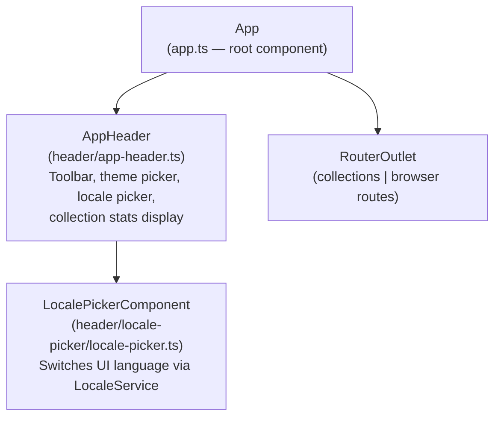
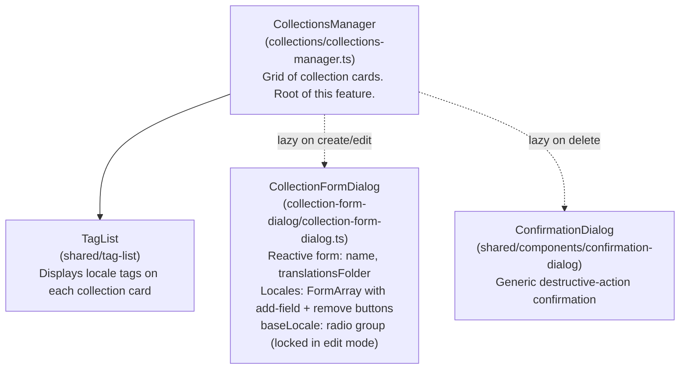
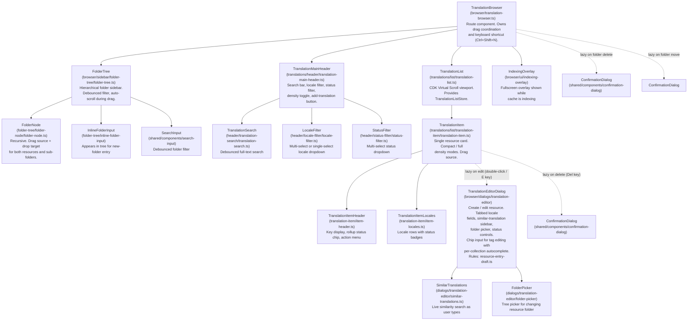
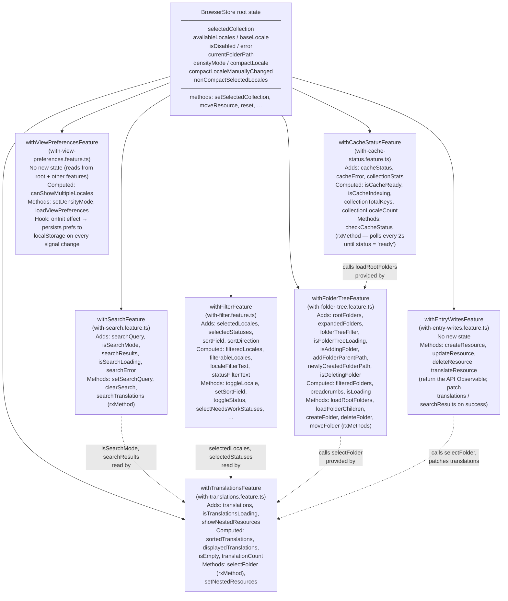

# Frontend Architecture — Tracker UI

The Tracker UI is a standalone Angular 20 SPA served by the NestJS API process. It provides two feature areas — a **collections manager** for creating and configuring translation collections, and a **translation browser** for browsing, filtering, editing, and reorganising resources within a collection. State is managed exclusively with NgRx Signal Store (`signalStore` / `signalStoreFeature`). All components are standalone, signal-based, and use `OnPush` change detection.

Return to [architecture README](README.md).

---

## Table of Contents

- [Route Structure](#route-structure)
- [Component Trees](#component-trees)
  - [App Shell](#app-shell)
  - [Collections Feature](#collections-feature)
  - [Browser Feature](#browser-feature)
- [State Management Architecture](#state-management-architecture)
  - [BrowserStore — Feature Composition](#browserstore--feature-composition)
  - [BrowserStore Feature Breakdown](#browserstore-feature-breakdown)
  - [TranslationListStore](#translationliststore)
  - [CollectionsStore](#collectionsstore)
- [Key UI Patterns](#key-ui-patterns)
  - [Virtual Scrolling](#virtual-scrolling)
  - [Optimistic Updates with Rollback](#optimistic-updates-with-rollback)
  - [Drag-and-Drop — Move Resource and Folder](#drag-and-drop--move-resource-and-folder)
  - [Lazy-Loaded Dialogs](#lazy-loaded-dialogs)
  - [Translation Editor and the Resource Entry Draft](#translation-editor-and-the-resource-entry-draft)
  - [Writing a Resource Entry](#writing-a-resource-entry)
- [Theming System](#theming-system)
- [i18n — Transloco Integration](#i18n--transloco-integration)
- [Cross-Links](#cross-links)

---

## Route Structure

The app shell boots at `/collections`. The translation browser is accessed at `/browser/:collectionName`. Both routes are lazy-loaded via `loadComponent`:

```
/                         → redirect → /collections
/collections              → CollectionsManager (lazy)
/browser/:collectionName  → TranslationBrowser (lazy)
/settings                 → Settings (lazy)
```

---

## Component Trees

### App Shell

<!-- Top-level component hierarchy for the App shell -->



`App` loads `CollectionsStore` on `ngOnInit` so collection data is available before any route resolves. `AppHeader` reads collection context from `HeaderContextService` (a plain injectable signal holder) — `TranslationBrowser` writes into it and `AppHeader` reads from it, decoupling the two without a store dependency.

---

### Collections Feature

<!-- Component hierarchy for the Collections feature (/collections route) -->



`CollectionsManager` reads from `CollectionsStore` (provided in root). Dialogs are opened via `MatDialog.open()` using dynamic `import()` — they are never in the initial bundle.

---

### Browser Feature

<!-- Full component hierarchy for the Translation Browser (/browser/:collectionName route) -->



`TranslationBrowser` wraps the sidebar and list in a `CdkDropListGroup` so drag-and-drop events can cross component boundaries. The `activeDragData` signal on `TranslationBrowser` propagates the currently dragged item to `FolderTree` via an input, enabling drop-target highlighting in the sidebar while an item is dragged from the list.

---

## State Management Architecture

### BrowserStore — Feature Composition

`BrowserStore` is a single `signalStore` provided in root. Its state is split across seven `signalStoreFeature` functions that compose sequentially. Cross-cutting state (the fields shared between multiple features) lives in the root `withState()` call; each feature adds its own slice.

<!-- BrowserStore feature composition — how with-* files build up the root store -->



**Composition order matters.** `withEntryWritesFeature` and `withFolderTreeFeature` require `selectFolder` (and the folder tree also `setTranslationsLoading`) from `withTranslationsFeature`, so `withTranslationsFeature` must appear first. `withCacheStatusFeature` requires `loadRootFolders` from `withFolderTreeFeature`, so it follows. `withViewPreferencesFeature` reads from every other feature's state and is last.

---

### BrowserStore Feature Breakdown

| Feature file | State owned | Key computed signals | Key methods |
|---|---|---|---|
| `with-search.feature.ts` | `searchQuery`, `isSearchMode`, `searchResults`, `isSearchLoading`, `searchError` | — | `setSearchQuery`, `clearSearch`, `searchTranslations` |
| `with-filter.feature.ts` | `selectedLocales`, `selectedStatuses`, `sortField`, `sortDirection` | `filteredLocales`, `filterableLocales`, `localeFilterText`, `statusFilterText`, `isShowingAllLocales`, `isShowingAllStatuses` | `toggleLocale`, `setSelectedLocales`, `setSortField`, `toggleSortDirection`, `toggleStatus`, `selectNeedsWorkStatuses` |
| `with-translations.feature.ts` | `translations`, `isTranslationsLoading`, `showNestedResources` | `sortedTranslations`, `displayedTranslations`, `isEmpty`, `translationCount`, `hasTranslations` | `selectFolder`, `setTranslationsLoading`, `setNestedResources` |
| `with-entry-writes.feature.ts` | (no new state) | — | `createResource`, `updateResource`, `deleteResource`, `translateResource` — see [Writing a Resource Entry](#writing-a-resource-entry) |
| `with-folder-tree.feature.ts` | `rootFolders`, `expandedFolders`, `folderTreeFilter`, `isFolderTreeLoading`, `isAddingFolder`, `addFolderParentPath`, `newlyCreatedFolderPath`, `isDeletingFolder`, `deletingFolderPath` | `filteredFolders`, `breadcrumbs`, `isLoading` | `loadRootFolders`, `loadFolderChildren`, `createFolder`, `createFolderAt`, `deleteFolder`, `moveFolder`, `toggleFolderExpanded`, `startAddingFolder`, `cancelAddingFolder` |
| `with-cache-status.feature.ts` | `cacheStatus`, `cacheError`, `collectionStats` | `isCacheReady`, `isCacheIndexing`, `collectionTotalKeys`, `collectionLocaleCount`, `hasCollectionStats` | `checkCacheStatus` (polls every 2 s via `interval`, stops when `status === 'ready'`) |
| `with-view-preferences.feature.ts` | (no new state) | `canShowMultipleLocales` | `setDensityMode`, `loadViewPreferences` (reads `localStorage`) |

Root-level methods on `BrowserStore` (not in a feature):

| Method | Purpose |
|---|---|
| `setSelectedCollection` | Switches active collection, restores view preferences from `localStorage`, triggers cache polling |
| `moveResource` | Optimistic remove from `translations` → API call → re-fetch on success, rollback on error |
| `reset` | Clears all state slices back to initial values |
| `setBaseLocale`, `setDisabled`, `clearError` | Simple `patchState` helpers |

---

### TranslationListStore

`TranslationListStore` is a lightweight store provided at the `TranslationList` component level (not root). It composes two features:

- **`withItemUiState`** — tracks `translatingKeys: Set<string>` (in-progress auto-translate calls) and `recentlyUpdatedKey: string | undefined` (drives the 1.5 s flash highlight after a save). Exposes `addTranslatingKey`, `removeTranslatingKey`, `flashRecentlyUpdated`, `isTranslating(key)`, `isRecentlyUpdated(key)`. Cleans up the flash timer `onDestroy`.
- **`withItemActions`** — exposes `editTranslation`, `deleteTranslation`, `translateResource`, `copyKey`. Edit goes through `TranslationEditorLauncher`; delete opens `ConfirmationDialog`. Delete and translate resolve the row's full key and call `BrowserStore.deleteResource` / `BrowserStore.translateResource`, which update the caches. The feature keeps the per-row feedback: the translating spinner, the flash, and the toasts.

Because `TranslationListStore` is component-provided, each `TranslationList` instance gets its own store. `TranslationItem` injects it via `inject(TranslationListStore)` — no prop drilling needed.

---

### CollectionsStore

`CollectionsStore` is a flat, root-provided signal store, with no feature decomposition. It holds `config: LingoTrackerConfigDto | null`, `isLoading`, and `error`. Computed signals derive `collectionEntries`, `collectionEntriesWithLocales`, `hasCollections`, and `collections`.

The store exposes five methods: `loadCollections`, `createCollection`, `updateCollection`, `deleteCollection`, and `updateGlobalConfig`. Each one reloads the full config from the API after it mutates, instead of updating local state optimistically. Collections change rarely, so this keeps the store simple.

`updateCollection` is async. Locale diffing and file-system mutations happen inside `PUT /collections/:name` on the core side. The store awaits the response and reloads.

`updateGlobalConfig` posts the writable top-level fields to `PUT /config`. Today that is the global protected-terms list.

### Protected Terms in the UI

Protected terms live in JSON files on disk rather than in `.lingo-tracker.json`. The UI handles no paths of its own. It edits the terms, and the API decides which file receives them.

**Settings** (`/settings`) seeds a `protectedTermsList` signal from `config().protectedTerms` exactly once. A `#seeded` flag guards the seeding, so a later config refetch leaves edits in progress alone. The user edits terms as Material chips, and `store.updateGlobalConfig({ protectedTerms })` saves them.

A read-only line beneath the field renders `config().protectedTermsFilePath`. Someone who later meets the file in a diff can then see where it came from.

**The collection dialog** does the same for one collection, with one difference. A collection has no default terms file, so `canEditProtectedTerms()` is true only when the collection carries a `protectedTermsFile`. Without one the chips are disabled, and the dialog explains why. The terms have nowhere to go until someone sets the file with the CLI.

The dialog returns `protectedTermsFile` unchanged in its submit payload. It includes `protectedTerms` only when that setting exists. An edit therefore keeps the setting intact, and it sends no terms that the API would reject.

---

## Key UI Patterns

### Virtual Scrolling

The translation list can contain thousands of entries. `TranslationList` wraps items in a `CdkVirtualScrollViewport` (`@angular/cdk/scrolling`).

CDK Virtual Scroll requires a fixed item height. LingoTracker's items are variable in practice (compact mode vs. full mode, number of locale rows). The solution is a `computed` signal — `currentItemSize` — that derives the correct pixel height from the current store state:

- **Compact mode**: `96px` (or `100px` on touch devices) + `4px` margin = `100` / `104`.
- **Full mode**: `80px` base + `min(nonBaseLocaleCount, 4) × 32px` + `12px` margin. For example, with 3 non-base locales: `80 + 3×32 + 12 = 188px`.

The viewport recalculates its size via `viewport.checkViewportSize()` inside `requestAnimationFrame` whenever an item toggles expansion (`handleItemExpansion`). A `trackByKey` function is provided so CDK recycles DOM nodes by resource key.

---

### Optimistic Updates with Rollback

**Move resource** (`BrowserStore.moveResource`):

1. Snapshot current `translations` array.
2. Immediately `patchState` with the resource removed (`optimisticTranslations`).
3. Call `api.moveResource()`.
4. On success: reload folder tree and re-select the current folder.
5. On error: restore the snapshot, set `error`, show an error notification.

**Move folder** (`withFolderTreeFeature.moveFolder`):

1. Show a confirmation dialog (lazy-loaded).
2. On confirm: snapshot `rootFolders`, immediately remove the source folder from the tree.
3. Call `api.moveFolder()`.
4. On success: rebase the folder node's paths and insert it at the destination, expand the destination, reload translations.
5. On error: restore the snapshot, clear `isDisabled` and `isDeletingFolder`, show an error notification.

**Edit translation** (via `TranslationListStore.withItemActions`):

Editing happens inside the dialog, which saves through `BrowserStore.updateResource`. When the `PATCH` succeeds, the store replaces the stale entry in `translations` (and in `searchResults` during a search) with the resource in the response. There is no second request. The dialog then closes with `result.success`, and `TranslationListStore.flashRecentlyUpdated` sets `recentlyUpdatedKey` for 1.5 s to drive the highlight animation. If the `PATCH` fails, the caches do not change and the dialog shows the error.

---

### Drag-and-Drop — Move Resource and Folder

Angular CDK drag-and-drop (`@angular/cdk/drag-drop`) is used for two drag types, distinguished by a `DragData` union type:

```typescript
type DragData =
  | { type: 'resource'; key: string; folderPath: string }
  | { type: 'folder'; path: string };
```

`TranslationBrowser` wraps all drag participants in a `CdkDropListGroup`. `TranslationList` is a drag source only (`noDropPredicate = () => false`). `FolderNode` is both a drag source (folders) and a drop target (accepts resources and folders).

When a drag starts on `TranslationItem`, the `dragStarted` output bubbles up through `TranslationList` → `TranslationBrowser`. `TranslationBrowser` stores the `DragData` in its `activeDragData` signal and passes it to `FolderTree` via an input. `FolderTree` passes it down to `FolderNode` components so they can highlight when a draggable item is over them.

`FolderTree` also implements edge-proximity auto-scroll: a `mousemove` listener during drag checks the cursor position against the folder list's bounding rect. If within `50px` of the top or bottom edge, a `setInterval` scrolls at `15px` per `50ms` until the cursor moves away.

On drop, `FolderTree` calls either `BrowserStore.moveResource` or `BrowserStore.moveFolder`, both of which apply optimistic updates as described above.

---

### Lazy-Loaded Dialogs

No dialog component appears in any component's `imports` array. All dialogs are opened via:

```typescript
import('./path/to/dialog').then((m) => {
  this.#dialog.open(m.SomeDialog, { ... });
});
```

This keeps dialog modules out of the initial bundle entirely. The pattern is used for:

- `CollectionFormDialog` — create / edit collection (from `CollectionsManager`)
- `TranslationEditorDialog` — create / edit resource (from `TranslationMainHeader` and `TranslationListStore.withItemActions`)
- `ConfirmationDialog` — delete collection, delete resource, delete folder, move folder (from multiple call sites)

`TranslationEditorDialog` opens the `FolderPicker` (a nested dialog via `MatDialog`) if the user wants to move the resource to a different folder. `FolderPicker` in turn calls `BrowserStore.createFolderAt` to create folders inline without leaving the dialog.

The dialog also includes a tag chip input (Material `mat-chip-grid` + `mat-autocomplete`) in the Base Info tab. Autocomplete suggestions are derived client-side as a `computed()` over `BrowserStore.translations()`, scoped to the current collection. Tags are normalized on chip commit (`normalizeTag` from `@simoncodes-ca/domain`) and sent as `tags: string[]` on the existing `PATCH /collections/:name/resources` endpoint.

### Translation Editor and the Resource Entry Draft

`TranslationEditorDialog` (`browser/dialogs/translation-editor/`) creates and edits one resource entry. It has two parts:

- **The component** owns the Angular parts: the reactive form, focus choreography, the location popover and the other-locales drawer, clipboard, flash timers, the confirmation dialogs, and the RxJS wiring for the similar-values search.
- **`resource-entry-draft.ts`** owns the rules. It is a pure module with no Angular imports. The dialog turns its form, target folder and tags into a plain `ResourceEntryDraft` and asks the module for every decision.

| Function | Rule |
|---|---|
| `absorbDottedKey(rawKey, currentFolder, folderFromKey)` | A dotted key typed in the key field moves its prefix to the folder and keeps the leaf. The next dotted key extends the folder only while the folder is still the one the last absorption set. |
| `folderEntryKeys(folderPath, known)` / `collisionFor(key, folderPath, known, ownKey?)` | Which entry keys a folder holds, from three sources in order: the expanded folder tree, the folder the browser shows, then folders the dialog fetched. Nested keys (with a dot) are not entries of the folder. The match is exact and case-sensitive, the same as `addResource`. The entry being edited never collides with itself. |
| `contextTree(input, moreLabel)` | The "Where it lands" tree: the target folder among its siblings, and an 8-entry window of its entries around the key. The remaining entries are one "more" row. |
| `addTag` / `removeTag` | Tag list operations. Tags are normalized with `normalizeTag`. Inherited tags cannot be removed. |
| `toCreateDto(draft, baseLocale)` | The create request. Every typed translation is sent with status `new`. |
| `toUpdateDto(draft, original)` / `editedLocales` | The update request. A locale is sent when it has a value or when its status changed. |
| `hasUnsavedChanges(draft, initial, fieldsEdited)` | Closing loses work when a form field was edited, the folder moved, or the tags changed. |

The key field validator is `segmentValidator` (`shared/validators/segment.validator.ts`). It uses the domain `isValidSegment` rule and reports under the `pattern` error key. The bundle name and the inline new-folder name use the same validator. The folder filter in the location popover uses `filterFolderTree` from `browser/store/folder-tree.utils.ts`, the same function as `BrowserStore.filteredFolders`.

The dialog reads two things directly from `BrowserApiService`: `searchTranslations` for similar values, and `getResourceTree` for the entries of a folder picked in the popover. Both are dialog-local reads. The store's `selectFolder` would move the browser list behind the dialog, so the dialog does not use it.

### Writing a Resource Entry

All UI writes of a resource entry go through `withEntryWritesFeature` on `BrowserStore`:

| Method | Caller | After a successful write |
|---|---|---|
| `createResource(collectionName, dto)` | `TranslationEditorDialog` (create) | Reloads the current folder with `selectFolder`. |
| `updateResource(collectionName, dto)` | `TranslationEditorDialog` (edit) | Patches the entry in place. If the DTO has a `targetFolder` property, removes the entry instead. |
| `deleteResource(collectionName, fullKey)` | `withItemActions.deleteTranslation` | Removes the entry when `entriesDeleted > 0`. |
| `translateResource(collectionName, fullKey)` | `withItemActions.translateResource` | Patches the entry in place. |

Each method takes the full dot-delimited key and returns the API `Observable`. The caller subscribes and keeps its own error handling, for example the dialog's 409 conflict dialog and its 400 and 404 messages. The store changes its caches only on success.

`toUpdateDto` includes `targetFolder` only when the entry moves to a different non-root folder. A move to the collection root is sent without `targetFolder`, as before this change. The server then edits the entry in its current folder, so the store patches the row in place. The store rule and the DTO rule use the same test: the `targetFolder` property is present or absent.

The two caches use different keys. `translations` uses the key relative to `currentFolderPath`, so a nested entry keeps its sub-path (`dialog.title`). `searchResults` uses the full key. The store converts the key with `listKeyFor` in one place. The API returns a bare entry key, so the store also replaces the key of the returned resource. Callers do not convert keys.

`TranslationEditorLauncher` and `TranslationMainHeader` only give feedback after the dialog closes: the row flash and the toasts.

---

## Theming System

The theme system has three layers:

**1. Angular Material M2 — custom watercolor palette**

Defined in `apps/tracker/src/styles/theme.scss`. A single typography config uses `Nunito` as the font family. Two Material themes are defined:

| Theme | Primary | Accent | Warn |
|---|---|---|---|
| Light | `deep-orange-300` (coral/vermillion) | `light-blue-400` (sky blue) | `red-300` |
| Dark | same palettes | same palettes | same palettes |

Both themes use `density: -1` (slightly more compact than default Material sizing).

**2. ThemeService — signal-based mode selection**

`ThemeService` (`shared/services/theme.service.ts`) manages a `themeMode` signal with type `'light' | 'dark' | 'system'`. An `effectiveTheme` computed signal resolves `'system'` to the actual OS preference by listening to the `prefers-color-scheme` media query. Preference is persisted to `localStorage` under the key `lingo-tracker-theme`.

The service applies the theme by setting the `data-theme` attribute on `document.documentElement`:

| `data-theme` value | Result |
|---|---|
| `'light'` | `:root` — light theme (default) |
| `'dark'` | `[data-theme='dark']` selector — dark theme |
| absent + OS dark | `@media (prefers-color-scheme: dark) :root:not([data-theme])` — dark theme |

`AppHeader` calls `ThemeService.setTheme()` from a menu of three options (Light, Dark, System).

**3. CSS custom properties — design tokens**

`apps/tracker/src/styles/tokens.scss` defines spacing, border-radius, shadow, and colour tokens as CSS custom properties. These are consumed by component SCSS files, keeping component styles theme-agnostic.

---

## i18n — Transloco Integration

The Tracker UI is fully internationalised using [Transloco](https://jsverse.github.io/transloco/).

**Runtime loading**

`TranslocoHttpLoader` (`shared/services/transloco-loader.ts`) fetches `/assets/i18n/{lang}.json` over HTTP. These JSON files are **generated by the LingoTracker bundle pipeline itself** — the Tracker UI is dog-fooded using its own tooling. See [bundle-generation.md](bundle-generation.md) for the full pipeline.

**Typed token constants**

Each call to `transloco.translate()` in the codebase uses a typed constant from `TRACKER_TOKENS` rather than a raw string key. `TRACKER_TOKENS` is defined in `apps/tracker/src/i18n-types/tracker-resources.ts`, which is **auto-generated by `lingo-tracker bundle`** and must not be edited manually:

```typescript
// Auto-generated — do not edit
export const TRACKER_TOKENS = {
  BROWSER: {
    TOAST: {
      RESOURCECREATED: 'browser.toast.resourceCreated',
      // ...
    },
  },
  // ...
};
```

The token file provides compile-time safety: a missing key is a TypeScript error, not a silent runtime blank. When a new translation resource is added via the CLI or the UI, `lingo-tracker bundle` re-generates the token file.

**UI language switching**

`LocaleService` (`shared/services/locale.service.ts`) holds the active UI locale as a signal. `LocalePickerComponent` in the app header calls `TranslocoService.setActiveLang()` to switch languages at runtime without a page reload. The bundle loader fetches the new locale JSON on demand.

---

## Cross-Links

- [api.md](api.md) — all API calls from the frontend go through `BrowserApiService` and `CollectionsApiService`; see the REST endpoint reference for request/response shapes
- [user-flows.md](user-flows.md) — sequence diagrams for browse/edit, full-text search, and drag-and-drop flows (flows 3, 4, 5)
- [bundle-generation.md](bundle-generation.md) — the bundle pipeline that produces `/assets/i18n/*.json` and regenerates `TRACKER_TOKENS`
- [glossary.md](glossary.md) — definitions for [translation status](glossary.md#translation-status), [ICU format](glossary.md#icu-format), and [collection](glossary.md#collection) referenced throughout this document
