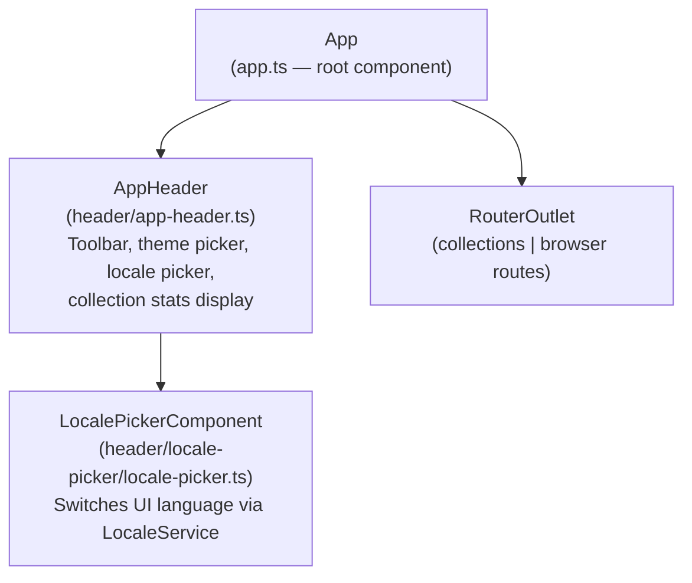
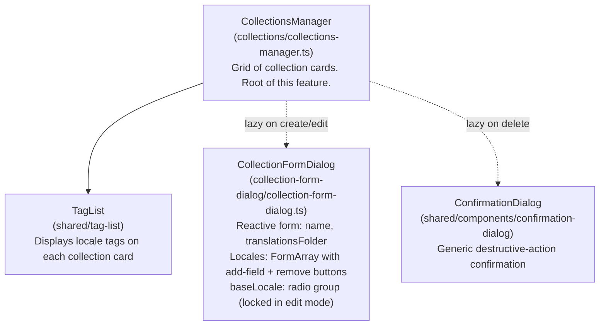
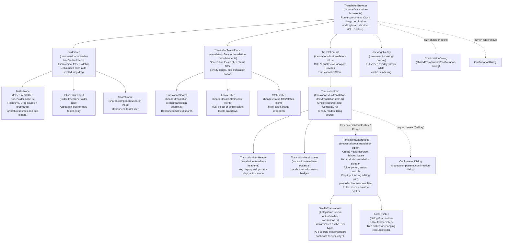
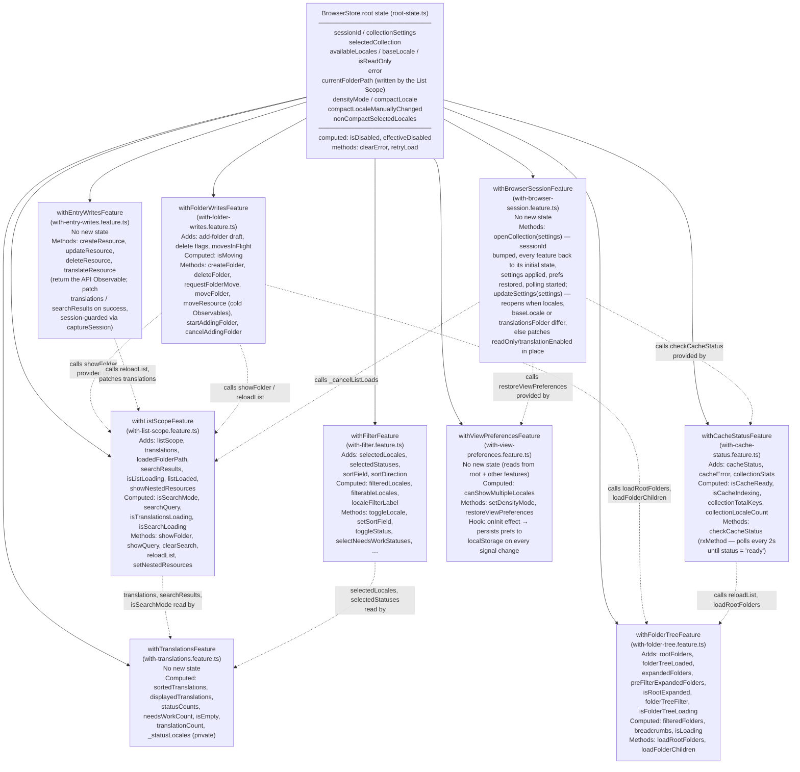

# Frontend Architecture — Tracker UI

The Tracker UI is a standalone Angular 21 SPA served by the NestJS API process. It provides two feature areas — a **collections manager** for creating and configuring translation collections, and a **translation browser** for browsing, filtering, editing, and reorganising resources within a collection. State is managed exclusively with NgRx Signal Store (`signalStore` / `signalStoreFeature`). All components are standalone, signal-based, and use `OnPush` change detection.

Return to [architecture README](README.md).

---

## Table of Contents

- [Route Structure](#route-structure)
- [Component Trees](#component-trees)
  - [App Shell](#app-shell)
  - [Collections Feature](#collections-feature)
  - [Collection Connector Links](#collection-connector-links)
  - [Browser Feature](#browser-feature)
- [State Management Architecture](#state-management-architecture)
  - [BrowserStore — Feature Composition](#browserstore--feature-composition)
  - [BrowserStore Feature Breakdown](#browserstore-feature-breakdown)
  - [List Scope — What the List Shows](#list-scope--what-the-list-shows)
  - [TranslationListStore](#translationliststore)
  - [CollectionsStore](#collectionsstore)
  - [Collection Form Dialog](#collection-form-dialog)
  - [API Errors — One Adapter at the HTTP Seam](#api-errors--one-adapter-at-the-http-seam)
- [Key UI Patterns](#key-ui-patterns)
  - [Virtual Scrolling](#virtual-scrolling)
  - [Optimistic Updates with Rollback](#optimistic-updates-with-rollback)
  - [Drag-and-Drop — Move Resource and Folder](#drag-and-drop--move-resource-and-folder)
  - [Lazy-Loaded Dialogs](#lazy-loaded-dialogs)
  - [Translation Editor and the Resource Entry Draft](#translation-editor-and-the-resource-entry-draft)
  - [Translation Status Summary](#translation-status-summary)
  - [Translation Rows and the Row View](#translation-rows-and-the-row-view)
  - [Writing a Resource Entry](#writing-a-resource-entry)
  - [The Editor Outcome](#the-editor-outcome)
  - [Bundle Form Dialog](#bundle-form-dialog)
- [Theming System](#theming-system)
- [i18n — Transloco Integration](#i18n--transloco-integration)
- [Testing](#testing)
- [Cross-Links](#cross-links)

---

## Route Structure

The app shell boots at `/collections`. The translation browser is accessed at `/browser/:collectionName`. Both routes are lazy-loaded via `loadComponent`:

```
/                         → redirect → /collections
/collections              → CollectionsManager (lazy)
/browser/:collectionName  → TranslationBrowser (lazy)
/settings                 → Settings (lazy)
```

`CollectionsManager` passes the collection name as a plain path segment to `router.navigate`; Angular encodes it for the URL. `TranslationBrowser` uses the already-decoded `ActivatedRoute` parameter directly to resolve the collection. API clients encode collection names once when interpolating URL path segments. For query values such as a resource tree's folder `path`, `HttpParams` performs the encoding from the plain value.

---

## Component Trees

### App Shell

<!-- Top-level component hierarchy for the App shell -->


```mermaid
flowchart TD
    App["App\n(app.ts — root component)"]
    App --> AppHeader["AppHeader\n(header/app-header.ts)\nToolbar, theme picker, locale picker,\ncollection stats display"]
    App --> RouterOutlet["RouterOutlet\n(collections | browser routes)"]
    AppHeader --> LocalePicker["LocalePickerComponent\n(header/locale-picker/locale-picker.ts)\nSwitches UI language via LocaleService"]
```

`App` loads `CollectionsStore` on `ngOnInit` so collection data is available before any route resolves. `AppHeader` reads collection context from `HeaderContextService` (a plain injectable signal holder) — `TranslationBrowser` writes into it and `AppHeader` reads from it, decoupling the two without a store dependency.

---

### Collections Feature

<!-- Component hierarchy for the Collections feature (/collections route) -->


```mermaid
flowchart TD
    CollectionsManager["CollectionsManager\n(collections/collections-manager.ts)\nGrid of collection cards. Root of this feature."]

    CollectionsManager --> TagList["TagList\n(shared/tag-list)\nDisplays locale tags on each collection card"]

    CollectionsManager -. "lazy on create/edit" .-> CollectionFormDialog["CollectionFormDialog\n(collection-form-dialog/collection-form-dialog.ts)\nReactive form: name, translationsFolder\nLocales: FormArray with add-field + remove buttons\nbaseLocale: radio group (locked in edit mode)"]
    CollectionsManager -. "lazy on delete" .-> ConfirmationDialog["ConfirmationDialog\n(shared/components/confirmation-dialog)\nGeneric destructive-action confirmation"]
```

`CollectionsManager` reads from `CollectionsStore` (provided in root). Dialogs are opened via `MatDialog.open()` using dynamic `import()` — they are never in the initial bundle.

---

### Collection Connector Links

`apps/tracker/src/app/collections/collections-manager.ts` measures the `.split` container, the bundles column, the hovered bundle card and only its referenced collection cards on hover, scroll, resize or card changes. It passes those plain viewport rectangles and bundle references to `collectionLinks` in `apps/tracker/src/app/collections/collection-links.ts`. That Angular-free function selects the hovered bundle and returns SVG paths, collection dot centres and the shared bundle port. It rounds coordinates to one decimal, keeps the port inside the bundles column, and limits curve handles to half the horizontal span. When the columns stack or no measured collection matches, it returns no links and no port. `collection-links.spec.ts` fixes the path strings against values captured from the former component calculation for side-by-side, stacked, clamped and several-collection layouts.

---

### Browser Feature

<!-- Full component hierarchy for the Translation Browser (/browser/:collectionName route) -->


```mermaid
flowchart TD
    TranslationBrowser["TranslationBrowser\n(browser/translation-browser.ts)\nRoute component. Owns drag coordination\nand keyboard shortcut (Ctrl+Shift+N)."]

    TranslationBrowser --> FolderTree
    TranslationBrowser --> TranslationMainHeader
    TranslationBrowser --> TranslationList
    TranslationBrowser --> IndexingOverlay["IndexingOverlay\n(browser/ui/indexing-overlay)\nFullscreen overlay shown while\ncache is indexing"]

    FolderTree["FolderTree\n(browser/sidebar/folder-tree/folder-tree.ts)\nHierarchical folder sidebar.\nDebounced filter, auto-scroll during drag."]
    FolderTree --> FolderNode["FolderNode\n(folder-tree/folder-node/folder-node.ts)\nRecursive. Drag source + drop target\nfor both resources and sub-folders."]
    FolderTree --> InlineFolderInput["InlineFolderInput\n(folder-tree/inline-folder-input)\nAppears in tree for new-folder entry"]
    FolderTree --> SearchInput["SearchInput\n(shared/components/search-input)\nDebounced folder filter"]

    TranslationMainHeader["TranslationMainHeader\n(translations/header/translation-main-header.ts)\nSearch bar, locale filter, status filter,\ndensity toggle, add-translation button."]
    TranslationMainHeader --> TranslationSearch["TranslationSearch\n(header/translation-search/translation-search.ts)\nDebounced full-text search"]
    TranslationMainHeader --> LocaleFilter["LocaleFilter\n(header/locale-filter/locale-filter.ts)\nMulti-select or single-select locale dropdown"]
    TranslationMainHeader --> StatusFilter["StatusFilter\n(header/status-filter/status-filter.ts)\nMulti-select status dropdown"]

    TranslationList["TranslationList\n(translations/list/translation-list.ts)\nCDK Virtual Scroll viewport.\nProvides TranslationListStore."]
    TranslationList --> TranslationItem["TranslationItem\n(translations/list/translation-item/translation-item.ts)\nSingle resource card. Compact / full\ndensity modes. Drag source."]
    TranslationItem --> TranslationItemHeader["TranslationItemHeader\n(translation-item/item-header.ts)\nKey display, rollup status chip, action menu"]
    TranslationItem --> TranslationItemLocales["TranslationItemLocales\n(translation-item/item-locales.ts)\nLocale rows with status badges"]

    TranslationItem -. "lazy on edit (double-click / E key)" .-> TranslationEditorDialog
    TranslationItem -. "lazy on delete (Del key)" .-> ConfirmationDialog2["ConfirmationDialog\n(shared/components/confirmation-dialog)"]

    TranslationEditorDialog["TranslationEditorDialog\n(browser/dialogs/translation-editor)\nCreate / edit resource. Tabbed locale\nfields, similar-translation sidebar,\nfolder picker, status controls.\nChip input for tag editing with\nper-collection autocomplete.\nRules: resource-entry-draft.ts"]
    TranslationEditorDialog --> SimilarTranslations["SimilarTranslations\n(dialogs/translation-editor/similar-translations.ts)\nSimilar values as the user types\n(API search, mode=similar),\neach with its similarity %"]
    TranslationEditorDialog --> FolderPicker["FolderPicker\n(dialogs/translation-editor/folder-picker)\nTree picker for changing resource folder"]

    TranslationBrowser -. "lazy on folder delete" .-> ConfirmationDialog3["ConfirmationDialog\n(shared/components/confirmation-dialog)"]
    TranslationBrowser -. "lazy on folder move" .-> ConfirmationDialog4["ConfirmationDialog"]
```

`TranslationBrowser` wraps the sidebar and list in a `CdkDropListGroup` so drag-and-drop events can cross component boundaries. The `activeDragData` signal on `TranslationBrowser` propagates the currently dragged item to `FolderTree` via an input, enabling drop-target highlighting in the sidebar while an item is dragged from the list.

---

## State Management Architecture

### BrowserStore — Feature Composition

`BrowserStore` is a single `signalStore` provided in root. Its state is split across nine `signalStoreFeature` functions that compose sequentially. Cross-cutting state (the fields shared between multiple features) lives in the root `withState()` call (`store/root-state.ts`); each feature adds its own slice and exports its initial state. The last feature is the [Browser Session](glossary.md#browser-session): `openCollection(settings)` is the one way a collection is opened or switched, and `updateSettings(settings)` the one way the open collection's settings change.

<!-- BrowserStore feature composition — how with-* files build up the root store -->


```mermaid
flowchart TD
    Root["BrowserStore root state (root-state.ts)\n─────────────────────────\nsessionId / collectionSettings\nselectedCollection\navailableLocales / baseLocale / isReadOnly\nerror\ncurrentFolderPath (written by the List Scope)\ndensityMode / compactLocale\ncompactLocaleManuallyChanged\nnonCompactSelectedLocales\n─────────────────────────\ncomputed: isDisabled, effectiveDisabled\nmethods: clearError, retryLoad"]

    Root --> WLS["withListScopeFeature\n(with-list-scope.feature.ts)\nAdds: listScope, translations, loadedFolderPath,\nsearchResults, isListLoading, listLoaded,\nshowNestedResources\nComputed: isSearchMode, searchQuery,\nisTranslationsLoading, isSearchLoading\nMethods: showFolder, showQuery, clearSearch,\nreloadList, setNestedResources"]

    Root --> WF["withFilterFeature\n(with-filter.feature.ts)\nAdds: selectedLocales, selectedStatuses,\nsortField, sortDirection\nComputed: filteredLocales, filterableLocales,\nlocaleFilterLabel\nMethods: toggleLocale, setSortField,\ntoggleStatus, selectNeedsWorkStatuses, …"]

    Root --> WT["withTranslationsFeature\n(with-translations.feature.ts)\nNo new state\nComputed: sortedTranslations, displayedTranslations,\nstatusCounts, needsWorkCount, isEmpty,\ntranslationCount, _statusLocales (private)"]

    Root --> WEW["withEntryWritesFeature\n(with-entry-writes.feature.ts)\nNo new state\nMethods: createResource, updateResource,\ndeleteResource, translateResource\n(return the API Observable; patch\ntranslations / searchResults on success,\nsession-guarded via captureSession)"]

    Root --> WFT["withFolderTreeFeature\n(with-folder-tree.feature.ts)\nAdds: rootFolders, folderTreeLoaded,\nexpandedFolders, preFilterExpandedFolders,\nisRootExpanded, folderTreeFilter, isFolderTreeLoading\nComputed: filteredFolders, breadcrumbs, isLoading\nMethods: loadRootFolders, loadFolderChildren"]

    Root --> WM["withFolderWritesFeature\n(with-folder-writes.feature.ts)\nAdds: add-folder draft, delete flags, movesInFlight\nComputed: isMoving\nMethods: createFolder, deleteFolder, requestFolderMove, moveFolder, moveResource (cold Observables), startAddingFolder, cancelAddingFolder"]

    Root --> WCS["withCacheStatusFeature\n(with-cache-status.feature.ts)\nAdds: cacheStatus, cacheError, collectionStats\nComputed: isCacheReady, isCacheIndexing,\ncollectionTotalKeys, collectionLocaleCount\nMethods: checkCacheStatus (rxMethod — polls every 2s\nuntil status = 'ready')"]

    Root --> WVP["withViewPreferencesFeature\n(with-view-preferences.feature.ts)\nNo new state (reads from root + other features)\nComputed: canShowMultipleLocales\nMethods: setDensityMode, restoreViewPreferences\nHook: onInit effect → persists prefs to\nlocalStorage on every signal change"]

    Root --> WBS["withBrowserSessionFeature\n(with-browser-session.feature.ts)\nNo new state\nMethods: openCollection(settings) — sessionId\nbumped, every feature back to its initial state,\nsettings applied, prefs restored, polling started;\nupdateSettings(settings) — reopens when locales,\nbaseLocale or translationsFolder differ,\nelse patches readOnly/translationEnabled in place"]

    WLS -.->|"translations, searchResults,\nisSearchMode read by"| WT
    WBS -.->|"calls restoreViewPreferences\nprovided by"| WVP
    WBS -.->|"calls checkCacheStatus\nprovided by"| WCS
    WF -.->|"selectedLocales, selectedStatuses\nread by"| WT
    WM -.->|"calls showFolder\nprovided by"| WLS
    WEW -.->|"calls reloadList,\npatches translations"| WLS
    WM -.->|"calls showFolder / reloadList"| WLS
    WM -.->|"calls loadRootFolders,\nloadFolderChildren"| WFT
    WCS -.->|"calls reloadList, loadRootFolders"| WFT
    WBS -.->|"calls _cancelListLoads"| WLS
```

**Composition order matters.** `withListScopeFeature` comes first after the root state: `withTranslationsFeature` derives from its rows, and `withEntryWritesFeature` and `withFolderWritesFeature` ask it to show a folder or reload. `withFolderWritesFeature` also calls the folder tree's loads, so it follows `withFolderTreeFeature`. `withCacheStatusFeature` requires `reloadList` and `loadRootFolders`, so it follows both. `withViewPreferencesFeature` reads from every other feature's state. `withBrowserSessionFeature` calls `restoreViewPreferences` and `checkCacheStatus`, and is last.

**Opening a collection.** The store is root-provided, so it outlives the `/browser/:collectionName` route. `TranslationBrowser` resolves the routed collection's settings from the loaded config (`resolveCollectionSettings(config, name)`, the Tracker's counterpart of core's `openCollection`: collection value, else global, else default) each time the config changes. When the routed collection is not the open one, it calls `store.openCollection(settings)`. The session bumps `sessionId`, patches every feature's exported initial state together with the root state, stores the settings (`collectionSettings`, plus the projections `selectedCollection`, `availableLocales`, `baseLocale`, `isReadOnly`), then has the view-preferences feature restore what `localStorage` holds for that collection (a saved `medium` density, or none, reads as `compact`; in compact the one displayed locale is resolved against the collection's locales), and starts index polling. The folder, search, filter, translations, folder-tree and cache-status state of the previous collection does not survive the switch.

**Responses from a closed session.** A loader captures `sessionId` when its request starts (`captureSession`, `store/session-guard.ts`) and pipes the API response through `withinSession`. When another `openCollection` has run in the meantime, the response is dropped: a value is not written and an error completes without a rollback, toast or follow-up navigation. The List Scope's loads, `loadRootFolders` and `loadFolderChildren` use it, and so does the launcher's lookup in `openByFullKey`; Folder writes return a stale-session outcome without updating caches or feedback; the entry writes (`with-entry-writes.feature.ts`: `createResource`, `updateResource`, `deleteResource`, `translateResource`) still return their response to the caller but write the store only in their own session — the translation editor dialog's `updateResource` subscription can outlive the browser, so a save that resolves after another collection has opened must not patch or drop a row in the session that replaced it. The counter, not the collection name, is compared, so a response from an earlier open of the same collection (A, B, A) is dropped too. `checkCacheStatus` needs no guard: every open calls it, and its `switchMap` cancels the previous poll. The List Scope goes one step further: `openCollection` calls `_cancelListLoads`, so a list load of the previous session is unsubscribed, its HTTP request cancelled and its not-ready retries stopped, rather than left to run and be dropped.

**Re-entering the open collection.** Going back to the Collections page and opening the same collection again is not an open: the user keeps their place (selected folder, expansion, search query and results, filters). `TranslationSearch` starts its box from `store.searchQuery()`, and `isDisabled` is derived from the List Scope, so the remounted tree stays disabled while the search is active. When the config has changed, `TranslationBrowser` calls `store.updateSettings(settings)`. Settings equal to the stored ones (`sameCollectionSettings`), as on an unrelated config reload, are a no-op. Otherwise `updateSettings` branches on what changed (`collectionNeedsReopen` in `collection-settings.ts`): a `readOnly` or `translationEnabled` edit alone writes `collectionSettings` and its projections in place and changes nothing else; a `locales`, `baseLocale` or `translationsFolder` edit invalidates data cached under the old settings — the folder tree, translations, filter selections, the cache-status check — so `updateSettings` calls `openCollection(settings)` instead, a fresh session that restores the collection's saved view preferences against its current locales (a saved locale the collection no longer has is dropped, not kept selected, so it cannot leave a stale column on screen or get written back to `localStorage`). `collectionSettings` is the one source of settings in the browser: `translationEnabled` and `translationsFolder` are read from it, and no component resolves settings from the raw config.

---

### BrowserStore Feature Breakdown

| Feature file | State owned | Key computed signals | Key methods |
|---|---|---|---|
| `with-list-scope.feature.ts` | `listScope`, `translations`, `loadedFolderPath`, `searchResults`, `isListLoading`, `shownScope`, `listError`, `showNestedResources` | `listLoaded`, `isSearchMode`, `searchQuery`, `isTranslationsLoading`, `isSearchLoading` | `showFolder`, `showQuery`, `clearSearch`, `reloadList`, `setNestedResources` — see [List Scope](#list-scope--what-the-list-shows) |
| `with-filter.feature.ts` | `selectedLocales`, `selectedStatuses`, `sortField`, `sortDirection` | `filteredLocales`, `filterableLocales`, `localeFilterLabel`, `statusFilterText`, `isShowingAllLocales`, `isShowingAllStatuses` | `toggleLocale`, `setSelectedLocales`, `setSortField`, `toggleSortDirection`, `toggleStatus`, `selectNeedsWorkStatuses` |
| `with-translations.feature.ts` | (no new state) | `sortedTranslations`, `displayedTranslations`, `statusCounts`, `needsWorkCount`, `isEmpty`, `translationCount`, `hasTranslations` | — |
| `with-entry-writes.feature.ts` | (no new state) | — | `createResource`, `updateResource`, `deleteResource`, `translateResource` — see [Writing a Resource Entry](#writing-a-resource-entry) |
| `with-folder-tree.feature.ts` | `rootFolders`, `folderTreeLoaded`, `expandedFolders` and `preFilterExpandedFolders` (both `ReadonlySet<string>`, replaced on every change), `isRootExpanded`, `folderTreeFilter`, `isFolderTreeLoading` | `filteredFolders`, `breadcrumbs`, `isLoading`, `visibleExpandedFolders`, `areAllFoldersExpanded` | `loadRootFolders` (the tree only, without nested resources), `loadFolderChildren`, `setFolderTreeFilter`, `toggleFolderExpanded`, `expandFolder`, `toggleRootExpanded`, `expandAllFolders`, `collapseAllFolders`, tree load error handling |
| `with-folder-writes.feature.ts` | `isAddingFolder`, `addFolderParentPath`, `newlyCreatedFolderPath`, `isDeletingFolder`, `deletingFolderPath`, `movesInFlight` | `isMoving` | Cold typed outcome Observables: `createFolder`, `deleteFolder`, `moveResource`, `moveFolder`, `requestFolderMove`; sidebar draft methods — see [Optimistic Updates with Rollback](#optimistic-updates-with-rollback) |
| `with-cache-status.feature.ts` | `cacheStatus`, `cacheError`, `collectionStats` | `isCacheReady`, `isCacheIndexing`, `collectionTotalKeys`, `collectionLocaleCount`, `hasCollectionStats` | `checkCacheStatus` (sets `cacheStatus: 'not-started'` and clears `cacheError`/`collectionStats` on every call, including an overlay retry; then polls every 2 s via `interval` until the status is no longer indexing) |
| `with-view-preferences.feature.ts` | (no new state) | `canShowMultipleLocales` | `setDensityMode`, `restoreViewPreferences` (reads `localStorage` for one collection and applies it) |
| `with-browser-session.feature.ts` | (no new state; writes the root `sessionId` and `collectionSettings`) | — | `openCollection(settings)` — the [Browser Session](glossary.md#browser-session): `sessionId` bumped, every feature to its initial state, settings applied, preferences restored, polling started; `updateSettings(settings)` — a no-op when equal; reopens via `openCollection` when `locales`, `baseLocale` or `translationsFolder` differ; otherwise patches `readOnly`/`translationEnabled` in place |

Root-level members of `BrowserStore` (not in a feature):

| Member | Purpose |
|---|---|
| `isDisabled` | Computed: `isSearchMode() \|\| isMoving()`. Locks folder navigation and moves. It has no writer: a search shown by the List Scope or a move in flight is the only way it becomes true. |
| `effectiveDisabled` | Computed: `isDisabled() \|\| isReadOnly()`, for editing affordances. |
| `listErrorMessage` | Computed: `listError() ?? error()`, what the list's error view shows. |
| `retryLoad` | The list's Retry: clears `error`, then the List Scope's `reloadList`, plus `loadRootFolders` when the folder tree never loaded in this session. |
| `clearError` | Clears `error` and `listError` |

### List Scope — What the List Shows

The [List Scope](glossary.md#list-scope) (`with-list-scope.feature.ts`) owns what the translation list shows and is the only loader of its rows. The scope is a folder or a search query:

```typescript
type ListScope = { kind: 'folder'; path: string } | { kind: 'search'; query: string };
```

| Method | Effect |
|---|---|
| `showFolder(path)` | Shows the folder (leaving a search, if one is shown) and loads its rows with the nested setting. Sets `currentFolderPath`. |
| `showQuery(query)` | Shows the hits of a text search. A blank query is `clearSearch`. Hits of an earlier search are dropped when a search starts from a folder, so they never stand in for the new one. |
| `clearSearch()` | Goes back to the folder behind the search. Its rows are shown as they are when they were loaded for that folder (`loadedFolderPath`); when a search cut the folder's load short, the folder is loaded. Without a search shown it does nothing (the search box calls it whenever its query empties), so it never cancels a folder load. |
| `reloadList()` | Loads the current scope again: after a create, after a resource move, from the list's Retry, and for the first list of a session once the index is ready. |
| `setNestedResources(value)` | Changes the nested setting and reloads a folder scope. |

The callers are the folder tree (a folder click, a delete shows the parent), `TranslationSearch`, the moves, the entry writes, the cache-status poll and `TranslationEditorLauncher.openByFullKey`. None of them loads rows or writes `currentFolderPath`, `listError` or a loading flag itself. Entry writes (`patchEntry`/`dropEntry`) and moves (the optimistic drop and its undo) patch the loaded rows in place.

**One pipeline.** Every load goes through one `switchMap`: a newer scope cancels the older load (its HTTP request and any not-ready retries), so answers cannot land out of order. `openCollection` cancels it too (`_cancelListLoads`).

**One busy state.** `isListLoading`. `isSearchLoading` (the search box's spinner) is the flag in a search scope. `isTranslationsLoading` (the list's spinner) is the flag in a folder scope, and in a search scope with no hits yet (the first search from a folder), so the list does not show its empty state while that search loads; a refined search keeps its hits up.

**One failure rule.** The rule is `handleLoadFailure` (`store/load-failure.ts`), shared with the folder tree's loads; each caller supplies what "on screen", "keep" and "error state" mean for its own state. When a load fails with `CollectionIndexNotReadyError` and a list has already loaded in this session (`listLoaded`), the scope goes back to `shownScope`, the last scope that loaded (or that `clearSearch` went back to), so the scope and `currentFolderPath` match the rows on screen even when a newer scope was cancelled before it loaded; a toast gives the message. Any other failure is `listError`, with the Retry button. Only the List Scope writes `listError` (a list load clears it as it starts), so the folder tree's loads, which clear the shared `error`, cannot bring the previous folder's rows back under a new breadcrumb. The fallback message is `browser.toast.loadTranslationsFailed` for a folder and `browser.toast.searchTranslationsFailed` for a search.

**Tests.** `with-list-scope.feature.spec.ts` drives the store through the real HTTP seam (`HttpTestingController`) and checks scope changes: show folder A, a query, folder B, and check the rows, the busy flags and that a cancelled load never lands.

---

### TranslationListStore

`TranslationListStore` is a lightweight store provided at the `TranslationList` component level (not root). It composes two features:

- **`withItemUiState`** — tracks `translatingKeys: Set<string>` (in-progress auto-translate calls) and `recentlyUpdatedKey: string | undefined` (drives the 1.5 s flash highlight after a save). Both are keyed by each resource's `fullKey`. Exposes `addTranslatingKey`, `removeTranslatingKey`, `flashRecentlyUpdated`, `isTranslating(key)`, `isRecentlyUpdated(key)`. Cleans up the flash timer `onDestroy`.
- **`withItemActions`** — exposes `editTranslation`, `deleteTranslation`, `translateResource`, `copyKey`. Edit goes through `TranslationEditorLauncher`; delete opens `ConfirmationDialog`. Delete and translate take the row's `fullKey` and call `BrowserStore.deleteResource` / `BrowserStore.translateResource`, which update the caches. The feature keeps the per-row feedback: the translating spinner, the flash, and the toasts.

Because `TranslationListStore` is component-provided, each `TranslationList` instance gets its own store. `TranslationItem` injects it via `inject(TranslationListStore)` — no prop drilling needed.

---

### CollectionsStore

`CollectionsStore` is a root-provided signal store: `config: LingoTrackerConfigDto | null`, `isLoading` (a load in flight) and `error` (a failed load's message), with `withBundlesFeature` composed on for bundle definitions and runs. Computed signals derive `collectionEntries`, `collectionEntriesWithLocales`, `hasCollections`, and `collections`.

`loadCollections` is the one `rxMethod`. Every mutation is a [Config Write](glossary.md#config-write) (`collections/store/config-write.ts`): `createCollection`, `updateCollection(name, update)`, `deleteCollection`, `updateGlobalConfig`, and the bundle feature's `createBundle`, `updateBundle(name, update)` and `deleteBundle`. Each returns a cold `Observable<LingoTrackerConfigDto | null>`: on subscribe it sends the request, reloads the full config from the API (collections change rarely, so nothing is updated optimistically), stores it, and only then resolves with it. If that reload fails, the write still happened: the Observable resolves with `null`, and the store reports the failed load in `error`, as a failed initial load does, so a caller closes and toasts as usual and a retry never meets a 409. A rejected write errors with the request's [`ApiError`](#api-errors--one-adapter-at-the-http-seam) and leaves the store untouched, so the caller decides: the form dialogs stay open and show the refusal, the manager's shared confirm-then-delete helper toasts only after a delete happens, and Settings Draft reseeds from the saved config. Mutations never touch `isLoading`, and touch `error` only through that reload, so a rejected write never blanks the page or leaves a stale banner.

The two form dialogs use `NamedEntrySubmit` in [Dialog Config Submit](glossary.md#dialog-config-submit) to choose the create or update write, build the rename patch, validate a server-taken name, and select the localized refusal fallback. It passes the cold Observable and saved result to `submitDialogConfigWrite`, which owns `saving`, the temporary `disableClose` lock, the success close, and restoration on refusal. The forms render its name-conflict or message outcome themselves, including any API details. `classifyConfigRefusal` remains available to Settings for row rule errors. Its page-owned subscription and `saving` signal survive navigation so the outcome toast still appears after the page is gone.

`updateCollection` sends `PUT /collections/:name`; locale diffing and file-system changes happen on the core side. `updateGlobalConfig` sends the writable top-level fields to `PUT /config`: the global protected-terms list and the preferred-terminology rules; rejected rules come back as an `invalid` error whose `details` are the per-row `PreferredTermRuleErrorDto`s.

### Collection Form Dialog

`collections/collection-form-dialog/collection-draft.ts` is the Angular-free [Collection Draft](glossary.md#collection-draft). It seeds plain values from an existing collection or a blank create, validates and normalizes added locales, picks and protects the base locale, and compares current locales with the original list before a destructive save. The draft also owns the read-only folder default and the user-choice latch. Its result builder sends empty locale and tag lists to clear overrides, omits an unset base locale, sends `protectedTermsFile: ''` when no file is configured, and includes terms only with a file. `collection-form-dialog.ts` keeps the typed FormGroup and FormArray, renders chips and Transloco text, opens the removal confirmation, and submits the draft result through `NamedEntrySubmit`. The dialog passes the current controls to the draft for mutations and save; display helpers read only the controls they need.

### Protected Terms in the UI

Protected terms live in JSON files on disk rather than in `.lingo-tracker.json`. The UI handles no paths of its own. It edits the terms, and the API decides which file receives them.

**Settings** (`/settings`) seeds [Settings Draft](glossary.md#settings-draft) from the first config to arrive, through one effect that then destroys itself; a config the store reloads for another reason never reseeds edits in progress. `SettingsDraft` composes `ProtectedTermsDraft` and `PreferredTerminologyDraft`, owns the combined save gate and change count, and calls the write function supplied by the page. It records submitted rule rows as it builds the changed-list payload, then emits `saved`, `blocked`, `refused`, or `unchanged`. The saved config reseeds both lists; a `null` answer (the write was accepted but the reload failed) reseeds from both lists as sent. Either accepted outcome earns one toast, while the store reports a failed reload through `error`. A refusal keeps every edit and maps valid API rule errors onto the submitted rows. The component binds the child drafts directly and owns focus, scrolling, the refusal banner, and toasts. Both editors are locked while the config is still `null` and while a save is in flight (`editingLocked`).

A read-only line beneath the field renders `config().protectedTermsFilePath`. Someone who later meets the file in a diff can then see where it came from.

**The collection dialog** uses `ProtectedTermsChips` from `shared/protected-terms/`. It preserves loaded chips exactly, including whitespace and duplicates, so an unrelated edit sends the stored list unchanged. New chips use the same normalization and case-sensitive duplicate rule as `ProtectedTermsDraft`; removal drops matching chips immediately. A collection has no default terms file, so `canEditProtectedTerms()` is true only when the collection carries a `protectedTermsFile`. Without one the chips are disabled, and the dialog explains why. The terms have nowhere to go until someone sets the file with the CLI.

The dialog returns `protectedTermsFile` unchanged in its submit payload. It includes `protectedTerms` only when that setting exists. An edit therefore keeps the setting intact, and it sends no terms that the API would reject.

---

### API Errors — One Adapter at the HTTP Seam

The API clients (`BrowserApiService`, `CollectionsApiService`) never expose Angular's `HttpErrorResponse`. `provideTrackerHttpClient()` (`shared/api-error/api-error.ts`) installs one functional interceptor, `apiErrorInterceptor`, on the app's `HttpClient`. Every `HttpClient` request goes through it — the API clients and the Transloco loader alike — so it is the only place in the Tracker that reads a status code or an error body: every failed response becomes an `ApiError`, an `Error` with four fields.

| Field | Value |
|---|---|
| `kind` | Shrunk to what a consumer actually branches on: `invalid` (400, 422), `not-found` (404), `conflict` (409), `other` (everything else — network failures, 403, every 5xx, any other status). |
| `status` | The real HTTP status (or 0 for a network failure), for logs or for a future consumer that needs more than `kind`. |
| `serverMessage` | The `message` of the API's `{ statusCode, message, error }` body; `undefined` for a network failure, a non-JSON body (an HTML page from a proxy), or the API's generic 500, whose body has no message. |
| `details` | The body's `errors` array when present: bundle rule messages (`string[]`) or preferred-terminology rule errors (`PreferredTermRuleErrorDto[]`). |

Consumers use two things. `apiErrorMessage(error, fallback)` is the text to show: the server's message when the API sent one, the message of an `Error` the Tracker raised itself (`CollectionIndexNotReadyError`), else the caller's localized fallback for that operation (`browser.toast.loadFoldersFailed` and the like). `kind` drives a decision: the translation editor opens the key-conflict dialog on `conflict` and shows its not-found text on `not-found`; the collection and bundle form dialogs put a `conflict` on the name field; the settings page reads the `details` of an `invalid` answer as rule errors (through a type guard, not a cast — a row missing `index`/`field`/`code`/`message` is dropped); the bundle dialog lists the string `details` of an `invalid` definition, and `withBundlesFeature` appends them to a failed run's message (`Invalid bundle definition: a; b`). No store, dialog or picker matches on a status or parses a body.

**No status is special.** `LingoTrackerExceptionFilter` (`apps/api/src/app/errors/lingo-tracker-exception.filter.ts`) answers every exception it does not otherwise map — anything that is not an `HttpException` or a typed `LingoTrackerError` — with a 500 whose body carries no `message` at all, so `apiErrorMessage` lands on the caller's localized fallback by its one rule. A 500 that does carry a message is deliberate and shown as is: an `InvalidConfigError` says what is wrong with `.lingo-tracker.json` (the settings page shows it when a save hits a malformed `preferredTerminologyFile` pointer), and a translation provider left unconfigured names the problem. So does a 502 or 429 from `translationErrorToHttp` in the same filter.

## Key UI Patterns

### Virtual Scrolling

The translation list can contain thousands of entries. `TranslationList` wraps items in a `CdkVirtualScrollViewport` (`@angular/cdk/scrolling`).

CDK Virtual Scroll requires a fixed item height. LingoTracker's items are variable in practice (compact mode vs. full mode, number of locale rows). The solution is a `computed` signal — `currentItemSize` — that derives the correct pixel height from the current store state:

- **Compact mode**: `96px` (or `100px` on touch devices) + `4px` margin = `100` / `104`.
- **Full mode**: `80px` base + `min(nonBaseLocaleCount, 4) × 32px` + `12px` margin. For example, with 3 non-base locales: `80 + 3×32 + 12 = 188px`.

The viewport recalculates its size via `viewport.checkViewportSize()` inside `requestAnimationFrame` whenever an item toggles expansion (`handleItemExpansion`). A `trackByKey` function is provided so CDK recycles DOM nodes by resource key.

---

### Optimistic Updates with Rollback

All folder writes live in `withFolderWritesFeature`. Each method returns a cold Observable with a typed outcome: success, no-op, refusal (`ApiError`), read-only, no collection, or stale session. Subscribing starts the request. The feature guards cached state by Browser Session and refuses writes to read-only collections before HTTP. It never writes the shared root `error`; callers map outcomes to their existing messages. `movesInFlight` locks navigation while an optimistic move is pending.

`FolderTree` owns the delete confirmation and supplies the move confirmation dialog to `requestFolderMove` in `with-folder-writes.feature.ts`. That store entry point checks for a no-op, captures the session, requests confirmation when needed, and moves the folder. `FolderTree` does not read `sessionId` or capture a move session. The sidebar and picker call the same `createFolder` method. The picker retains its own draft because its dialog can coexist with the sidebar, but both use the same `folder-draft.ts` transition functions. Picker expansion remains local. The sidebar's inline create error stays visible through unrelated tree updates. `folderCreateErrorEpoch` advances on any new sidebar draft or successful create, and the component's captured session check clears the error on a collection switch or reopen.

A resource drop removes its row optimistically, then reloads the tree and List Scope on success. On failure it puts that row back only if the list still shows the same folder and the row is absent. A folder move removes its node optimistically; on success it rebases and inserts the node, updates expansion, and shows the moved folder. `folder-move-plan.ts` computes the successful move from the current tree, current expansion, and the source node captured before the request. Its plan names the expansion patch, the folder to show, and either a tree patch with any destination-child load or a root reload. The feature applies those effects in order: tree patch, destination children or root load, expansion patch, then navigation. On failure, the same module plans rollback against the current tree. It inserts the source node only if absent and its parent is loaded; an unloaded parent gets its children on its next load. A tree load that arrived during the request is preserved. Deleting a folder prunes its expansion paths and navigates to its parent only when the shown folder was deleted or lay below it.

**Edit translation** (via `TranslationListStore.withItemActions`):

Editing happens inside the dialog, which saves through `BrowserStore.updateResource`. When the `PATCH` succeeds, the store replaces the stale entry in `translations` (and in `searchResults` during a search) with the resource in the response. There is no second request. The dialog then closes with the `saved` [Editor Outcome](#the-editor-outcome), the launcher toasts, and `TranslationListStore.flashRecentlyUpdated` sets `recentlyUpdatedKey` for 1.5 s to drive the highlight animation. If the `PATCH` fails, the caches do not change and the dialog shows the error.

---

### Drag-and-Drop — Move Resource and Folder

Angular CDK drag-and-drop (`@angular/cdk/drag-drop`) is used for two drag types, distinguished by a `DragData` union type:

```typescript
type DragData =
  | { type: 'resource'; key: string; folderPath: string }
  | { type: 'folder'; path: string };
```

`TranslationBrowser` wraps all drag participants in a `CdkDropListGroup`. `TranslationList` is a drag source only (`noDropPredicate = () => false`). `FolderNode` is both a drag source (folders) and a drop target (accepts resources and folders).

When a drag starts on `TranslationItem`, the `dragStarted` output bubbles up through `TranslationList` → `TranslationBrowser`. `TranslationBrowser` stores the `DragData` in its `activeDragData` signal and passes it to `FolderTree` via an input. `FolderTree` passes it down to `FolderNode` components so they can highlight when a draggable item is over them.

`FolderTree` also implements edge-proximity auto-scroll: a `mousemove` listener during drag checks the cursor position against the folder list's bounding rect. If within `50px` of the top or bottom edge, a `setInterval` scrolls at `15px` per `50ms` until the cursor moves away.

`folder-drop.ts` returns `canLand` for a folder or root drop target and a separate no-op reason. `FolderNode` and `FolderTree` use `canLand` for highlighting and CDK predicates; Folder Writes uses the no-op reason before HTTP. A folder may land on its current parent, where the move returns `already-at-location` and shows the existing info toast. A resource whose `folderPath` is `''` can move from the collection root into a folder. On drop, `FolderTree` calls `BrowserStore.moveResource` or `BrowserStore.requestFolderMove`; both apply optimistic updates as described above.

---

### Lazy-Loaded Dialogs

No dialog component appears in any component's `imports` array. All dialogs are opened via:

```typescript
import('./path/to/dialog').then((m) => {
  this.#dialog.open(m.SomeDialog, { ... });
});
```

This keeps dialog modules out of the initial bundle entirely. The pattern is used for:

- `CollectionFormDialog` — create / edit collection (from `CollectionsManager`)
- `BundleFormDialog` — create / edit bundle (from `CollectionsManager`)
- `TranslationEditorDialog` — create / edit resource (only from `TranslationEditorLauncher`, which the header, the list's rows and the "Open existing" hand-off call)
- `ConfirmationDialog` — delete collection, delete resource, delete folder, move folder (from multiple call sites)

The listed collection, folder, and editor confirmations use [Confirmation](glossary.md#confirmation) (`injectConfirm`). It owns the lazy open and resolves a boolean; callers provide their existing data, width, and close options. For a folder move, Folder Writes passes a Browser Session guard to the dialog callback and checks the session again after the answer.

`CollectionsManager.#openSavedDialog` is the shared launcher for the collection and bundle forms. It imports the selected dialog, opens it with its own panel class and input focus, then shows the existing success toast only when the dialog closes with a saved result.

`TranslationEditorDialog` opens the `FolderPicker` (a nested dialog via `MatDialog`) if the user wants to move the resource to a different folder. `FolderPicker` in turn calls `BrowserStore.createFolder(name, parentPath)` to create folders inline without leaving the dialog.

The dialog also includes a tag chip input (Material `mat-chip-grid` + `mat-autocomplete`) in the Base Info tab. `editor-entry-sources.ts` derives autocomplete suggestions from the browser's translations, scoped to the current collection. Tags are normalized on chip commit by [Tag List Edit](glossary.md#tag-list-edit) (using `normalizeTag` from `@simoncodes-ca/domain`) and sent as `tags: string[]` on the existing `PATCH /collections/:name/resources` endpoint.

### Translation Editor and the Resource Entry Draft

`TranslationEditorDialog` (`browser/dialogs/translation-editor/`) creates and edits one resource entry. It has two parts:

- **The component** owns template bindings, focus choreography, the location popover and the other-locales drawer, clipboard, flash timers, and rendering the confirmation dialogs.
- **`EditorEntryForm`** owns the typed reactive form, resource-summary and locale seeding, the raw-value signal bridge, needs-work locale rows, read-only tags with `addTag`/`removeTag`, unsaved-work detection and `draft(folderPath)` for Editor Submit. Its class can be tested without TestBed.
- **`EditorAdvisories`** owns preferred-term findings and the failed-load gate, the 300 ms check, pinned Similar Values state and exact match. `observe(initialValue, baseValueChanges, similarSuggestions)` subscribes to the streams and `destroy()` tears them down. Its state is read-only to the dialog; `applyTerm(control, rule)` performs the rewrite through normal form events. Pure functions filter tag suggestions. The Use button's focus return and the panel/Escape state machine stay in the dialog.
- **`SimilarValues`** owns the [Similar Values](glossary.md#similar-values) lookup: the shared three-character minimum, 300 ms pause, distinct values, and an empty result on failure.
- **`FolderPeek`** opens a [Folder Peek](glossary.md#folder-peek) scope for each editor. That scope caches entries and shares in-flight reads until the dialog closes. The launcher opens a fresh scope for each `openByFullKey` call. The service shares only concurrent reads across scopes; responses from an earlier Browser Session are dropped.
- **`EditorLocation`** owns [Editor Location](glossary.md#editor-location): the selected folder, dotted-key continuation, the browser and peek entry sources, the collision and context views, and the decision to peek an unknown target folder. The dialog owns the popover's staged folder and filter. Edit mode can peek both the original folder and a destination; the edited entry's key is exempt only in its original folder.
- **`resource-entry-draft.ts`** owns the entry rules. It is a pure module with no Angular imports. `EditorEntryForm` turns its form, target folder and tags into a plain `ResourceEntryDraft`. `resolveDraftKey` gives the preview, create request and conflict hand-off one trimmed full key.
- **`editor-entry-sources.ts`** derives tag suggestions from the browser's current entries.
- **`editor-submit.ts`** owns [Editor Submit](glossary.md#editor-submit): `EditorSubmitSession` holds the phase from the first prompt through the write or conflict choice, ignores another trigger while occupied, and remembers "Save Anyway" for a retry after refusal. Store writes and the two prompts are passed in. `submitEditor` builds the request and maps the response to an Editor Outcome or classified refusal. The session turns refusals into message or hand-off decisions; the dialog renders their localized text, focus and closing. The entry form's raw-value signal keeps the dialog's computeds current without revision counters.

| Function | Rule |
|---|---|
| `absorbDottedKey(rawKey, currentFolder, folderFromKey)` | A dotted key typed in the key field moves its prefix to the folder and keeps the leaf. The next dotted key extends the folder only while the folder is still the one the last absorption set. |
| `folderEntryKeys(folderPath, known)` / `collisionFor(key, folderPath, known, ownKey?)` | Which entry keys a folder holds, from three sources in order: the expanded folder tree, the folder the browser shows, then folders the dialog's Folder Peek scope read. Only resources whose `folderPath` is the folder count (nested resources the list folds in do not). The match is exact and case-sensitive, the same as `addResource`. The entry being edited never collides with itself. |
| `contextTree(input, moreLabel)` | The "Where it lands" tree: the target folder among its siblings, and an 8-entry window of its entries around the key. The remaining entries are one "more" row. |
| `addTag` / `removeTag` | Thin resource-draft wrappers around Tag List Edit. Tags are normalized with `normalizeTag`. Inherited tags cannot be removed. |
| `toCreateDto(draft)` | The create request. Every typed translation is sent with status `new`. Locales left empty are not sent; the server seeds them by the collection's rule ([locale seeding](glossary.md#locale-seeding)). The request has no base locale: the collection's applies. |
| `toUpdateDto(draft, original)` / `editedLocales` | The update request. `original` is the Resource Summary the edit started from; `key` is its `fullKey`. A change of folder (the collection root included) is sent as `moveTo`, the destination folder. A locale is sent when it has a value or when its status changed. |
| `hasUnsavedChanges(draft, initial, fieldsEdited)` | Closing loses work when a form field was edited, the folder moved, or the tags changed. |

The key field validator is `segmentValidator` (`shared/validators/segment.validator.ts`). It uses the domain `isValidSegment` rule and reports under the `pattern` error key. The bundle name and the inline new-folder name use the same validator. The folder filter in the location popover uses `filterFolderTree` from `browser/store/folder-tree.utils.ts`, the same function as `BrowserStore.filteredFolders`.

The dialog feeds base values to `SimilarValues`, while `EditorLocation` asks its `FolderPeekScope` to read unknown selected folders. The List Scope's `showFolder` would move the browser list behind the dialog, so neither read uses it.

**Similar values.** After a 300 ms typing pause, and when the base value has at least 3 characters (and, in edit mode, differs from the stored value), `SimilarValues` calls `searchTranslations(collectionName, value, SIMILAR_DISPLAY_LIMIT + 1, 'similar')`. The API answers with [Resource Search](glossary.md#resource-search)'s similar-value mode: base values at least 80% similar to the typed text, or that contain it or are contained in it as whole words with a similarity of at least 40%, ranked by similarity. `SimilarValues` drops the entry being edited (by `fullKey`) and keeps the first `SIMILAR_DISPLAY_LIMIT` (10) hits in the API's order. It asks for one extra hit so that a full list of 10 remains after it drops the entry itself. Every base-value change clears pinned hits immediately. A change below three characters cancels a pending search, and returning to a value after typing something else searches again. An eligible edit keeps the spinner on through the debounce; an ineligible edit clears it. The count badge, the exact-duplicate caption and the pinned list read the dialog's result signal. Before the similar-mode API search, the dialog ran a 25-hit text search and kept substring matches in text-search order, so a key-only hit could use up the 25. The header full-text search (the List Scope's `showQuery`) still uses the default text mode. Each row shows the hit's `similarity` (0..1, sent in similar mode) as a quiet percentage chip at the end of its key line: `Math.round(similarity * 100)%`, computed in the row view (`displayedRows`). A hit without `similarity` shows no chip. The visible number is `aria-hidden`; screen readers get `browser.similarTranslations.similarityX` ("85% similar") instead.

Status labels in the editor (the status pill, its menu and the context column dots) come from `statusLabelTokenFor` in the shared translation-status presentation module, the same tokens the rows use.

### Translation Status Summary

Each status roll-up in the browser uses the domain [translation status summary](glossary.md#translation-status-summary) (`countByStatus`, `worstStatus`, `STATUS_PRECEDENCE`). These roll-ups are the `TranslationRollup` ring and its accessible name, the item's screen-reader breakdown, the locale column's single-status chip, the `StatusFilter` counts and `matchesAnyStatus`, and sort by status. The components only render the result. The Tracker keeps the presentation in one table, `shared/translation-status/translation-status-presentation.ts`. `STATUS_PRESENTATION` gives the chip icon, the ring-centre glyph, the label token and the count token for each status. `rollupCenter(counts)` gives the ring centre: the worst status, or `mixed` when `new` and `stale` are both present. The module also has `STATUS_DISPLAY_ORDER` (`new`, `stale`, `translated`, `verified`), which the filter rail, the rollup tooltip rows and sort by status use. The ring draws its arcs in the reverse of this order. The arc geometry (dash arrays, offsets, the cut-off for arcs too small to see) and the tooltip row sort are pure functions in `browser/translations/list/translation-item/rollup-geometry.ts`; `TranslationRollup` only renders them. The breakdown text and a card's locale rows use the worst-first `STATUS_PRECEDENCE` instead. A per-folder roll-up can use the same functions if `FolderNodeDto` gets status data in the future.

Every status the Tracker shows, filters, counts or sorts by is the domain `displayStatus(target)` in `libs/domain/src/lib/resource-summary.ts`. It is the stored status or, for a target that needs work and has no stored status, `DEFAULT_MISSING_METADATA_STATUS` (`new`). This follows the rule that an entry without metadata is `new` everywhere. The rule affects display only: no DTO gets a status, and nothing is written. So a locale with no metadata shows a `new` chip in both densities. It is also counted as `new` in the rollup and in the status filter counts. The `new` filter and the "Needs work" shortcut show it, and sort by status ranks it as `new`. `needsWorkCount` counts the rows that the "Needs work" shortcut (`NEEDS_WORK_STATUSES`: `new` + `stale`) shows, once each. These are the rows where some target has `needsWork`, the same test as the translate action. The shortcut's exact selection uses domain `isNeedsWorkStatusSelection`.

The status filter, its counts, `needsWorkCount` and sort by status all read one list of locales: the private `_statusLocales` computed in `with-translations.feature.ts`. It is the selected locales or, when none is selected (the UI's "All locales"), every available locale. Before, sort by status got the empty selection, so every row ranked as `verified` and the list fell back to key order.

**Locale filter text.** The store holds no display text. `localeFilterLabel` is data (`{ kind: 'all' }`, `{ kind: 'locale', locale }` or `{ kind: 'count', count }`), and `LocaleFilter` words it through Transloco (`browser.localeFilter.allLocales`, the ICU plural `browser.localeFilter.localesCountX`), including in the trigger's aria-label.

### Translation Rows and the Row View

Every row in the list shows one [Resource Summary](glossary.md#resource-summary) (`ResourceSummaryDto`). The summary already carries the explicit address (`fullKey`, `folderPath`, `entryKey`), the base locale and value, and one target row per collection locale with `needsWork` and `sameAsBase`. So no row module works out a key, filters out the base locale, or re-implements "new or stale".

The pure module `browser/translations/list/translation-item/row-view.ts` (no Angular imports, like the Resource Entry Draft) turns a summary and the list's selection (`visibleLocales` from `filteredLocales`, `compactLocale` from `compactDisplayLocale`) into a `RowView`:

| Field | Rule |
|---|---|
| `baseRow` | The source row for full density; absent when the base value is blank. |
| `localeRows` | The visible target locales with their display status, worst status first (`STATUS_PRECEDENCE`), then by locale code. A missing value is `''`. |
| `compact` | The single compact line: the base value, or the chosen locale's value in its place. `needsAttention` (the status chip) is set when the locale's target has `needsWork`: `new`, `stale`, or no metadata. The chip names the display status, so a locale with no metadata is `new`. `isSameAsBase` is set only when there is no chip, so a row has at most one marker. |
| `rollupLocales` / `statusCounts` | Every target locale with a display status, whatever the filter shows, and their `countByStatus`. The rollup ring, its tooltip and the screen-reader breakdown read these. |
| `canTranslate` | Some target `needsWork`: the same test `translateExistingResource` uses, so the translate action is enabled exactly when the server has work to do. |
| `hasLongValue` | The base or a visible locale value is longer than `LONG_VALUE_THRESHOLD` (200) and is clipped. |

`sharedStatus(rows)` gives the locale grid's single chip when every rendered row shares one status. `TranslationItem` computes the view once and passes it to `TranslationItemHeader`; `TranslationItemLocales` and `TranslationRollup` receive rows. The components keep only the DOM parts: expansion, overlays, drag, touch and keyboard handling. The rules are tested in `row-view.spec.ts` as pure functions.

The list's entry actions live in `withItemActions` on `TranslationListStore`. The row and header pass the `ResourceSummaryDto` only; the actions read the open collection from `BrowserStore` when they run. Delete and translate stop before an API call when no collection is open or the collection is read-only. Delete applies that guard before opening the shared confirmation dialog, while the header uses `isReadOnly` to render disabled actions and its lock glyph. Copy writes the entry's `fullKey`; edit hands the entry to `TranslationEditorLauncher`. The action feature owns request feedback and the translating and recently updated row state. Its interface tests cover confirmation, guards, API outcomes and clipboard results.

`BrowserApiService.getResourceTree` hides the collection index's "not ready" answer (HTTP 202): it retries and gives its consumers only a tree, so the List Scope, `loadRootFolders`, `loadFolderChildren`, `FolderPeek`, the launcher and the editor have no retry or shape check of their own. If the index is still not ready after the retries, the error is a `CollectionIndexNotReadyError`. When a root tree has already loaded for the collection (`folderTreeLoaded`), the folder tree loads keep the tree and show a toast (the same `handleLoadFailure` rule); when a list has already loaded (`listLoaded`), the List Scope keeps the list and the scope it shows. On the first load, the store goes to the `error` state. `folderTreeLoaded` is not the same as "some root folders": a collection with only root resources has no folders. It is reset when the collection changes.

### Writing a Resource Entry

All UI writes of a resource entry go through `withEntryWritesFeature` on `BrowserStore`:

| Method | Caller | After a successful write |
|---|---|---|
| `createResource(collectionName, dto)` | `TranslationEditorDialog` (create) | Reloads the List Scope (`reloadList`). |
| `updateResource(collectionName, dto)` | `TranslationEditorDialog` (edit) | Patches the entry in place. If the DTO has a `moveTo` property, removes the entry from the list instead, whatever the destination. |
| `deleteResource(collectionName, fullKey)` | `withItemActions.deleteTranslation` | Removes the entry when `entriesDeleted > 0`. |
| `translateResource(collectionName, fullKey)` | `withItemActions.translateResource` | Patches the entry in place. |

Each method takes the full dot-delimited key and returns the API `Observable`. `EditorSubmitSession` consumes the create or update result and classifies [`ApiError`](#api-errors--one-adapter-at-the-http-seam) refusals. The dialog shows the chosen key-conflict prompt or localized `invalid` and `not-found` message. The store changes its caches only on success.

`toUpdateDto` includes `moveTo` only when the entry changes folder, and `''` means the collection root. The server edits the entry, then moves it there (core `editResource` with `moveTo`). The store then drops the row, and it does not check whether the destination is still in the list's scope. `doesUpdateMoveEntry` is the one presence test used by the store and the dialog's Editor Outcome. Limitation: with nested resources on (`includeNested`), the list shows a folder and its descendants. An entry that moves from one descendant to another stays in scope, but its row disappears until the next reload of the folder.

Both caches (`translations` and `searchResults`) are keyed by each resource's `fullKey`, in folder mode, nested mode and search mode alike. The API returns the updated resource with its own full address, so the store swaps it in by `fullKey`; there is no key conversion anywhere. A drag carries the row's `fullKey` and its real `folderPath`, also for nested rows.

`TranslationEditorLauncher` only gives feedback after the dialog closes, from its [Editor Outcome](#the-editor-outcome); the list adds the row flash.

### The Editor Outcome

`TranslationEditorLauncher` (`browser/services/translation-editor-launcher.ts`) opens every create and edit: `openCreate()` (the header's add button, in the folder the list shows), `openEdit(resource)` (a list row) and `openByFullKey(fullKey)` (the "Open existing" hand-off). It holds the one dialog configuration and reads the one result the dialog closes with, the [Editor Outcome](glossary.md#editor-outcome):

```typescript
type EditorOutcome =
  | { kind: 'saved'; fullKey: string; skippedLocales: string[] }
  | { kind: 'moved'; fullKey: string; folderPath: string; skippedLocales: string[] }
  | { kind: 'created'; fullKey: string; skippedLocales: string[] }
  | { kind: 'open-existing'; fullKey: string }
  | { kind: 'cancelled' };
```

| Outcome | Feedback |
|---|---|
| `saved` | "Translation updated" toast, then the skipped-locales warning when auto-translation skipped any. |
| `moved` | "Moved … to …" toast (the edit had a `moveTo`, the same test the store uses to drop the row), then the skipped-locales warning. |
| `created` | "Resource created" toast; the skipped-locales warning follows after `CREATE_WARNING_DELAY_MS` (3.2 s), so the two toasts do not overlap. |
| `open-existing` | `openByFullKey`: a session-guarded lookup of the entry, `showFolder` on its folder (which leaves a search), then an edit of it. The hand-off resolves with that edit's outcome, so a caller never sees `open-existing`. A key the folder no longer holds, or a failed lookup, is a "not found" toast. |
| `cancelled` | Nothing. A dialog closed without a result (backdrop) and an edit the server found nothing to change in are cancels too. |

Each method resolves with the outcome once the feedback is given. The list's `editTranslation` flashes the row on `saved`. The reload after a write stays in the store (`with-entry-writes.feature.ts`): it runs inside the write's Browser Session, before the dialog closes, so the launcher has nothing to reload. `translation-editor-launcher.spec.ts` tests every outcome with a fake `MatDialog`.

### Bundle Form Dialog

`BundleFormDialog` (`collections/bundle-form-dialog/`) creates and edits a bundle definition. Its pure [Bundle Draft](glossary.md#bundle-draft) module maps raw form choices to a `BundleDefinitionDto`, which is an alias of the domain [Bundle Definition](glossary.md#bundle-definition) type. The dialog owns the typed form, its validators and subscriptions, navigation, dry-run debounce, preview state and submission:

- **Field validators** give live feedback on each control: required fields, the unique name, `segmentValidator` for the name, a non-empty collection list and rule list. The collection and rule required checks use the domain `hasBundleCollections` and `hasBundleRules` predicates and keep their form error keys. The other rules the server also applies call the domain predicates: `hasLocalePlaceholder` for the file name pattern, `isTypeScriptFile` for the types file and `isValidJavaScriptIdentifier` for the constant name.
- **On populate**, `toDraft` reads the definition through `normalizeBundleDefinition`, so a legacy `typeDist` shows as the types file and is saved as `typeDistFile`. `toDefinition` maps tri-state and optional form choices back to the DTO; `dryRunRequest` applies the name, folder and pattern gate.
- **On submit**, after the field validators pass, the dialog runs the domain `checkBundleDefinition(definition, collectionNames, name)` (the name only while it can be edited), the same check core and the API dry run apply. Any message stops the submit and shows above the footer (`submitErrors`, an alert, in the domain's English text). The next edit clears it. Then `NamedEntrySubmit` chooses the store's `createBundle` or `updateBundle` [Config Write](glossary.md#config-write), builds the rename patch, and hands it to [Dialog Config Submit](glossary.md#dialog-config-submit). That module closes with the result only once the server accepts the write, sets `saving`, and blocks Esc and the backdrop with `dialogRef.disableClose` while the write is in flight. Cancel and the close icon are disabled too. A refusal restores closing and saving. A second submit during a write is ignored. The dialog renders a `name-conflict` (a taken name) on the name field and opens the Output section; otherwise it lists any string API details in `submitErrors`, whatever the refusal kind. A refusal without string details shows its message, else the localized fallback. The collection form dialog renders a name conflict on its name field and other refusals on the `submitError` line above the buttons, which the next edit clears.
- **Rule tag chips** use [Tag List Edit](glossary.md#tag-list-edit) for normalized, deduplicated adds and removal. Collection form chips use the same helper.
- **Output paths** come from the domain `bundleOutputFile` through pure Bundle Draft preview functions: the rail summary (with the `{locale}` placeholder kept), the "writes" hint and the local "Will write" tree. The dry-run tree comes from the API plan, which uses the same rule, so both trees show the paths core writes. The module also chooses the first invalid section in rail order.
- The form keeps its dry-run debounce and preview state. `CollectionsStore.dryRunBundle` sends the request and passes an API Error back unchanged.

---

## Theming System

The theme system has three layers:

**1. Angular Material M2 — custom watercolor palette**

Defined in `apps/tracker/src/styles/theme.scss`. A single typography config uses `Nunito` as the font family. Two Material themes are defined:

| Theme | Primary | Accent | Warn |
|---|---|---|---|
| Light | `deep-orange-300` (coral/vermillion) | `light-blue-400` (sky blue) | `red-300` |
| Dark | same palettes | same palettes | same palettes |

Both themes use `density: -1` (slightly more compact than default Material sizing).

**2. ThemeService — signal-based mode selection**

`ThemeService` (`shared/services/theme.service.ts`) manages a `themeMode` signal with type `'light' | 'dark' | 'system'`. An `effectiveTheme` computed signal resolves `'system'` to the actual OS preference by listening to the `prefers-color-scheme` media query. Preference is persisted to `localStorage` under the key `lingo-tracker-theme`.

The service applies the theme by setting the `data-theme` attribute on `document.documentElement`:

| `data-theme` value | Result |
|---|---|
| `'light'` | `:root` — light theme (default) |
| `'dark'` | `[data-theme='dark']` selector — dark theme |
| absent + OS dark | `@media (prefers-color-scheme: dark) :root:not([data-theme])` — dark theme |

`AppHeader` calls `ThemeService.setTheme()` from a menu of three options (Light, Dark, System).

**3. CSS custom properties — design tokens**

`apps/tracker/src/styles/tokens.scss` defines spacing, border-radius, shadow, and colour tokens as CSS custom properties. These are consumed by component SCSS files, keeping component styles theme-agnostic.

---

## i18n — Transloco Integration

The Tracker UI is fully internationalised using [Transloco](https://jsverse.github.io/transloco/).

**Runtime loading**

`TranslocoHttpLoader` (`shared/services/transloco-loader.ts`) fetches `/assets/i18n/{lang}.json` over HTTP. These JSON files are **generated by the LingoTracker bundle pipeline itself** — the Tracker UI is dog-fooded using its own tooling. See [bundle-generation.md](bundle-generation.md) for the full pipeline.

**Typed token constants**

Each call to `transloco.translate()` in the codebase uses a typed constant from `TRACKER_TOKENS` rather than a raw string key. `TRACKER_TOKENS` is defined in `apps/tracker/src/i18n-types/tracker-resources.ts`, which is **auto-generated by `lingo-tracker bundle`** and must not be edited manually:

```typescript
// Auto-generated — do not edit
export const TRACKER_TOKENS = {
  BROWSER: {
    TOAST: {
      RESOURCECREATED: 'browser.toast.resourceCreated',
      // ...
    },
  },
  // ...
};
```

The token file provides compile-time safety: a missing key is a TypeScript error, not a silent runtime blank. When a new translation resource is added via the CLI or the UI, `lingo-tracker bundle` re-generates the token file.

**UI language switching**

`LocaleService` (`shared/services/locale.service.ts`) holds the active UI locale as a signal. `LocalePickerComponent` in the app header calls `TranslocoService.setActiveLang()` to switch languages at runtime without a page reload. The bundle loader fetches the new locale JSON on demand.

---

## Testing

Specs are co-located `*.spec.ts` files run by Vitest (jsdom, `globals: true`) through the Analog Angular plugin, with `src/test-setup.ts` as the setup file. `nx test tracker` depends on `generate-tokens`, because specs import `TRACKER_TOKENS`.

`nx typecheck tracker` covers the specs. Its inferred command (`tsc --build tsconfig.json`) checks the app only, so `project.json` adds a `typecheck-spec` target (`tsc --noEmit -p tsconfig.spec.json`) and makes `typecheck` depend on it. `tsconfig.spec.json` cannot be a composite project reference, as domain's is: with `composite` set, the Analog plugin, which reads the same file, compiles no specs ("No test suite found"). Spec conventions the typecheck enforces:

- Update a store's protected state with `patchState(unprotected(store), …)` (`@ngrx/signals/testing`).
- Type a `SpectatorService` over a signal store as `SpectatorService<InstanceType<typeof Store>>`.
- Mocks carry the real DTO shape (a `ResourceSummaryDto` has `tags` and `inheritedTags`). A partial fake of a DOM or library type takes one `as unknown as` cast with a comment at the point where it is handed over.
- A mocked API service fails with the adapter's value, `toApiError(new HttpErrorResponse({ status, error: { message } }))`, never a plain `new Error(...)` standing in for HTTP. A spec that provides `HttpClient` uses `provideTrackerHttpClient()`, so a flushed `HttpTestingController` failure goes through the interceptor.

---

## Cross-Links

- [api.md](api.md) — all API calls from the frontend go through `BrowserApiService` and `CollectionsApiService`; see the REST endpoint reference for request/response shapes
- [user-flows.md](user-flows.md) — sequence diagrams for browse/edit, full-text search, and drag-and-drop flows (flows 3, 4, 5)
- [bundle-generation.md](bundle-generation.md) — the bundle pipeline that produces `/assets/i18n/*.json` and regenerates `TRACKER_TOKENS`
- [glossary.md](glossary.md) — definitions for [translation status](glossary.md#translation-status), [ICU format](glossary.md#icu-format), and [collection](glossary.md#collection) referenced throughout this document
